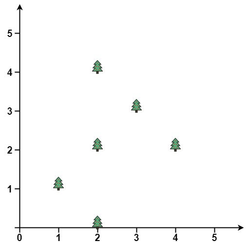
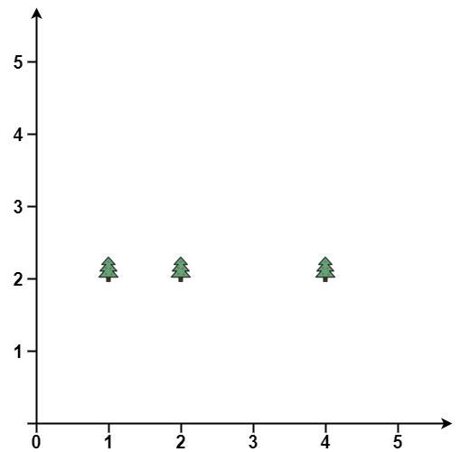

[#0587-erect-the-fence]
= 587. 安装栅栏

https://leetcode.cn/problems/erect-the-fence/[LeetCode - 587. 安装栅栏^]

给定一个数组 `trees`，其中 `trees[i] = [x~i~, y~i~]` 表示树在花园中的位置。

你被要求用最短长度的绳子把整个花园围起来，因为绳子很贵。只有把 *所有的树都围起来*，花园才围得很好。

返回__恰好位于围栏周边的树木的坐标__。

*示例 1:*

....
输入: points = [[1,1],[2,2],[2,0],[2,4],[3,3],[4,2]]
输出: [[1,1],[2,0],[3,3],[2,4],[4,2]]
....

*示例 2:*

....
输入: points = [[1,2],[2,2],[4,2]]
输出: [[4,2],[2,2],[1,2]]
....

*注意:*

* `1 \<= points.length \<= 3000`
* `points[i].length == 2`
* `0 \<= x~i~, y~i~ \<= 100`
* 所有给定的点都是 **唯一 **的。

== 思路分析

[[src-0587]]
[tabs]
====
一刷::
+
--
[{java_src_attr}]
----
include::{sourcedir}/_0587_ErectTheFence.java[tag=answer]
----
--

// 二刷::
// +
// --
// [{java_src_attr}]
// ----
// include::{sourcedir}/_0587_ErectTheFence_2.java[tag=answer]
// ----
// --
====

== 参考资料

