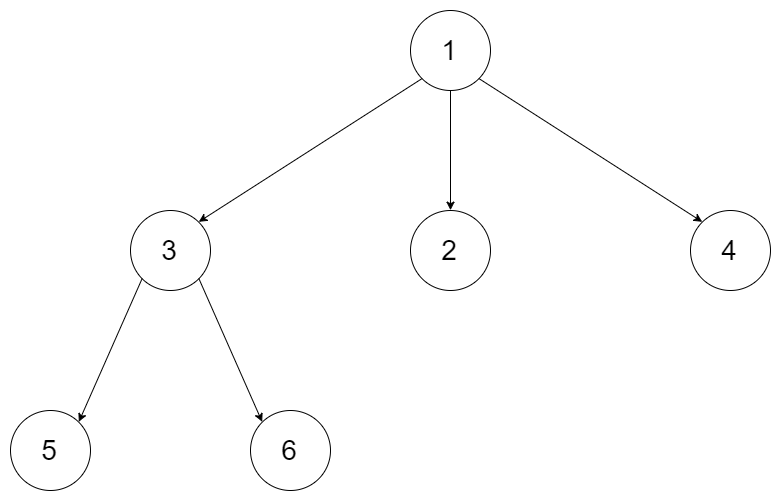
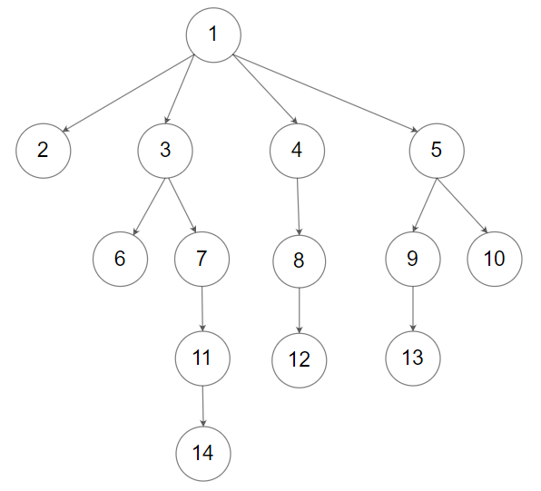

[#0590-n-ary-tree-postorder-traversal]
= 590. N 叉树的后序遍历

https://leetcode.cn/problems/n-ary-tree-postorder-traversal/[LeetCode - 590. N 叉树的后序遍历^]

给定一个 n 叉树的根节点 `root`，返回 _其节点值的 **后序遍历**_。

n 叉树 在输入中按层序遍历进行序列化表示，每组子节点由空值 `null` 分隔（请参见示例）。

*示例 1：*

....
输入：root = [1,null,3,2,4,null,5,6]
输出：[5,6,3,2,4,1]
....

*示例 2：*

....
输入：root = [1,null,2,3,4,5,null,null,6,7,null,8,null,9,10,null,null,11,null,12,null,13,null,null,14]
输出：[2,6,14,11,7,3,12,8,4,13,9,10,5,1]
....

*提示：*

* 节点总数在范围 `[0, 10^4^]` 内
* `0 \<= Node.val \<= 10^4^`
* n 叉树的高度小于或等于 `1000`

**进阶：**递归法很简单，你可以使用迭代法完成此题吗?

== 思路分析

[[src-0590]]
[tabs]
====
一刷(递归)::
+
--
[{java_src_attr}]
----
include::{sourcedir}/_0590_NAryTreePostorderTraversal_1a.java[tag=answer]
----
--

一刷(迭代)::
+
--
[{java_src_attr}]
----
include::{sourcedir}/_0590_NAryTreePostorderTraversal_1b.java[tag=answer]
----
--

// 二刷::
// +
// --
// [{java_src_attr}]
// ----
// include::{sourcedir}/_0590_NAryTreePostorderTraversal_2.java[tag=answer]
// ----
// --
====

== 参考资料

. https://leetcode.cn/problems/n-ary-tree-postorder-traversal/solutions/2645191/jian-dan-dfspythonjavacgojs-by-endlessch-ytdk/[590. N 叉树的后序遍历 - 简单 DFS^]
. https://leetcode.cn/problems/n-ary-tree-postorder-traversal/solutions/426335/che-di-chi-tou-shu-de-qian-zhong-hou-xu-di-gui-fa-/[590. N 叉树的后序遍历 - 彻底吃透树的前中后序递归法（递归三部曲）和迭代法^]
