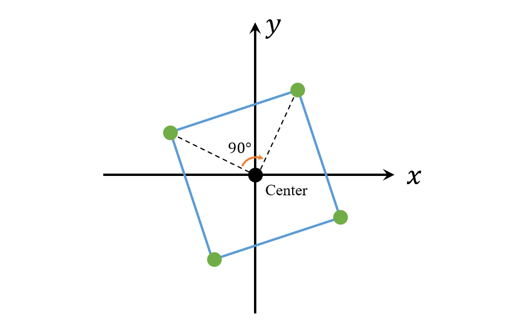

[#0593-valid-square]
= 593. 有效的正方形

https://leetcode.cn/problems/valid-square/[LeetCode - 593. 有效的正方形^]

给定2D空间中四个点的坐标 `p1`, `p2`, `p3` 和 `p4`，如果这四个点构成一个正方形，则返回 `true`。

点的坐标 `p~i~ 表示为 `[x~i~, y~i~]`。 `输入没有任何顺序`。

一个 *有效的正方形* 有四条等边和四个等角(90度角)。

*示例 1:*

....
输入: p1 = [0,0], p2 = [1,1], p3 = [1,0], p4 = [0,1]
输出: True
....

*示例 2:*

....
输入：p1 = [0,0], p2 = [1,1], p3 = [1,0], p4 = [0,12]
输出：false
....

*示例 3:*

....
输入：p1 = [1,0], p2 = [-1,0], p3 = [0,1], p4 = [0,-1]
输出：true
....

*提示:*

* `p1.length == p2.length == p3.length == p4.length == 2`
* `-10^4^ \<= x~i~, y~i~ \<= 10^4^`

== 思路分析

最容易想到的解法是计算一个点到其他点的距离，其中两条边相等且相加等于对角线。逐个点判断即可。

还有一种解法是绕着中心点旋转 90°，然后各点还是相等。如图：

[[src-0593]]
[tabs]
====
一刷::
+
--
[{java_src_attr}]
----
include::{sourcedir}/_0593_ValidSquare.java[tag=answer]
----
--

// 二刷::
// +
// --
// [{java_src_attr}]
// ----
// include::{sourcedir}/_0593_ValidSquare_2.java[tag=answer]
// ----
// --
====

== 参考资料

. https://leetcode.cn/problems/valid-square/solutions/1705912/bu-ji-suan-chang-du-zhi-kao-lu-by-liuyvj-43qm/[593. 有效的正方形 - 不考虑边长或点序，利用旋转变换的方法^]
. https://leetcode.cn/problems/valid-square/solutions/1706213/by-ac_oier-lwdf/[593. 有效的正方形 - 简单几何运用题^]
