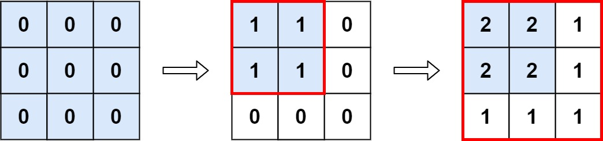

[#0598-range-addition-ii]
= 598. 区间加法 II

https://leetcode.cn/problems/range-addition-ii/[LeetCode - 598. 区间加法 II^]

给你一个 `m x n` 的矩阵 `M` 和一个操作数组 `op`。矩阵初始化时所有的单元格都为 `0`。`ops[i] = [a~i~, b~i~]` 意味着当所有的 `0 \<= x \< a~i~` 和 `0 \<= y \< b~i~` 时， `M[x][y]` 应该加 1。

在 _执行完所有操作后_ ，计算并返回 _矩阵中最大整数的个数_ 。

*示例 1:*

....
输入: m = 3, n = 3，ops = [[2,2],[3,3]]
输出: 4
解释: M 中最大的整数是 2, 而且 M 中有4个值为2的元素。因此返回 4。
....

*示例 2:*

....
输入: m = 3, n = 3, ops = [[2,2],[3,3],[3,3],[3,3],[2,2],[3,3],[3,3],[3,3],[2,2],[3,3],[3,3],[3,3]]
输出: 4
....

*示例 3:*

....
输入: m = 3, n = 3, ops = []
输出: 9
....

*提示:*

* `+1 <= m, n <= 4 * 10^4^
* `0 \<= ops.length \<= 10^4^`
* `+ops[i].length == 2+`
* `+1 <= a~i~ <= m+`
* `+1 <= b~i~ <= n+`

== 思路分析

以为是矩阵计算模拟，要一步一步模拟来搞。没想到是脑筋急转弯：求矩阵重叠部分面积即可！

[[src-0598]]
[tabs]
====
一刷::
+
--
[{java_src_attr}]
----
include::{sourcedir}/_0598_RangeAdditionIi.java[tag=answer]
----
--

// 二刷::
// +
// --
// [{java_src_attr}]
// ----
// include::{sourcedir}/_0598_RangeAdditionIi_2.java[tag=answer]
// ----
// --
====

== 参考资料

. https://leetcode.cn/problems/range-addition-ii/solutions/3053429/nao-jin-ji-zhuan-wan-pythonjavaccgojsrus-7166/[598. 区间加法 II - 脑筋急转弯^]
. https://leetcode.cn/problems/range-addition-ii/solutions/1088092/gong-shui-san-xie-jian-dan-mo-ni-ti-by-a-006h/[598. 区间加法 II - 简单模拟题^]
. https://leetcode.cn/problems/range-addition-ii/solutions/1086781/fan-wei-qiu-he-ii-by-leetcode-solution-kcxq/[598. 区间加法 II - 官方题解^]
