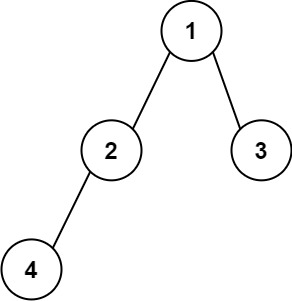
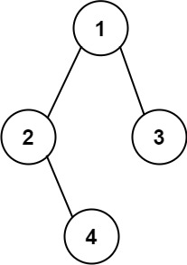

[#0606-construct-string-from-binary-tree]
= 606. 根据二叉树创建字符串

https://leetcode.cn/problems/construct-string-from-binary-tree/[LeetCode - 606. 根据二叉树创建字符串^]

给你二叉树的根节点 `root`，请你采用前序遍历的方式，将二叉树转化为一个由括号和整数组成的字符串，返回构造出的字符串。

空节点使用一对空括号对 `()` 表示，转化后需要省略所有不影响字符串与原始二叉树之间的一对一映射关系的空括号对。

*示例 1：*

....
输入：root = [1,2,3,4]
输出："1(2(4))(3)"
解释：初步转化后得到 "1(2(4)())(3()())" ，但省略所有不必要的空括号对后，字符串应该是"1(2(4))(3)" 。
....

*示例 2：*

....
输入：root = [1,2,3,null,4]
输出："1(2()(4))(3)"
解释：和第一个示例类似，但是无法省略第一个空括号对，否则会破坏输入与输出一一映射的关系。
....

*提示：*

* 树中节点的数目范围是 `[1, 10^4^]`
* `-1000 \<= Node.val \<= 1000`

== 思路分析

一个树的前根遍历，也可以看作使用前根遍历来序列化一棵树。

[[src-0606]]
[tabs]
====
一刷::
+
--
[{java_src_attr}]
----
include::{sourcedir}/_0606_ConstructStringFromBinaryTree.java[tag=answer]
----
--

// 二刷::
// +
// --
// [{java_src_attr}]
// ----
// include::{sourcedir}/_0606_ConstructStringFromBinaryTree_2.java[tag=answer]
// ----
// --
====

== 参考资料

. https://leetcode.cn/problems/construct-string-from-binary-tree/solutions/1349029/by-ac_oier-i2sk/[606. 根据二叉树创建字符串 - 一题三解 :「递归」&「非递归」&「通用非递归」^]
. https://leetcode.cn/problems/construct-string-from-binary-tree/solutions/1343920/gen-ju-er-cha-shu-chuang-jian-zi-fu-chua-e1af/[606. 根据二叉树创建字符串 - 官方题解^]
