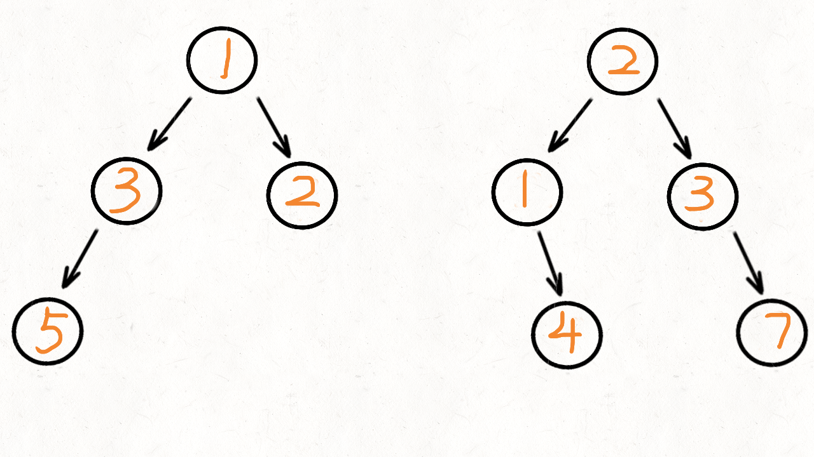

[#0617-merge-two-binary-trees]
= 617. Merge Two Binary Trees

https://leetcode.com/problems/merge-two-binary-trees/[LeetCode - Merge Two Binary Trees]

Given two binary trees and imagine that when you put one of them to cover the other, some nodes of the two trees are overlapped while the others are not.

You need to merge them into a new binary tree. The merge rule is that if two nodes overlap, then sum node values up as the new value of the merged node. Otherwise, the NOT null node will be used as the node of new tree.

.Example:
----
Input:
      Tree 1                     Tree 2
          1                         2
         / \                       / \
        3   2                     1   3
       /                           \   \
      5                             4   7
Output:
      Merged tree:
          3
         / \
        4   5
       / \   \
      5   4   7
----

*Note:* The merging process must start from the root nodes of both trees.

Given two binary trees and imagine that when you put one of them to cover the other, some nodes of the two trees are overlapped while the others are not.

You need to merge them into a new binary tree. The merge rule is that if two nodes overlap, then sum node values up as the new value of the merged node. Otherwise, the NOT null node will be used as the node of new tree.

*Example 1:*

[subs="verbatim,quotes,macros"]
----
*Input:* 
	Tree 1                     Tree 2                  
          1                         2                             
         / \                       / \                            
        3   2                     1   3                        
       /                           \   \                      
      5                             4   7                  
*Output:* 
Merged tree:
	     3
	    / \
	   4   5
	  / \   \ 
	 5   4   7
----

 

*Note:* The merging process must start from the root nodes of both trees.

== 思路分析

[[src-0617]]
[{java_src_attr}]
----
include::{sourcedir}/_0617_MergeTwoBinaryTrees.java[tag=answer]
----

[{java_src_attr}]
----
include::{sourcedir}/_0617_MergeTwoBinaryTrees_2.java[tag=answer]
----

== 参考资料

. https://leetcode.cn/problems/merge-two-binary-trees/solutions/82841/dong-hua-yan-shi-di-gui-die-dai-617he-bing-er-cha-/[617. 合并二叉树 - 动画演示 递归+迭代^]
. https://leetcode.cn/problems/merge-two-binary-trees/solutions/424201/he-bing-er-cha-shu-by-leetcode-solution/[617. 合并二叉树 - 官方题解^]
