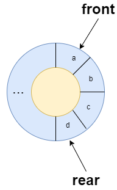

[#0622-design-circular-queue]
= 622. 设计循环队列

https://leetcode.cn/problems/design-circular-queue/[LeetCode - 622. 设计循环队列^]

设计你的循环队列实现。循环队列是一种线性数据结构，其操作表现基于 FIFO（先进先出）原则并且队尾被连接在队首之后以形成一个循环。它也被称为“环形缓冲器”。

循环队列的一个好处是我们可以利用这个队列之前用过的空间。在一个普通队列里，一旦一个队列满了，我们就不能插入下一个元素，即使在队列前面仍有空间。但是使用循环队列，我们能使用这些空间去存储新的值。

你的实现应该支持如下操作：

* `MyCircularQueue(k)`: 构造器，设置队列长度为 k 。
* `Front`: 从队首获取元素。如果队列为空，返回 -1 。
* `Rear`: 获取队尾元素。如果队列为空，返回 -1 。
* `enQueue(value)`: 向循环队列插入一个元素。如果成功插入则返回真。
* `deQueue()`: 从循环队列中删除一个元素。如果成功删除则返回真。
* `isEmpty()`: 检查循环队列是否为空。
* `isFull()`: 检查循环队列是否已满。

*示例：*

....
MyCircularQueue circularQueue = new MyCircularQueue(3); // 设置长度为 3
circularQueue.enQueue(1);  // 返回 true
circularQueue.enQueue(2);  // 返回 true
circularQueue.enQueue(3);  // 返回 true
circularQueue.enQueue(4);  // 返回 false，队列已满
circularQueue.Rear();  // 返回 3
circularQueue.isFull();  // 返回 true
circularQueue.deQueue();  // 返回 true
circularQueue.enQueue(4);  // 返回 true
circularQueue.Rear();  // 返回 4
....

*提示：*

* 所有的值都在 0 至 1000 的范围内；
* 操作数将在 1 至 1000 的范围内；
* 请不要使用内置的队列库。

== 思路分析

实现一个特殊队列。

[[src-0622]]
[tabs]
====
一刷::
+
--
[{java_src_attr}]
----
include::{sourcedir}/_0622_DesignCircularQueue.java[tag=answer]
----
--

// 二刷::
// +
// --
// [{java_src_attr}]
// ----
// include::{sourcedir}/_0622_DesignCircularQueue_2.java[tag=answer]
// ----
// --
====

== 参考资料

. https://leetcode.cn/problems/design-circular-queue/solutions/1713181/she-ji-xun-huan-dui-lie-by-leetcode-solu-1w0a/[622. 设计循环队列 - 官方题解^]
. https://leetcode.cn/problems/design-circular-queue/solutions/56619/shu-zu-shi-xian-de-xun-huan-dui-lie-by-liweiwei141/[622. 设计循环队列 - 数组实现的循环队列^]
. https://leetcode.cn/problems/design-circular-queue/solutions/3727074/she-ji-xun-huan-dui-lie-ti-jie-by-yolo-w-1i4q/[622. 设计循环队列 - 设计循环队列题解^]
