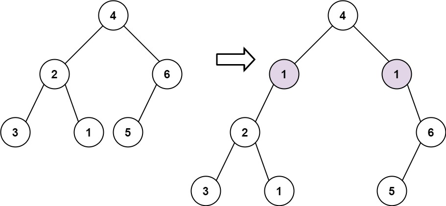
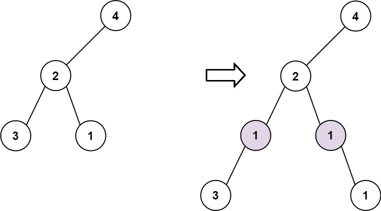

[#0623-add-one-row-to-tree]
= 623. 在二叉树中增加一行

https://leetcode.cn/problems/add-one-row-to-tree/[LeetCode - 623. 在二叉树中增加一行^]

给定一个二叉树的根 `root` 和两个整数 `val` 和 `depth` ，在给定的深度 `depth` 处添加一个值为 `val` 的节点行。

注意，根节点 `root` 位于深度 `1` 。

加法规则如下:

* 给定整数 `depth`，对于深度为 `depth - 1` 的每个非空树节点 `cur`，创建两个值为 `val` 的树节点作为 `cur` 的左子树根和右子树根。
* `cur` 原来的左子树应该是新的左子树根的左子树。
* `cur` 原来的右子树应该是新的右子树根的右子树。
* 如果 `depth == 1` 意味着 `depth - 1` 根本没有深度，那么创建一个树节点，值 `val `作为整个原始树的新根，而原始树就是新根的左子树。

*示例 1:*

....
输入: root = [4,2,6,3,1,5], val = 1, depth = 2
输出: [4,1,1,2,null,null,6,3,1,5]
....

*示例 2:*

....
输入: root = [4,2,null,3,1], val = 1, depth = 3
输出:  [4,2,null,1,1,3,null,null,1]
....

*提示:*

* 节点数在 `[1, 10^4^]` 范围内
* 树的深度在 `[1, 10^4^]`范围内
* `-100 \<= Node.val \<= 100`
* `-10^5^ \<= val \<= 10^5^`
* `1 \<= depth \<= the depth of tree + 1`

== 思路分析

深度优选遍历或广度优先遍历。

[[src-0623]]
[tabs]
====
一刷::
+
--
[{java_src_attr}]
----
include::{sourcedir}/_0623_AddOneRowToTree.java[tag=answer]
----
--

// 二刷::
// +
// --
// [{java_src_attr}]
// ----
// include::{sourcedir}/_0623_AddOneRowToTree_2.java[tag=answer]
// ----
// --
====

== 参考资料

. https://leetcode.cn/problems/add-one-row-to-tree/solutions/1720824/zai-er-cha-shu-zhong-zeng-jia-yi-xing-by-xcaf/[623. 在二叉树中增加一行 - 官方题解^]
. https://leetcode.cn/problems/add-one-row-to-tree/solutions/1723308/by-ac_oier-sc34/[623. 在二叉树中增加一行 - 简单二叉树遍历运用题^]
