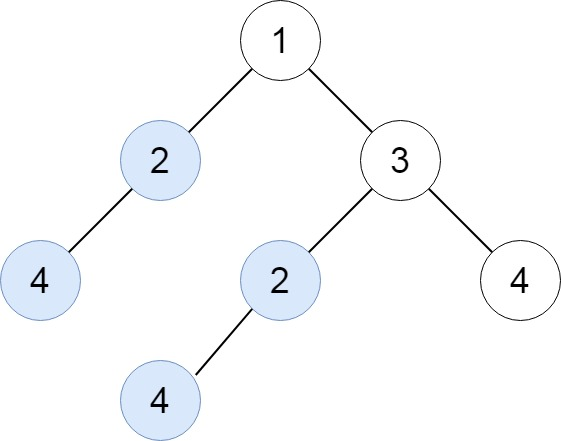
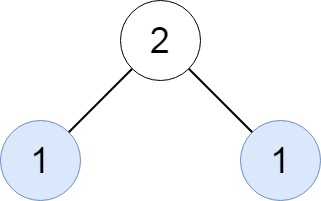
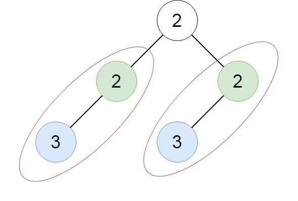

[#0652-find-duplicate-subtrees]
= 652. 寻找重复的子树

https://leetcode.cn/problems/find-duplicate-subtrees/[LeetCode - 652. 寻找重复的子树^]

给你一棵二叉树的根节点 `root` ，返回所有 *重复的子树*。

对于同一类的重复子树，你只需要返回其中任意 *一棵* 的根结点即可。

如果两棵树具有 *相同的结构* 和 *相同的结点值* ，则认为二者是 *重复* 的。

*示例 1：*

....
输入：root = [1,2,3,4,null,2,4,null,null,4]
输出：[[2,4],[4]]
....

*示例 2：*

....
输入：root = [2,1,1]
输出：[[1]]
....

*示例 3：*

....
输入：root = [2,2,2,3,null,3,null]
输出：[[2,3],[3]]
....

*提示：*

* 树中的结点数在 `[1, 5000]` 范围内。
* `+-200 <= Node.val <= 200+`

== 思路分析

深度优先遍历。先使用层级和数值对节点进行分流，相同高度和节点值的节点再尝试判断是否为相同子树。记录节点使用情况，添加过就不再处理。

[[src-0652]]
[tabs]
====
一刷::
+
--
[{java_src_attr}]
----
include::{sourcedir}/_0652_FindDuplicateSubtrees.java[tag=answer]
----
--

// 二刷::
// +
// --
// [{java_src_attr}]
// ----
// include::{sourcedir}/_0652_FindDuplicateSubtrees_2.java[tag=answer]
// ----
// --
====

== 参考资料

. https://leetcode.cn/problems/find-duplicate-subtrees/solutions/1798953/xun-zhao-zhong-fu-de-zi-shu-by-leetcode-zoncw/[652. 寻找重复的子树 - 官方题解^]
. https://leetcode.cn/problems/find-duplicate-subtrees/solutions/1801809/by-ac_oier-ly58/[652. 寻找重复的子树 - 常规 DFS + 哈希表运用题^]
. https://leetcode.cn/problems/find-duplicate-subtrees/solutions/1801819/by-muse-77-lsy1/[652. 寻找重复的子树 - 图解LeetCode^]
