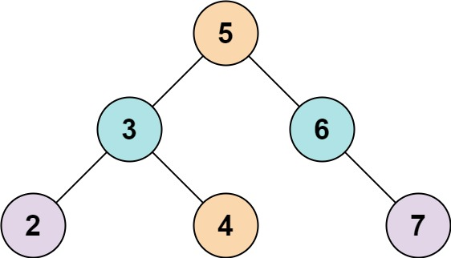
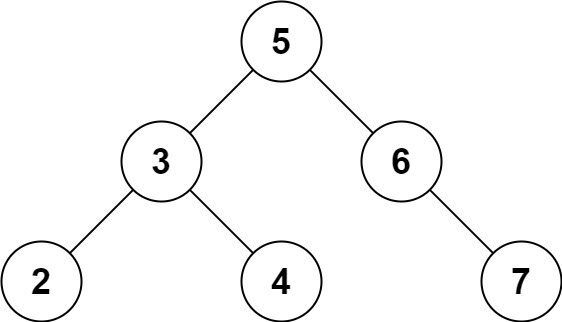

[#0653-two-sum-iv-input-is-a-bst]
= 653. 两数之和 IV - 输入二叉搜索树

https://leetcode.cn/problems/two-sum-iv-input-is-a-bst/[LeetCode - 653. 两数之和 IV - 输入二叉搜索树^]

给定一个二叉搜索树 `root` 和一个目标结果 `k`，如果二叉搜索树中存在两个元素且它们的和等于给定的目标结果，则返回 `true`。

*示例 1：*

....
输入: root = [5,3,6,2,4,null,7], k = 9
输出: true
....

*示例 2：*

....
输入: root = [5,3,6,2,4,null,7], k = 28
输出: false
....

*提示:*

* 二叉树的节点个数的范围是  `[1, 10^4^]`.
* `-10^4^ \<= Node.val \<= 10^4^`
* 题目数据保证，输入的 `root` 是一棵 *有效* 的二叉搜索树
* `-10^5^ \<= k \<= 10^5^`

== 思路分析

深度优先遍历+哈希。搜索二叉树，感觉用处不大。

[[src-0653]]
[tabs]
====
一刷::
+
--
[{java_src_attr}]
----
include::{sourcedir}/_0653_TwoSumIvInputIsABst.java[tag=answer]
----
--

// 二刷::
// +
// --
// [{java_src_attr}]
// ----
// include::{sourcedir}/_0653_TwoSumIvInputIsABst_2.java[tag=answer]
// ----
// --
====

== 参考资料

. https://leetcode.cn/problems/two-sum-iv-input-is-a-bst/solutions/1347526/liang-shu-zhi-he-iv-shu-ru-bst-by-leetco-b4nl/[653. 两数之和 IV - 输入二叉搜索树 - 官方题解^]
. https://leetcode.cn/problems/two-sum-iv-input-is-a-bst/solutions/1354976/by-ac_oier-zr4o/[653. 两数之和 IV - 输入二叉搜索树 - 一题双解:「哈希表+树的搜索」&「双指针 + BST 中序遍历」^]
