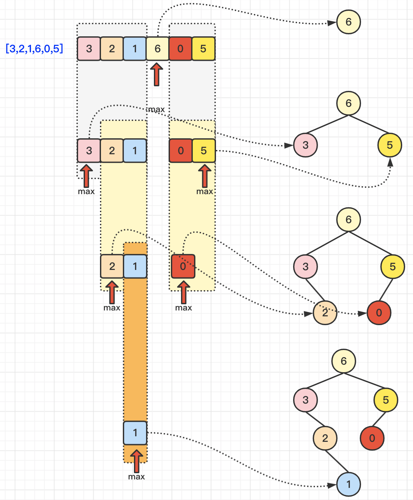
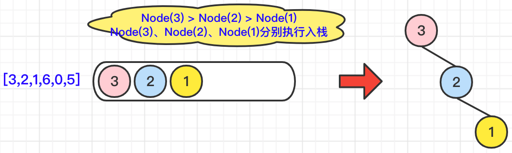
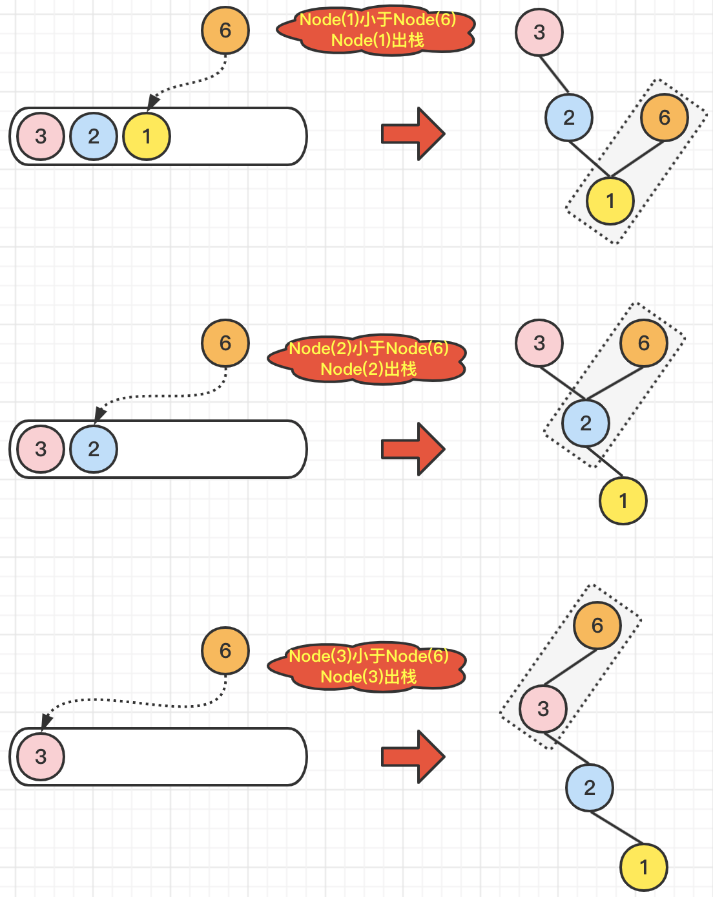
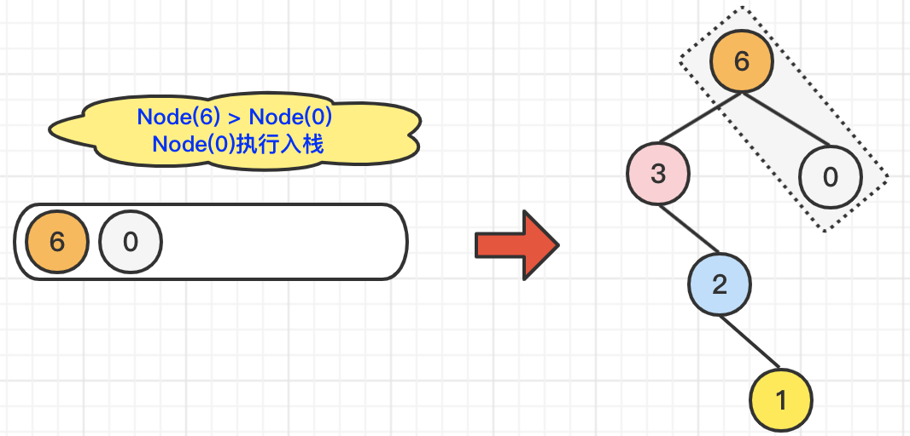
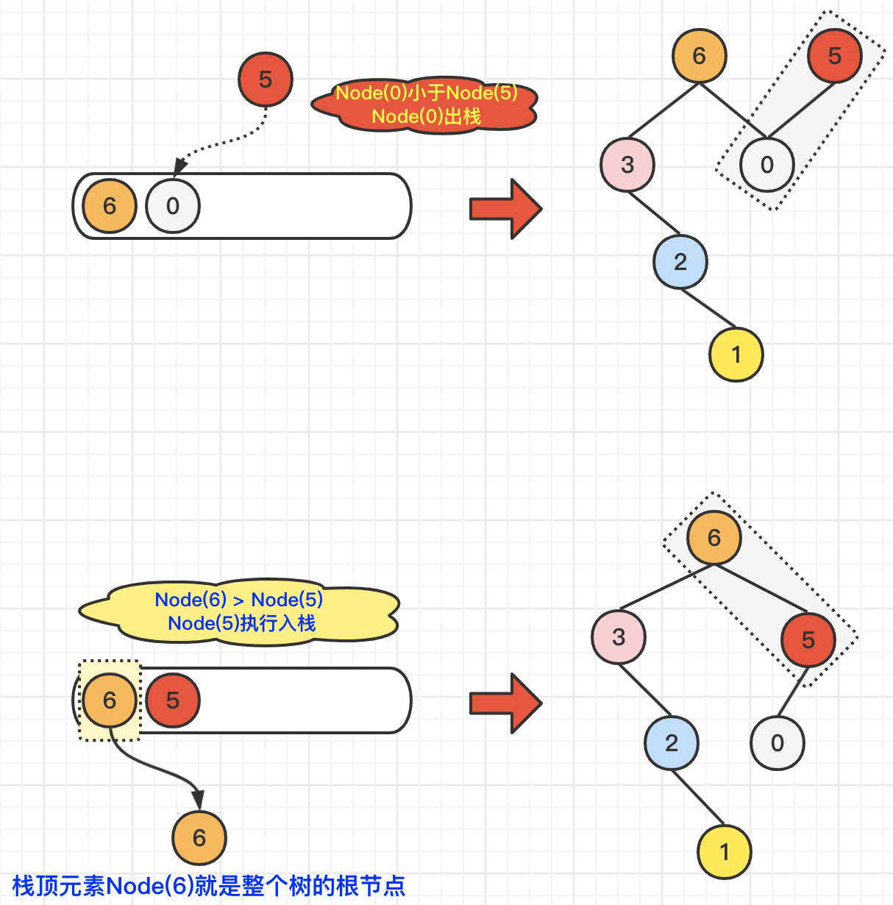

[#0654-maximum-binary-tree]
= 654. Maximum Binary Tree

https://leetcode.com/problems/maximum-binary-tree/[LeetCode - Maximum Binary Tree]

Given an integer array with no duplicates. A maximum tree building on this array is defined as follow:

. The root is the maximum number in the array. 
. The left subtree is the maximum tree constructed from left part subarray divided by the maximum number.
. The right subtree is the maximum tree constructed from right part subarray divided by the maximum number. 

Construct the maximum tree by the given array and output the root node of this tree.

*Example 1:*

[subs="verbatim,quotes,macros"]
----
*Input:* [3,2,1,6,0,5]
*Output:* return the tree root node representing the following tree:

      6
    /   \
   3     5
    \    / 
     2  0   
       \
        1
----

*Note:*

. The size of the given array will be in the range [1,1000].

== 思路分析

=== 一、递归

[[src-0654]]
[{java_src_attr}]
----
include::{sourcedir}/_0654_MaximumBinaryTree.java[tag=answer]
----

=== 二、单调栈

[{java_src_attr}]
----
include::{sourcedir}/_0654_MaximumBinaryTree_1.java[tag=answer]
----

== 参考资料

. https://leetcode.cn/problems/maximum-binary-tree/solutions/1762400/zhua-wa-mou-si-by-muse-77-myd7/[654. 最大二叉树 - 图解LeetCode^]

