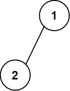
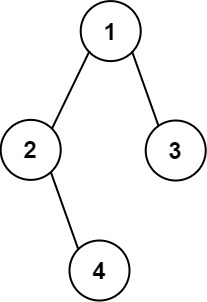

[#0655-print-binary-tree]
= 655. 输出二叉树

https://leetcode.cn/problems/print-binary-tree/[LeetCode - 655. 输出二叉树^]

给你一棵二叉树的根节点 `root`，请你构造一个下标从 *0* 开始、大小为 `m x n` 的字符串矩阵 `res`，用以表示树的 *格式化布局*。构造此格式化布局矩阵需要遵循以下规则：

* 树的 *高度* 为 `height`，矩阵的行数 `m` 应该等于 `height + 1`。
* 矩阵的列数 `n` 应该等于 `2^height+1^ - 1+`。
* *根节点* 需要放置在 *顶行* 的 *正中间* ，对应位置为 `res[0][(n-1)/2]` 。
* 对于放置在矩阵中的每个节点，设对应位置为 `res[r][c]`，将其左子节点放置在 `res[r+1][c-2^height-r-1^]`，右子节点放置在 `res[r+1][c+2^height-r-1^]`。
* 继续这一过程，直到树中的所有节点都妥善放置。
* 任意空单元格都应该包含空字符串 `""` 。

返回构造得到的矩阵 `res`。

*示例 1：*

....
输入：root = [1,2]
输出：
[["","1",""],
 ["2","",""]]
....

*示例 2：*

....
输入：root = [1,2,3,null,4]
输出：
[["","","","1","","",""],
 ["","2","","","","3",""],
 ["","","4","","","",""]]
....

*提示：*

* 树中节点数在范围 `[1, 2^10^]` 内
* `-99 \<= Node.val \<= 99`
* 树的深度在范围 `[1, 10]` 内

== 思路分析

深度优先遍历。题目理解起来有些拗口！重新描述一下，就是每次都把节点值添加到当前范围的整中间。其余填空字符串。

[[src-0655]]
[tabs]
====
一刷::
+
--
[{java_src_attr}]
----
include::{sourcedir}/_0655_PrintBinaryTree.java[tag=answer]
----
--

// 二刷::
// +
// --
// [{java_src_attr}]
// ----
// include::{sourcedir}/_0655_PrintBinaryTree_2.java[tag=answer]
// ----
// --
====

== 参考资料

. https://leetcode.cn/problems/print-binary-tree/solutions/1763780/shu-chu-er-cha-shu-by-leetcode-solution-cnxu/[655. 输出二叉树 - 官方题解^]
. https://leetcode.cn/problems/print-binary-tree/solutions/1766550/by-ac_oier-mays/[655. 输出二叉树 - 常规 DFS 运用题（树的遍历）^]
