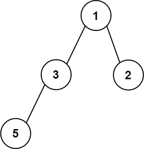

[#0662-maximum-width-of-binary-tree]
= 662. 二叉树最大宽度

https://leetcode.cn/problems/maximum-width-of-binary-tree/[LeetCode - 662. 二叉树最大宽度^]

给你一棵二叉树的根节点 `root` ，返回树的 *最大宽度* 。

树的 *最大宽度* 是所有层中最大的 *宽度* 。

每一层的 *宽度* 被定义为该层最左和最右的非空节点（即，两个端点）之间的长度。将这个二叉树视作与满二叉树结构相同，两端点间会出现一些延伸到这一层的 `null` 节点，这些 `null` 节点也计入长度。

题目数据保证答案将会在  *32 位* 带符号整数范围内。

*示例 1：*

image::images/0662-01.jpg[{image_attr}]

....
输入：root = [1,3,2,5,3,null,9]
输出：4
解释：最大宽度出现在树的第 3 层，宽度为 4 (5,3,null,9) 。
....

*示例 2：*

image::images/0662-02.jpg[{image_attr}]

....
输入：root = [1,3,2,5,null,null,9,6,null,7]
输出：7
解释：最大宽度出现在树的第 4 层，宽度为 7 (6,null,null,null,null,null,7) 。
....

*示例 3：*

....
输入：root = [1,3,2,5]
输出：2
解释：最大宽度出现在树的第 2 层，宽度为 2 (3,2) 。
....

*提示：*

* 树中节点的数目范围是 `[1, 3000]`
* `+-100 <= Node.val <= 100+`

== 思路分析

使用伪节点进行广度优先遍历超时！

从上到下，每个节点都有一个编号，如果父节点是 `x`，则左节点是 `2x`，而右节点是 `2x+1`，因为父节点可以这个节点编号传递下去，这样不需要关注空节点。把每一层节点放入到一个队列中，尾部节点的编号减去头部节点编号再加 1 就是每层的宽度。

还有一个深度优先遍历的解法：

注意：做深度优先遍历时，每一层肯定是最先遍历到最左节点，最后遍历到最右节点。所以，最小节点直接判空后存入即可。

[[src-0662]]
[tabs]
====
一刷（超时）::
+
--
[{java_src_attr}]
----
include::{sourcedir}/_0662_MaximumWidthOfBinaryTree.java[tag=answer]
----
--

一刷::
+
--
[{java_src_attr}]
----
include::{sourcedir}/_0662_MaximumWidthOfBinaryTree_1.java[tag=answer]
----
--

二刷::
+
--
[{java_src_attr}]
----
include::{sourcedir}/_0662_MaximumWidthOfBinaryTree_2.java[tag=answer]
----
--
====

== 参考资料

. https://leetcode.cn/problems/maximum-width-of-binary-tree/solutions/1776589/er-cha-shu-zui-da-kuan-du-by-leetcode-so-9zp3/[662. 二叉树最大宽度 - 官方题解^]
. https://leetcode.cn/problems/maximum-width-of-binary-tree/solutions/1779284/by-muse-77-7hwf/[662. 二叉树最大宽度 - 【爪哇缪斯】图解LeetCode^]

