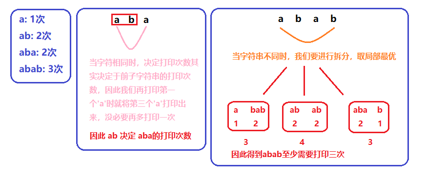
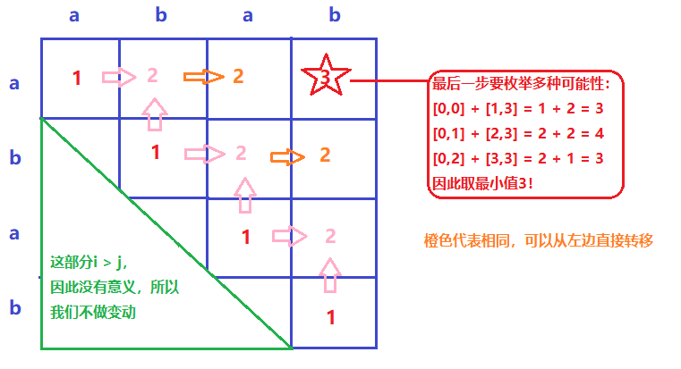

[#0664-strange-printer]
= 664. 奇怪的打印机

https://leetcode.cn/problems/strange-printer/[LeetCode - 664. 奇怪的打印机^]

有台奇怪的打印机有以下两个特殊要求：

* 打印机每次只能打印由 *同一个字符* 组成的序列。
* 每次可以在从起始到结束的任意位置打印新字符，并且会覆盖掉原来已有的字符。

给你一个字符串 `s`，你的任务是计算这个打印机打印它需要的最少打印次数。

*示例 1：*

....
输入：s = "aaabbb"
输出：2
解释：首先打印 "aaa" 然后打印 "bbb"。
....

*示例 2：*

....
输入：s = "aba"
输出：2
解释：首先打印 "aaa" 然后在第二个位置打印 "b" 覆盖掉原来的字符 'a'。
....

*提示：*

* `1 \<= s.length \<= 100`
* `s` 由小写英文字母组成

== 思路分析

没想到是动态规划。思路见下图：

[[src-0664]]
[tabs]
====
一刷::
+
--
[{java_src_attr}]
----
include::{sourcedir}/_0664_StrangePrinter.java[tag=answer]
----
--

// 二刷::
// +
// --
// [{java_src_attr}]
// ----
// include::{sourcedir}/_0664_StrangePrinter_2.java[tag=answer]
// ----
// --
====

== 参考资料

. https://leetcode.cn/problems/strange-printer/solutions/792309/xin-shou-pian-cong-xiao-wen-ti-zai-dao-q-qifh/[664. 奇怪的打印机 - 新手篇 -- 从小问题再到全局^]
. https://leetcode.cn/problems/strange-printer/solutions/792236/qi-guai-de-da-yin-ji-by-leetcode-solutio-ogbu/[664. 奇怪的打印机 - 官方题解^]
