[#0668-kth-smallest-number-in-multiplication-table]
= 668. 乘法表中第k小的数

https://leetcode.cn/problems/kth-smallest-number-in-multiplication-table/[LeetCode - 668. 乘法表中第k小的数^]

几乎每一个人都用 https://baike.baidu.com/item/%E4%B9%98%E6%B3%95%E8%A1%A8[乘法表]。但是你能在乘法表中快速找到第 `k` 小的数字吗？

乘法表是大小为 `m x n` 的一个整数矩阵，其中 `mat[i][j] == i * j`（下标从 *1* 开始）。

给你三个整数 `m`、`n` 和 `k`，请你在大小为 `m x n` 的乘法表中，找出并返回第 `k` 小的数字。

*示例 1：*

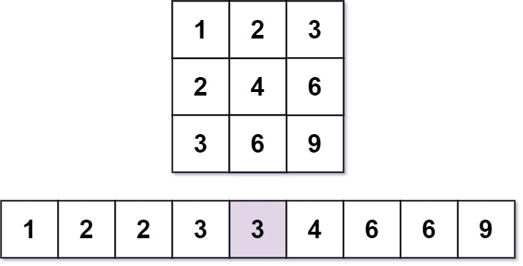

....
输入：m = 3, n = 3, k = 5
输出：3
解释：第 5 小的数字是 3 。
....

*示例 2：*

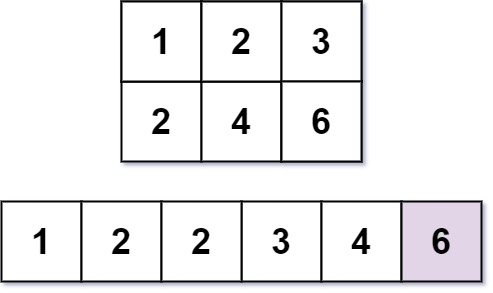

....
输入：m = 2, n = 3, k = 6
输出：6
解释：第 6 小的数字是 6 。
....

*提示：*

* `1 \<= m, n \<= 3 * 10^4^`
* `1 \<= k \<= m * n`

== 思路分析

二分查找。总想投机取巧地来计算计数，谁知还是得靠按行统计。

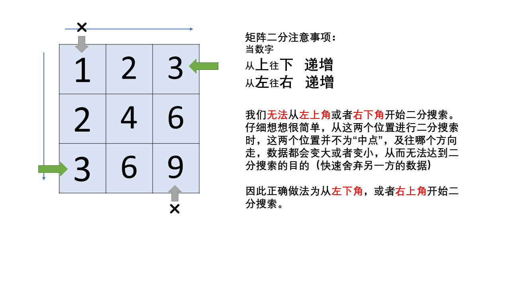

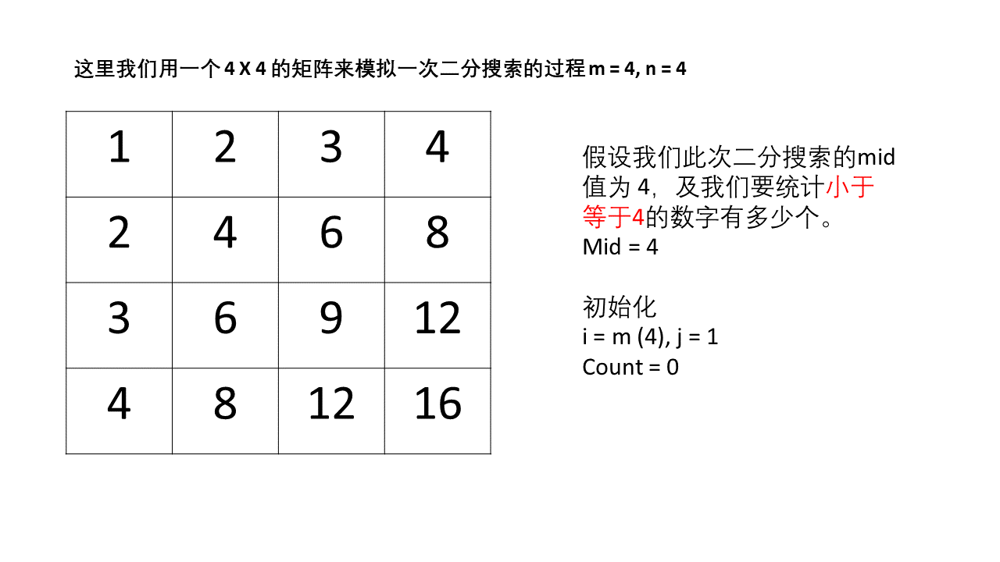

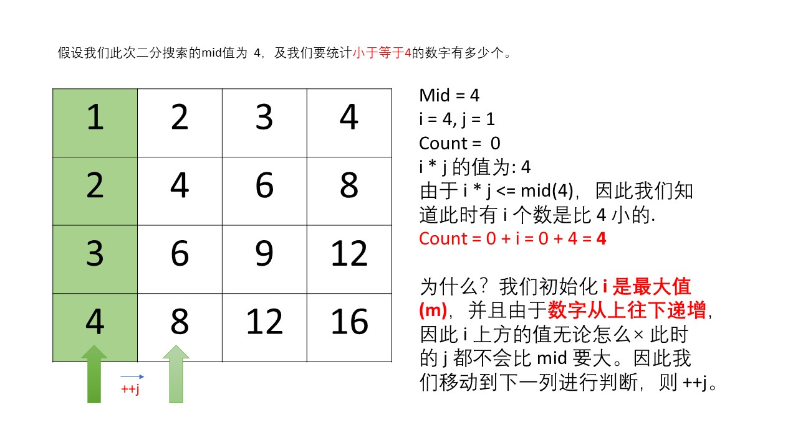

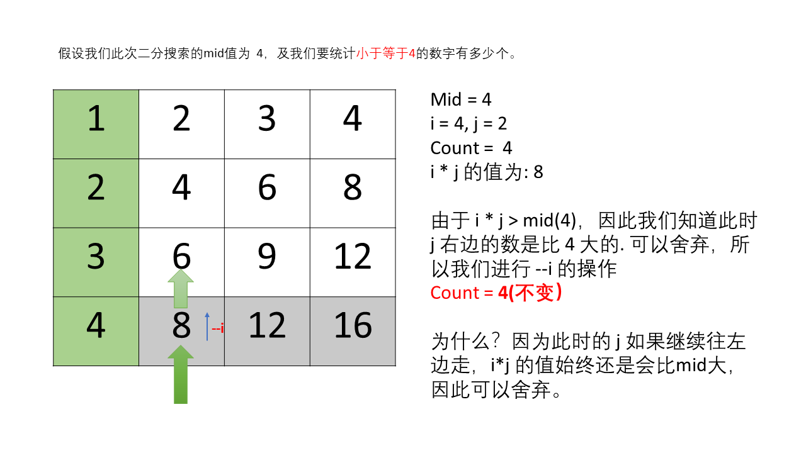

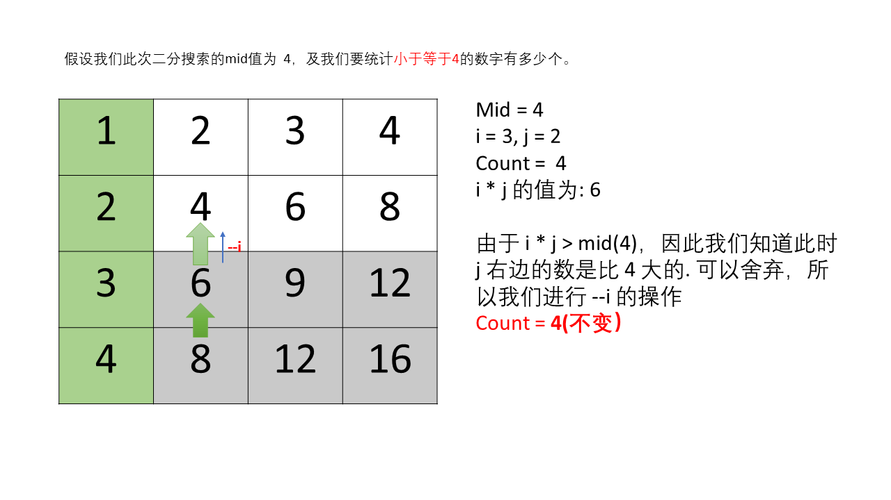

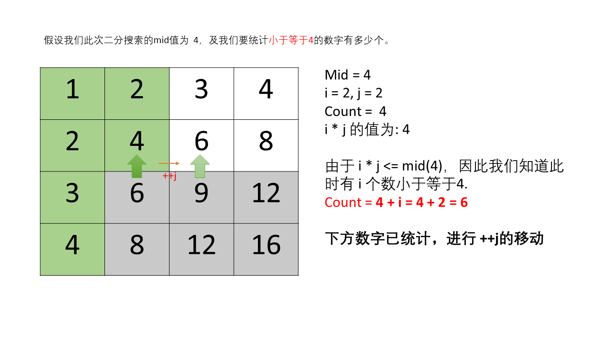

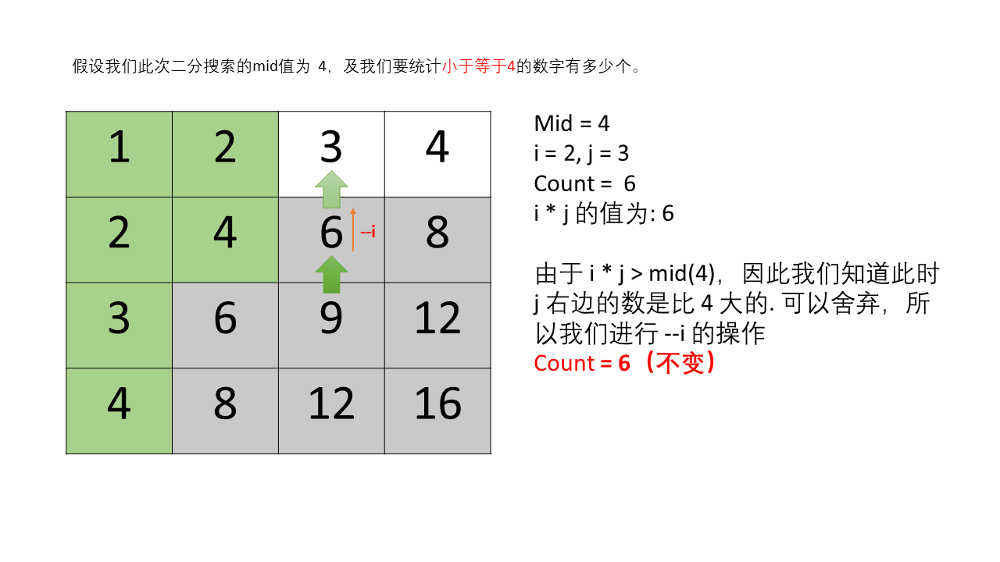

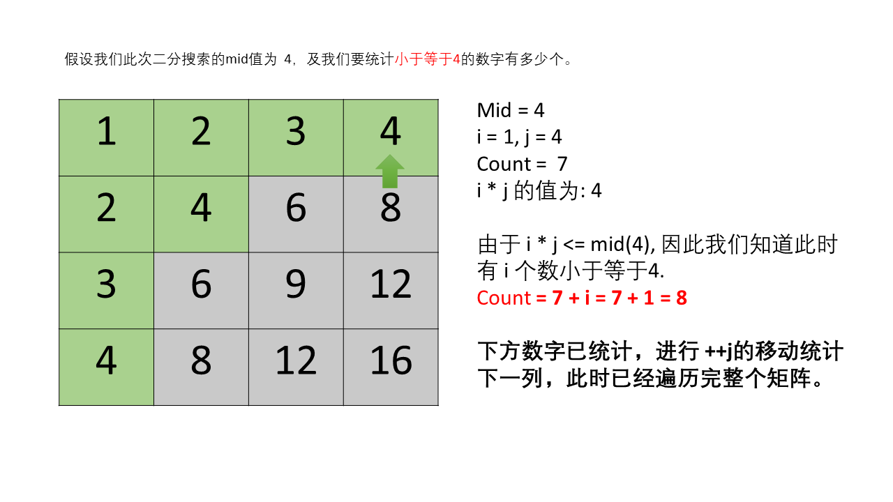

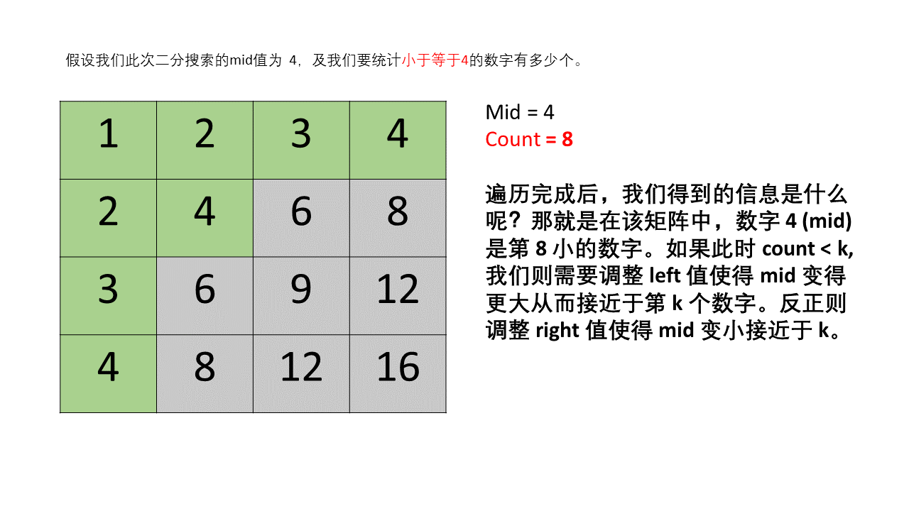

TIP: 矩阵二分查找通常从左下或者右上开始收缩。

[[src-0668]]
[tabs]
====
一刷::
+
--
[{java_src_attr}]
----
include::{sourcedir}/_0668_KthSmallestNumberInMultiplicationTable.java[tag=answer]
----
--

// 二刷::
// +
// --
// [{java_src_attr}]
// ----
// include::{sourcedir}/_0668_KthSmallestNumberInMultiplicationTable_2.java[tag=answer]
// ----
// --
====

== 参考资料

. https://leetcode.cn/problems/kth-smallest-number-in-multiplication-table/solutions/1501801/dong-tu-yan-shi-by-xiaohu9527-3k7s/[668. 乘法表中第k小的数 - 矩阵二分搜索 + 动图演示^]
. https://leetcode.cn/problems/kth-smallest-number-in-multiplication-table/solutions/2999698/di-k-xiao-da-wen-ti-de-tong-yong-zhuan-h-9y8i/[668. 乘法表中第k小的数 - 第 k 小/大问题的通用转化方法 + 优化^]
. https://leetcode.cn/problems/kth-smallest-number-in-multiplication-table/solutions/1499050/cheng-fa-biao-zhong-di-kxiao-de-shu-by-l-521a/[668. 乘法表中第k小的数 - 官方题解^]
