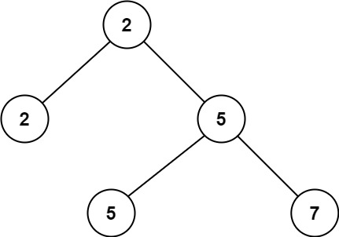
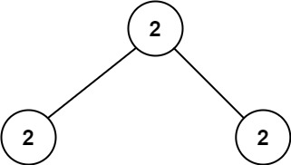

[#0671-second-minimum-node-in-a-binary-tree]
= 671. 二叉树中第二小的节点

https://leetcode.cn/problems/second-minimum-node-in-a-binary-tree/[LeetCode - 671. 二叉树中第二小的节点^]

给定一个非空特殊的二叉树，每个节点都是正数，并且每个节点的子节点数量只能为 `2` 或 `0`。如果一个节点有两个子节点的话，那么该节点的值等于两个子节点中较小的一个。

更正式地说，即 `root.val = min(root.left.val, root.right.val)` 总成立。

给出这样的一个二叉树，你需要输出所有节点中的 *第二小的值* 。

如果第二小的值不存在的话，输出 -1。

*示例 1：*

....
输入：root = [2,2,5,null,null,5,7]
输出：5
解释：最小的值是 2 ，第二小的值是 5 。
....

*示例 2：*

....
输入：root = [2,2,2]
输出：-1
解释：最小的值是 2, 但是不存在第二小的值。
....

*提示：*

* 树中节点数目在范围 `[1, 25]` 内
* `1 \<= Node.val \<= 2^31^ - 1`
* 对于树中每个节点 `root.val == min(root.left.val, root.right.val)`

== 思路分析

深度优先遍历。我想到的思路是使用大堆保存两个最小的值。官方题解的思路更精巧：直接存下根节点的值，然后取寻找结果。使用前根遍历更高效。

[[src-0671]]
[tabs]
====
一刷::
+
--
[{java_src_attr}]
----
include::{sourcedir}/_0671_SecondMinimumNodeInABinaryTree.java[tag=answer]
----
--

// 二刷::
// +
// --
// [{java_src_attr}]
// ----
// include::{sourcedir}/_0671_SecondMinimumNodeInABinaryTree_2.java[tag=answer]
// ----
// --
====

== 参考资料

. https://leetcode.cn/problems/second-minimum-node-in-a-binary-tree/solutions/898088/er-cha-shu-zhong-di-er-xiao-de-jie-dian-bhxiw/[671. 二叉树中第二小的节点 - 官方题解^]
. https://leetcode.cn/problems/second-minimum-node-in-a-binary-tree/solutions/898485/gong-shui-san-xie-yi-ti-shuang-jie-shu-d-eupu/[671. 二叉树中第二小的节点 - 一题双解 :「树的遍历」&「递归」^]
