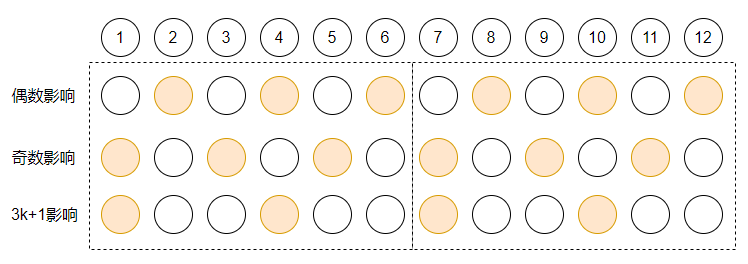
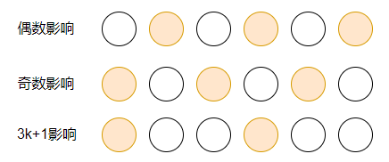
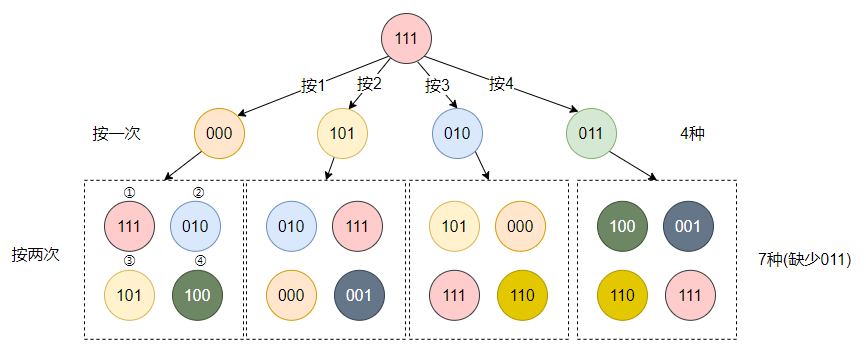

[#0672-bulb-switcher-ii]
= 672. 灯泡开关 Ⅱ

https://leetcode.cn/problems/bulb-switcher-ii/[LeetCode - 672. 灯泡开关 Ⅱ^]

房间中有 `n` 只已经打开的灯泡，编号从 `1` 到 `n` 。墙上挂着 *4 个开关*。

这 4 个开关各自都具有不同的功能，其中：

* **开关 1 ：**反转当前所有灯的状态（即开变为关，关变为开）
* **开关 2 ：**反转编号为偶数的灯的状态（即 `0, 2, 4, ...`）
* **开关 3 ：**反转编号为奇数的灯的状态（即 `1, 3, ...`）
* **开关 4 ：**反转编号为 `+j = 3k + 1+` 的灯的状态，其中 `k = 0, 1, 2, ...`（即 `1, 4, 7, 10, ...`）

你必须 *恰好* 按压开关 `presses` 次。每次按压，你都需要从 4 个开关中选出一个来执行按压操作。

给你两个整数 `n` 和 `presses` ，执行完所有按压之后，返回 *不同可能状态* 的数量。

*示例 1：*

....
输入：n = 1, presses = 1
输出：2
解释：状态可以是：
- 按压开关 1 ，[关]
- 按压开关 2 ，[开]
....

*示例 2：*

....
输入：n = 2, presses = 1
输出：3
解释：状态可以是：
- 按压开关 1 ，[关, 关]
- 按压开关 2 ，[开, 关]
- 按压开关 3 ，[关, 开]
....

*示例 3：*

....
输入：n = 3, presses = 1
输出：4
解释：状态可以是：
- 按压开关 1 ，[关, 关, 关]
- 按压开关 2 ，[关, 开, 关]
- 按压开关 3 ，[开, 关, 开]
- 按压开关 4 ，[关, 开, 开]
....

*提示：*

* `1 \<= n \<= 1000`
* `0 \<= presses \<= 1000`

== 思路分析

数学题。通过分析找规律。

常规解法是深度优先比遍历或广度优先遍历。

[[src-0672]]
[tabs]
====
一刷::
+
--
[{java_src_attr}]
----
include::{sourcedir}/_0672_BulbSwitcherIi.java[tag=answer]
----
--

// 二刷::
// +
// --
// [{java_src_attr}]
// ----
// include::{sourcedir}/_0672_BulbSwitcherIi_2.java[tag=answer]
// ----
// --
====

== 参考资料

. https://leetcode.cn/problems/bulb-switcher-ii/solutions/1824602/dengp-by-capital-worker-51rb/[672. 灯泡开关 Ⅱ - 力扣（LeetCode）^]
. https://leetcode.cn/problems/bulb-switcher-ii/solutions/1823710/deng-pao-kai-guan-ii-by-leetcode-solutio-he7o/[672. 灯泡开关 Ⅱ - 官方题解^]

