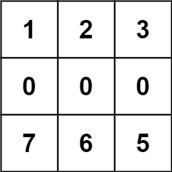
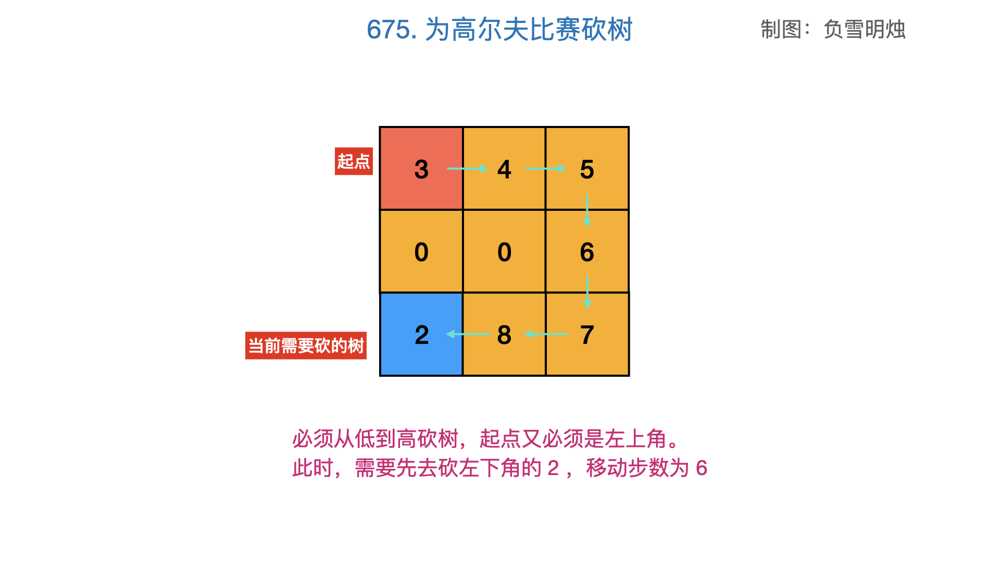
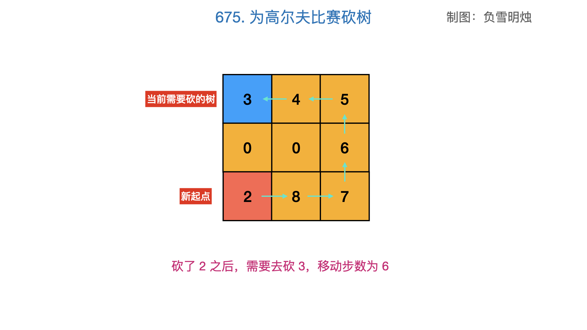
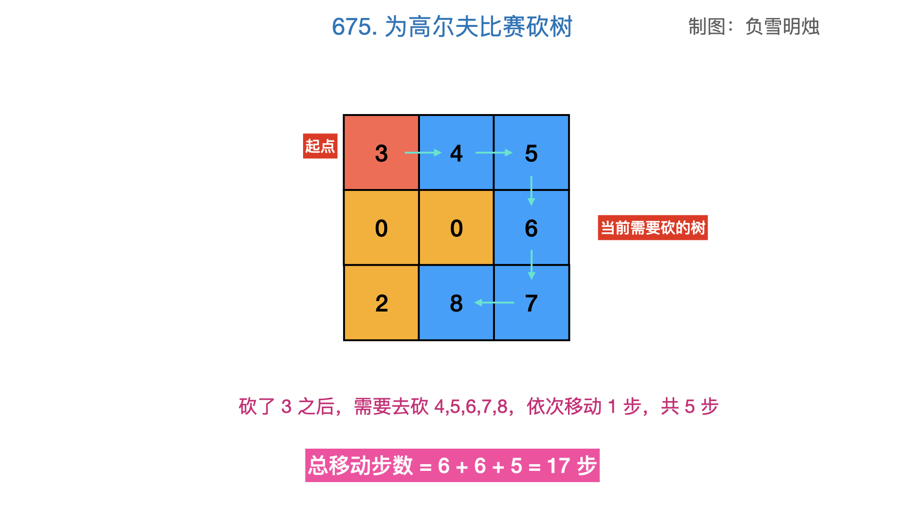
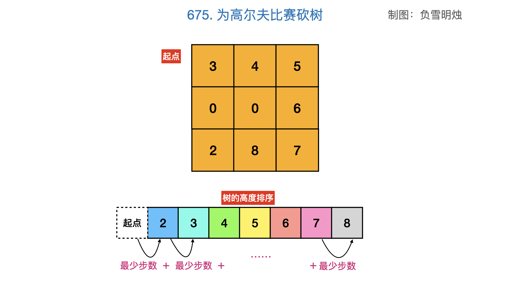

[#0675-cut-off-trees-for-golf-event]
= 675. 为高尔夫比赛砍树

https://leetcode.cn/problems/cut-off-trees-for-golf-event/[LeetCode - 675. 为高尔夫比赛砍树^]

你被请来给一个要举办高尔夫比赛的树林砍树。树林由一个 `m x n` 的矩阵表示， 在这个矩阵中：

* `0` 表示障碍，无法触碰
* `1` 表示地面，可以行走
* `比 1 大的数` 表示有树的单元格，可以行走，数值表示树的高度

每一步，你都可以向上、下、左、右四个方向之一移动一个单位，如果你站的地方有一棵树，那么你可以决定是否要砍倒它。

你需要按照树的高度从低向高砍掉所有的树，每砍过一颗树，该单元格的值变为 `1`（即变为地面）。

你将从 `(0, 0)` 点开始工作，返回你砍完所有树需要走的最小步数。如果你无法砍完所有的树，返回 `-1`。

可以保证的是，没有两棵树的高度是相同的，并且你至少需要砍倒一棵树。

*示例 1：*

image::images/0675-01.jpg[{image_attr}]

....
输入：forest = [[1,2,3],[0,0,4],[7,6,5]]
输出：6
解释：沿着上面的路径，你可以用 6 步，按从最矮到最高的顺序砍掉这些树。
....

*示例 2：*

....
输入：forest = [[1,2,3],[0,0,0],[7,6,5]]
输出：-1
解释：由于中间一行被障碍阻塞，无法访问最下面一行中的树。
....

*示例 3：*

....
输入：forest = [[2,3,4],[0,0,5],[8,7,6]]
输出：6
解释：可以按与示例 1 相同的路径来砍掉所有的树。
(0,0) 位置的树，可以直接砍去，不用算步数。
....

*提示：*

* `m == forest.length`
* `n == forest[i].length`
* `1 \<= m, n \<= 50`
* `0 \<= forest[i][j] \<= 10^9^`

== 思路分析

翻译一下题目：从“原点”开始，逐步通过最短路径向上攀爬，直达封顶。这个过程的步数就是题目答案。

[[src-0675]]
[tabs]
====
一刷::
+
--
[{java_src_attr}]
----
include::{sourcedir}/_0675_CutOffTreesForGolfEvent.java[tag=answer]
----
--

// 二刷::
// +
// --
// [{java_src_attr}]
// ----
// include::{sourcedir}/_0675_CutOffTreesForGolfEvent_2.java[tag=answer]
// ----
// --
====

== 参考资料

. https://leetcode.cn/problems/cut-off-trees-for-golf-event/solutions/1512295/by-fuxuemingzhu-dtet/[675. 为高尔夫比赛砍树 - 图解算法：题意分析 + BFS 模板分享^]
. https://leetcode.cn/problems/cut-off-trees-for-golf-event/solutions/1510776/wei-gao-er-fu-bi-sai-kan-shu-by-leetcode-rlrc/[675. 为高尔夫比赛砍树 - 官方题解^]
. https://leetcode.cn/problems/cut-off-trees-for-golf-event/solutions/1/by-ac_oier-ksth/[675. 为高尔夫比赛砍树 - 一题三解 :「BFS」&「AStar 算法」&「并查集预处理」^]
