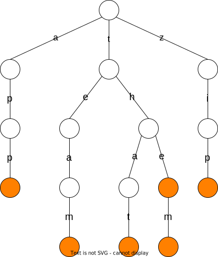
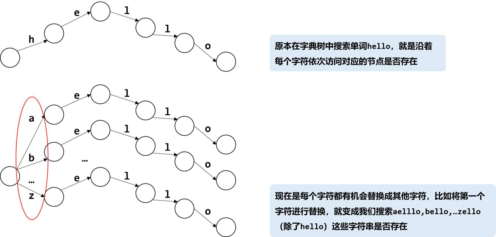
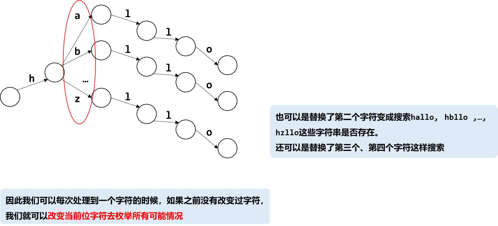

[#0676-implement-magic-dictionary]
= 676. 实现一个魔法字典

https://leetcode.cn/problems/implement-magic-dictionary/[LeetCode - 676. 实现一个魔法字典^]

设计一个使用单词列表进行初始化的数据结构，单词列表中的单词 *互不相同*。如果给出一个单词，请判定能否只将这个单词中**一个**字母换成另一个字母，使得所形成的新单词存在于你构建的字典中。

实现 `MagicDictionary` 类：

* `MagicDictionary()` 初始化对象
* `void buildDict(String[] dictionary)` 使用字符串数组 `dictionary` 设定该数据结构，`dictionary` 中的字符串互不相同
* `bool search(String searchWord)` 给定一个字符串 `searchWord`，判定能否只将字符串中 *一个* 字母换成另一个字母，使得所形成的新字符串能够与字典中的任一字符串匹配。如果可以，返回 `true` ；否则，返回 `false`。

*示例：*

....
输入
["MagicDictionary", "buildDict", "search", "search", "search", "search"]
[[], [["hello", "leetcode"]], ["hello"], ["hhllo"], ["hell"], ["leetcoded"]]
输出
[null, null, false, true, false, false]

解释
MagicDictionary magicDictionary = new MagicDictionary();
magicDictionary.buildDict(["hello", "leetcode"]);
magicDictionary.search("hello"); // 返回 False
magicDictionary.search("hhllo"); // 将第二个 'h' 替换为 'e' 可以匹配 "hello" ，所以返回 True
magicDictionary.search("hell"); // 返回 False
magicDictionary.search("leetcoded"); // 返回 False
....

*提示：*

* `1 \<= dictionary.length \<= 100`
* `1 \<= dictionary[i].length \<= 100`
* `dictionary[i]` 仅由小写英文字母组成
* `dictionary` 中的所有字符串 *互不相同*
* `1 \<= searchWord.length \<= 100`
* `searchWord` 仅由小写英文字母组成
* `buildDict` 仅在 `search` 之前调用一次
* 最多调用 `100` 次 `search`

== 思路分析

哈希或前缀树+深度优先搜索。

最简单的思路就是根据长度区分单词，然后根据长度获取对应单词列表，逐一判定。

复杂一点，执行效率也许可以更高一点的的办法就是前缀树+深度优先搜索。

[[src-0676]]
[tabs]
====
一刷::
+
--
[{java_src_attr}]
----
include::{sourcedir}/_0676_ImplementMagicDictionary.java[tag=answer]
----
--

// 二刷::
// +
// --
// [{java_src_attr}]
// ----
// include::{sourcedir}/_0676_ImplementMagicDictionary_2.java[tag=answer]
// ----
// --
====

== 参考资料

. https://leetcode.cn/problems/implement-magic-dictionary/solutions/1656423/shi-xian-yi-ge-mo-fa-zi-dian-by-leetcode-b35s/[676. 实现一个魔法字典 - 官方题解^]
. https://leetcode.cn/problems/implement-magic-dictionary/solutions/1661022/by-ac_oier-a01l/[676. 实现一个魔法字典 - 结合 DFS 的 Trie 运用题^]
. https://leetcode.cn/problems/implement-magic-dictionary/solutions/2877189/python3javacgotypescript-yi-ti-yi-jie-qi-z5ve/[676. 实现一个魔法字典 - 一题一解：前缀树 + DFS（清晰题解）^]
. https://leetcode.cn/problems/implement-magic-dictionary/solutions/2877560/trie-mei-ju-ha-xi-zi-dian-shu-yuan-li-tu-i7qm/[676. 实现一个魔法字典 - 【Trie】枚举 & 哈希 & 字典树（原理+推导+模版）^]
. https://leetcode.cn/problems/implement-magic-dictionary/solutions/1662444/by-lfool-pcng/[676. 实现一个魔法字典 - 详解前缀树「TrieTree 汇总级别整理 🔥🔥🔥」^]
. https://leetcode.cn/problems/implement-magic-dictionary/solutions/2877311/javapython3czi-dian-shu-dfsmei-ju-ti-hua-9i73/[676. 实现一个魔法字典 - 字典树 + DFS枚举^]
