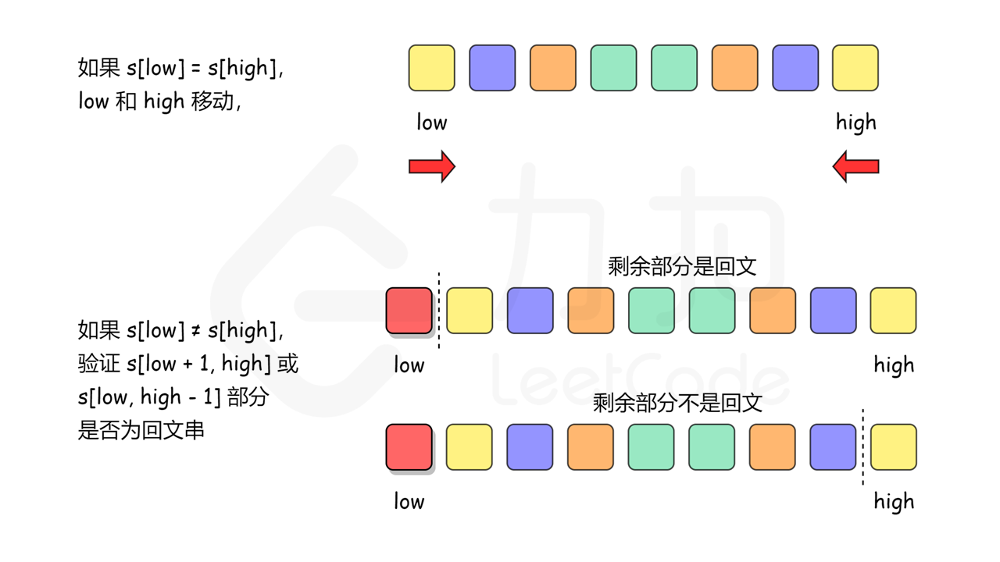

[#0680-valid-palindrome-ii]
= 680. 验证回文串 II

https://leetcode.cn/problems/valid-palindrome-ii/[LeetCode - 680. 验证回文串 II^]

给你一个字符串 `s`，*最多* 可以从中删除一个字符。

请你判断 `s` 是否能成为回文字符串：如果能，返回 `true` ；否则，返回 `false`。

*示例 1：*

....
输入：s = "aba"
输出：true
....

*示例 2：*

....
输入：s = "abca"
输出：true
解释：你可以删除字符 'c' 。
....

*示例 3：*

....
输入：s = "abc"
输出：false
....

*提示：*

* `1 \<= s.length \<= 10^5^`
* `s` 由小写英文字母组成

== 思路分析

贪心模式：从两端向中间挤压，遇到相同的就向中间一步走，遇到不同的就各自前进一步做判定。

[[src-0680]]
[tabs]
====
一刷::
+
--
[{java_src_attr}]
----
include::{sourcedir}/_0680_ValidPalindromeIi.java[tag=answer]
----
--

// 二刷::
// +
// --
// [{java_src_attr}]
// ----
// include::{sourcedir}/_0680_ValidPalindromeIi_2.java[tag=answer]
// ----
// --
====

== 参考资料

. https://leetcode.cn/problems/valid-palindrome-ii/solutions/251842/yan-zheng-hui-wen-zi-fu-chuan-ii-by-leetcode-solut/[680. 验证回文串 II - 官方题解^]
. https://leetcode.cn/problems/valid-palindrome-ii/solutions/252740/cong-liang-ce-xiang-zhong-jian-zhao-dao-bu-deng-de/[680. 验证回文串 II - 从两侧向中间找到不等的字符，删除后判断是否回文^]
. https://leetcode.cn/problems/valid-palindrome-ii/solutions/3053249/tan-xin-wei-shi-yao-xiang-deng-de-shi-ho-wtll/[680. 验证回文串 II - 贪心：为什么相等的时候不需要删^]
