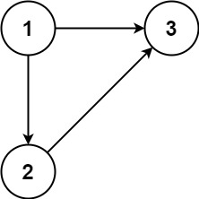
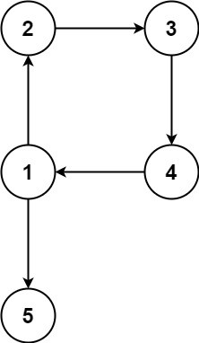
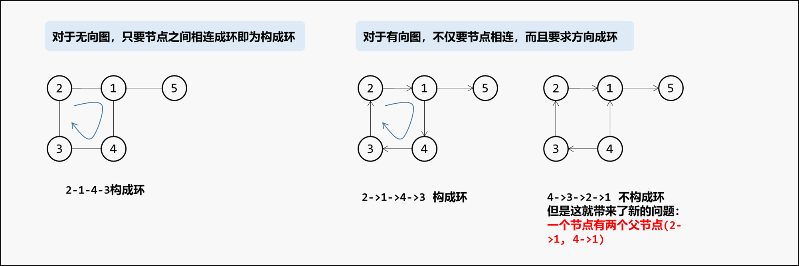
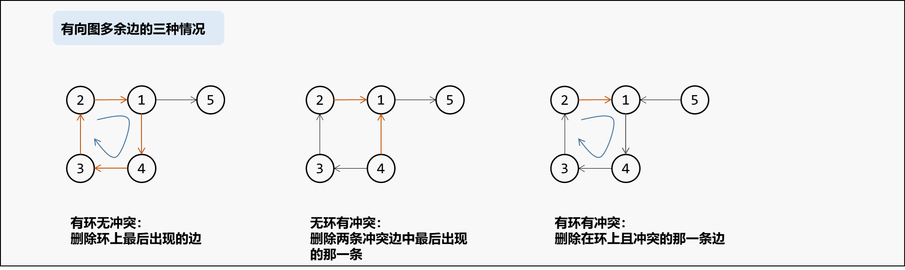
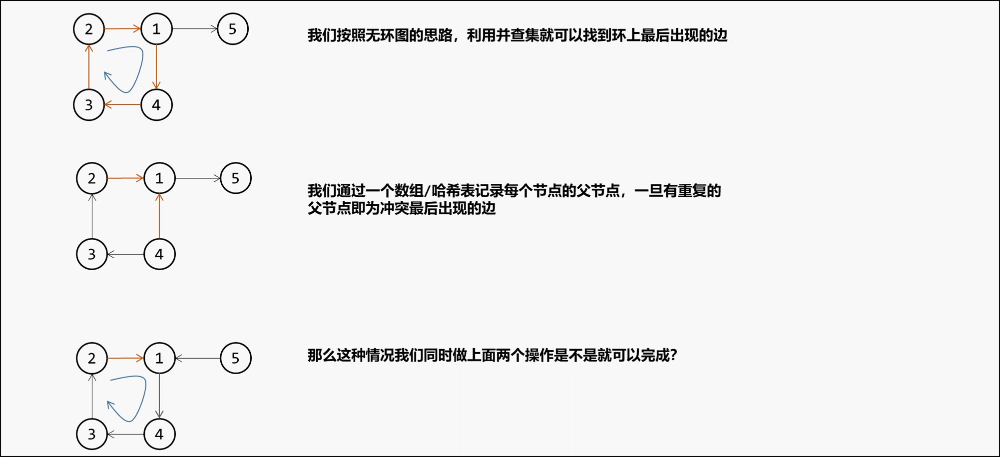
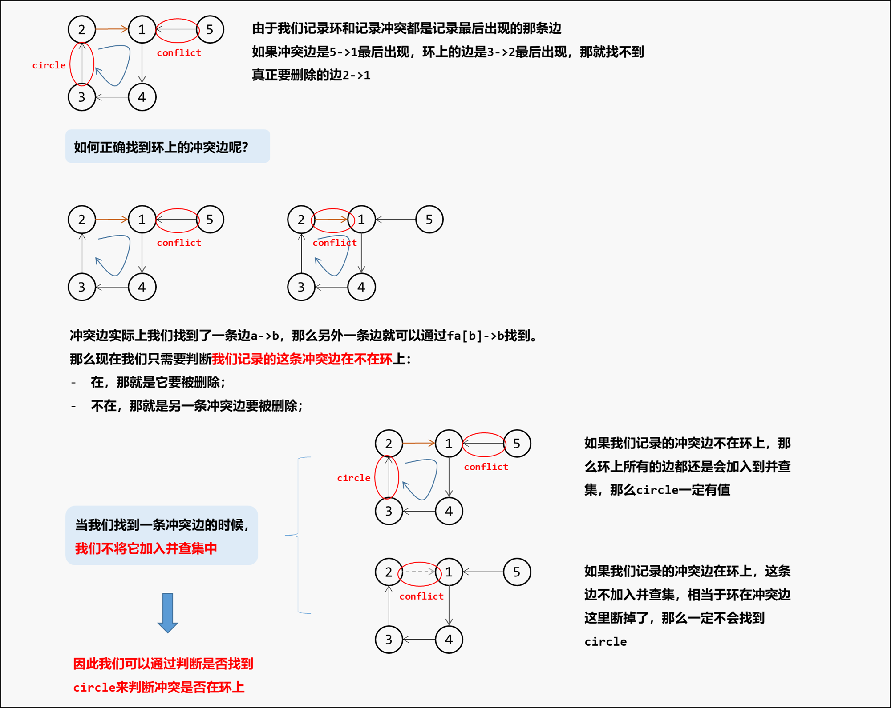

[#0685-redundant-connection-ii]
= 685. 冗余连接 II

https://leetcode.cn/problems/redundant-connection-ii/[LeetCode - 685. 冗余连接 II^]

在本问题中，有根树指满足以下条件的 *有向* 图。该树只有一个根节点，所有其他节点都是该根节点的后继。该树除了根节点之外的每一个节点都有且只有一个父节点，而根节点没有父节点。

输入一个有向图，该图由一个有着 `n` 个节点（节点值不重复，从 `1` 到 `n`）的树及一条附加的有向边构成。附加的边包含在 `1` 到 `n` 中的两个不同顶点间，这条附加的边不属于树中已存在的边。

结果图是一个以边组成的二维数组 `edges`。每个元素是一对 `[u~i~, v~i~]`，用以表示 *有向* 图中连接顶点 `u~i~` 和顶点 `v~i~` 的边，其中 `u~i~` 是 `v~i~` 的一个父节点。

返回一条能删除的边，使得剩下的图是有 `n` 个节点的有根树。若有多个答案，返回最后出现在给定二维数组的答案。

*示例 1：*

....
输入：edges = [[1,2],[1,3],[2,3]]
输出：[2,3]
....

*示例 2：*

....
输入：edges = [[1,2],[2,3],[3,4],[4,1],[1,5]]
输出：[4,1]
....

*提示：*

* `n == edges.length`
* `3 \<= n \<= 1000`
* `edges[i].length == 2`
* `1 \<= u~i~, v~i~ \<= n`

== 思路分析

不仅仅并查集，还要考虑冲突和成不成环，多转了好几个弯。

TIP: 看图示，还要再多思考思考。

[[src-0685]]
[tabs]
====
一刷::
+
--
[{java_src_attr}]
----
include::{sourcedir}/_0685_RedundantConnectionIi.java[tag=answer]
----
--

// 二刷::
// +
// --
// [{java_src_attr}]
// ----
// include::{sourcedir}/_0685_RedundantConnectionIi_2.java[tag=answer]
// ----
// --
====

== 参考资料

. https://leetcode.cn/problems/redundant-connection-ii/solutions/2968513/javapython3cbing-cha-ji-fen-lei-tao-lun-pbklw/[685. 冗余连接 II - 并查集 + 分类讨论：构成冲突或构成环的边【图解】^]
. https://leetcode.cn/problems/redundant-connection-ii/solutions/1761073/-by-coco-e1-m8ft/[685. 冗余连接 II - 分类讨论+并查集，击破hard^]
. https://leetcode.cn/problems/redundant-connection-ii/solutions/416748/rong-yu-lian-jie-ii-by-leetcode-solution/[685. 冗余连接 II - 官方题解^]
