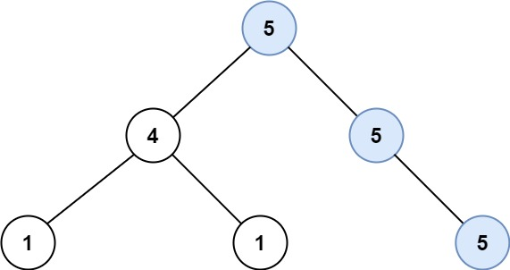
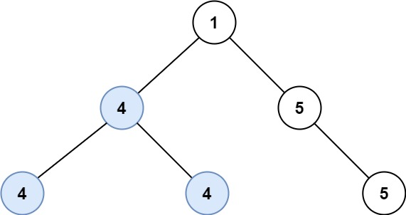
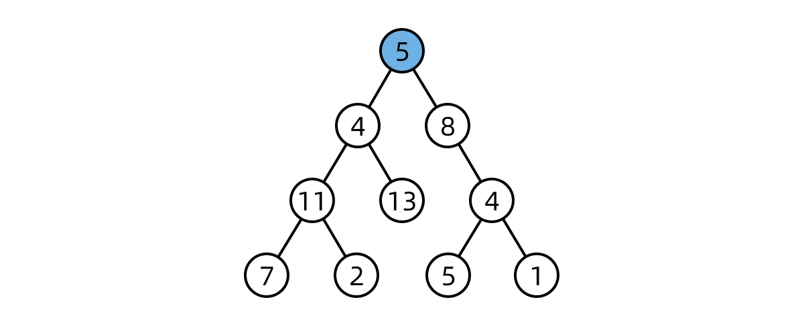

[#0687-longest-univalue-path]
= 687. 最长同值路径

https://leetcode.cn/problems/longest-univalue-path/[LeetCode - 687. 最长同值路径^]

给定一个二叉树的 `root` ，返回 _最长的路径的长度_，这个路径中的 _每个节点具有相同值_。这条路径可以经过也可以不经过根节点。

*两个节点之间的路径长度* 由它们之间的边数表示。

*示例 1:*

....
输入：root = [5,4,5,1,1,5]
输出：2
....

*示例 2:*

....
输入：root = [1,4,5,4,4,5]
输出：2
....

*提示:*

* 树的节点数的范围是 `[0, 10^4^]`
* `-1000 \<= Node.val \<= 1000`
* 树的深度将不超过 `1000`

== 思路分析

深度优先搜索！

[[src-0687]]
[tabs]
====
一刷::
+
--
[{java_src_attr}]
----
include::{sourcedir}/_0687_LongestUnivaluePath.java[tag=answer]
----
--

// 二刷::
// +
// --
// [{java_src_attr}]
// ----
// include::{sourcedir}/_0687_LongestUnivaluePath_2.java[tag=answer]
// ----
// --
====

== 参考资料

. https://leetcode.cn/problems/longest-univalue-path/solutions/815692/yi-pian-wen-zhang-jie-jue-suo-you-er-cha-94j7/[687. 最长同值路径 - 一篇文章解决所有二叉树路径问题（问题分析+分类模板+题目剖析）^]
. https://leetcode.cn/problems/longest-univalue-path/solutions/2227160/shi-pin-che-di-zhang-wo-zhi-jing-dpcong-524j4/[687. 最长同值路径 - 彻底掌握直径 DP！从二叉树到一般树！^]
. https://leetcode.cn/problems/longest-univalue-path/solutions/1790729/zui-chang-tong-zhi-lu-jing-by-leetcode-s-hgfk/[687. 最长同值路径 - 官方题解^]
