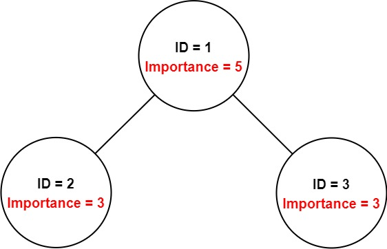
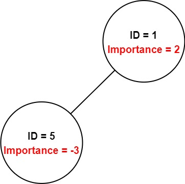

[#0690-employee-importance]
= 690. 员工的重要性

https://leetcode.cn/problems/employee-importance/[LeetCode - 690. 员工的重要性^]

你有一个保存员工信息的数据结构，它包含了员工唯一的 id，重要度和直系下属的 id。

给定一个员工数组 `employees`，其中：

* `employees[i].id` 是第 `i` 个员工的 ID。
* `employees[i].importance` 是第 `i` 个员工的重要度。
* `employees[i].subordinates` 是第 `i` 名员工的直接下属的 ID 列表。

给定一个整数 `id` 表示一个员工的 ID，返回这个员工和他所有下属的重要度的 *总和*。

*示例 1：*

....
输入：employees = [[1,5,[2,3]],[2,3,[]],[3,3,[]]], id = 1
输出：11
解释：
员工 1 自身的重要度是 5 ，他有两个直系下属 2 和 3 ，而且 2 和 3 的重要度均为 3 。因此员工 1 的总重要度是 5 + 3 + 3 = 11 。
....

*示例 2：*

....
输入：employees = [[1,2,[5]],[5,-3,[]]], id = 5
输出：-3
解释：员工 5 的重要度为 -3 并且没有直接下属。
因此，员工 5 的总重要度为 -3。
....

*提示：*

* `1 \<= employees.length \<= 2000`
* `1 \<= employees[i].id \<= 2000`
* 所有的 `employees[i].id` *互不相同*。
* `-100 \<= employees[i].importance \<= 100`
* 一名员工最多有一名直接领导，并可能有多名下属。
* `employees[i].subordinates` 中的 ID 都有效。

== 思路分析

哈希+深度优先搜索。先用 `Map` 建立起 `id` 到用户的映射关系，再深度优先搜索所有下属员工的优先级。

[[src-0690]]
[tabs]
====
一刷::
+
--
[{java_src_attr}]
----
include::{sourcedir}/_0690_EmployeeImportance.java[tag=answer]
----
--

// 二刷::
// +
// --
// [{java_src_attr}]
// ----
// include::{sourcedir}/_0690_EmployeeImportance_2.java[tag=answer]
// ----
// --
====

== 参考资料

. https://leetcode.cn/problems/employee-importance/solutions/2892882/ha-xi-biao-dfspythonjavacgojs-by-endless-rbx0/[690. 员工的重要性 - 哈希表+DFS^]
. https://leetcode.cn/problems/employee-importance/solutions/753331/yuan-gong-de-zhong-yao-xing-by-leetcode-h6xre/[690. 员工的重要性 - 官方题解^]
