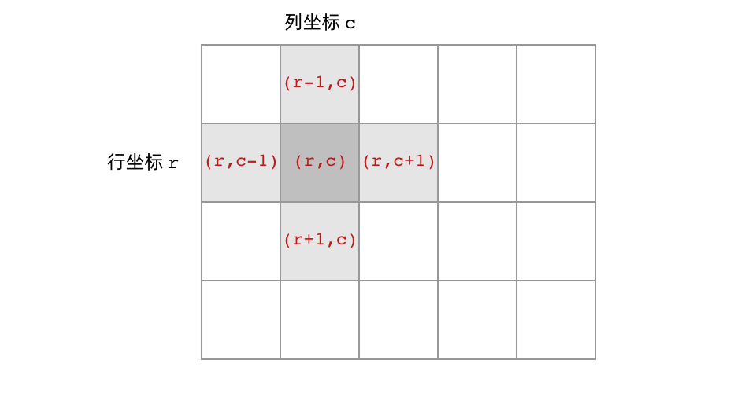

[#0695-max-area-of-island]
= 695. Max Area of Island

https://leetcode.com/problems/max-area-of-island/[LeetCode - Max Area of Island^]

Given a non-empty 2D array `grid` of 0's and 1's, an *island* is a group of `1`'s (representing land) connected 4-directionally (horizontal or vertical.) You may assume all four edges of the grid are surrounded by water.

Find the maximum area of an island in the given 2D array. (If there is no island, the maximum area is 0.)

*Example 1:*

image::images/0695-01.jpg[{image_attr}]

[subs="verbatim,quotes,macros"]
----
[[0,0,1,0,0,0,0,1,0,0,0,0,0],
 [0,0,0,0,0,0,0,1,1,1,0,0,0],
 [0,1,1,0,1,0,0,0,0,0,0,0,0],
 [0,1,0,0,1,1,0,0,*1*,0,*1*,0,0],
 [0,1,0,0,1,1,0,0,*1*,*1*,*1*,0,0],
 [0,0,0,0,0,0,0,0,0,0,*1*,0,0],
 [0,0,0,0,0,0,0,1,1,1,0,0,0],
 [0,0,0,0,0,0,0,1,1,0,0,0,0]]

----
Given the above grid, return `6`. Note the answer is not 11, because the island must be connected 4-directionally.

*Example 2:*

[subs="verbatim,quotes,macros"]
----
[[0,0,0,0,0,0,0,0]]
----
Given the above grid, return `0`.

*Note:* The length of each dimension in the given `grid` does not exceed 50.

== 思路分析

[[src-0695]]
[{java_src_attr}]
----
include::{sourcedir}/_0695_MaxAreaOfIsland.java[tag=answer]
----

== 参考资料

. https://leetcode.cn/problems/max-area-of-island/solutions/147677/dao-yu-de-zui-da-mian-ji-by-leetcode-solution/[695. 岛屿的最大面积 - 官方题解^]
. https://leetcode.cn/problems/max-area-of-island/solutions/150127/biao-zhun-javadong-tai-gui-hua-jie-fa-100-by-mark-/[695. 岛屿的最大面积 - Java标准DFS解法，100%，无全局变量。简洁易懂。^]

