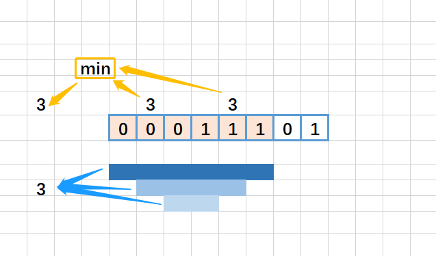

[#0696-count-binary-substrings]
= 696. 计数二进制子串

https://leetcode.cn/problems/count-binary-substrings/[LeetCode - 696. 计数二进制子串^]

给定一个字符串 `s`，统计并返回具有相同数量 `0` 和 `1` 的非空（连续）子字符串的数量，并且这些子字符串中的所有 `0` 和所有 `1` 都是成组连续的。

重复出现（不同位置）的子串也要统计它们出现的次数。

*示例 1：*

....
输入：s = "00110011"
输出：6
解释：6 个子串满足具有相同数量的连续 1 和 0 ："0011"、"01"、"1100"、"10"、"0011" 和 "01" 。
注意，一些重复出现的子串（不同位置）要统计它们出现的次数。
另外，"00110011" 不是有效的子串，因为所有的 0（还有 1 ）没有组合在一起。
....

*示例 2：*

....
输入：s = "10101"
输出：4
解释：有 4 个子串："10"、"01"、"10"、"01" ，具有相同数量的连续 1 和 0 。
....

*提示：*

* `1 \<= s.length \<= 10^5^`
* `s[i]` 为 `0` 或 `1`

== 思路分析

统计每段相同数字的长度，跟前段相比，取最小值。

[[src-0696]]
[tabs]
====
一刷::
+
--
[{java_src_attr}]
----
include::{sourcedir}/_0696_CountBinarySubstrings.java[tag=answer]
----
--

// 二刷::
// +
// --
// [{java_src_attr}]
// ----
// include::{sourcedir}/_0696_CountBinarySubstrings_2.java[tag=answer]
// ----
// --
====

== 参考资料

. https://leetcode.cn/problems/count-binary-substrings/solutions/3898025/yi-ci-bian-li-jian-ji-xie-fa-pythonjavac-0mdk/[696. 计数二进制子串 - 一次遍历，简洁写法^]
. https://leetcode.cn/problems/count-binary-substrings/solutions/367704/ji-shu-er-jin-zhi-zi-chuan-by-leetcode-solution/[696. 计数二进制子串 - 官方题解^]
. https://leetcode.cn/problems/count-binary-substrings/solutions/368133/count-binary-substrings-by-ikaruga/[696. 计数二进制子串 - 图解^]
