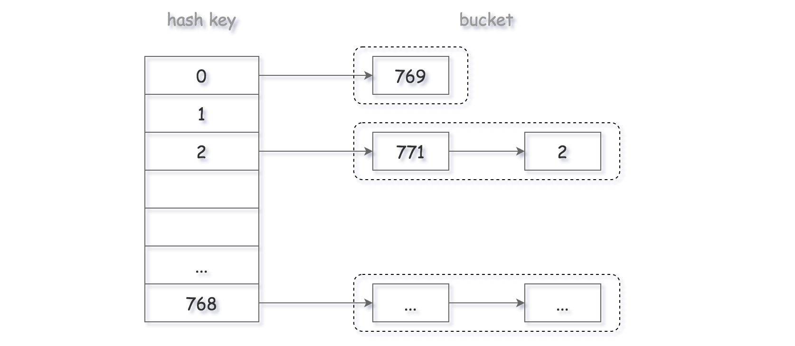

[#0705-design-hashset]
= 705. 设计哈希集合

https://leetcode.cn/problems/design-hashset/[LeetCode - 705. 设计哈希集合 ^]

不使用任何内建的哈希表库设计一个哈希集合（HashSet）。

实现 `MyHashSet` 类：

* `void add(key)` 向哈希集合中插入值 `key` 。
* `bool contains(key)` 返回哈希集合中是否存在这个值 `key` 。
* `void remove(key)` 将给定值 `key`
从哈希集合中删除。如果哈希集合中没有这个值，什么也不做。

*示例：*

....
输入：
["MyHashSet", "add", "add", "contains", "contains", "add", "contains", "remove", "contains"]
[[], [1], [2], [1], [3], [2], [2], [2], [2]]
输出：
[null, null, null, true, false, null, true, null, false]

解释：
MyHashSet myHashSet = new MyHashSet();
myHashSet.add(1);      // set = [1]
myHashSet.add(2);      // set = [1, 2]
myHashSet.contains(1); // 返回 True
myHashSet.contains(3); // 返回 False ，（未找到）
myHashSet.add(2);      // set = [1, 2]
myHashSet.contains(2); // 返回 True
myHashSet.remove(2);   // set = [1]
myHashSet.contains(2); // 返回 False ，（已移除）
....

*提示：*

* `0 \<= key \<= 10^6^`
* 最多调用 `10^4^` 次 `add`、`remove` 和 `contains`

== 思路分析

三种解决冲突的办法：

. 拉链法
. 开放地址法
. 再哈希法

[[src-0705]]
[tabs]
====
一刷::
+
--
[{java_src_attr}]
----
include::{sourcedir}/_0705_DesignHashset.java[tag=answer]
----
--

// 二刷::
// +
// --
// [{java_src_attr}]
// ----
// include::{sourcedir}/_0705_DesignHashset_2.java[tag=answer]
// ----
// --
====

== 参考资料

. https://leetcode.cn/problems/design-hashset/solutions/652778/she-ji-ha-xi-ji-he-by-leetcode-solution-xp4t/[705. 设计哈希集合 - 官方题解^]
. https://leetcode.cn/problems/design-hashset/solutions/653252/xiang-jie-hashset-de-she-ji-zai-shi-jian-4plc/[705. 设计哈希集合 - 详解 HashSet 的设计：在时间和空间上做权衡^]
. https://leetcode.cn/problems/design-hashset/solutions/653184/yi-ti-san-jie-jian-dan-shu-zu-lian-biao-nj3dg/[705. 设计哈希集合 - 【宫水三叶】一题三解：「简单数组」&「链表」& 「分桶数组」^]

