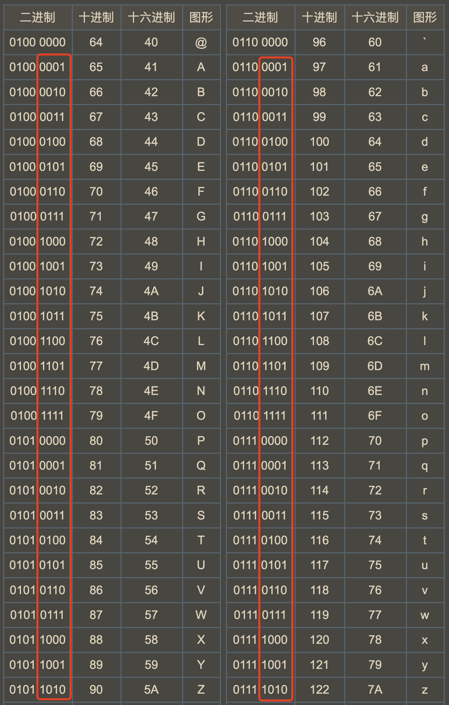

[#0709-to-lower-case]
= 709. 转换成小写字母

https://leetcode.cn/problems/to-lower-case/[LeetCode - 709. 转换成小写字母^]

给你一个字符串 `s`，将该字符串中的大写字母转换成相同的小写字母，返回新的字符串。

*示例 1：*

....
输入：s = "Hello"
输出："hello"
....

*示例 2：*

....
输入：s = "here"
输出："here"
....

*示例 3：*

....
输入：s = "LOVELY"
输出："lovely"
....

*提示：*

* `1 \<= s.length \<= 100`
* `s` 由 ASCII 字符集中的可打印字符组成

== 思路分析

通过字符加减完成转换，也可以调用原始库函数。

TIP: 原来“大小字母之间是差32”是有意为之：大小写字母后四位二进制相同；大小写字母前四位二进制就第三位不同，只需要对一个bit位操作就可以实现大小写之间的切换。

[[src-0709]]
[tabs]
====
一刷::
+
--
[{java_src_attr}]
----
include::{sourcedir}/_0709_ToLowerCase.java[tag=answer]
----
--

// 二刷::
// +
// --
// [{java_src_attr}]
// ----
// include::{sourcedir}/_0709_ToLowerCase_2.java[tag=answer]
// ----
// --
====

== 参考资料

. https://leetcode.cn/problems/to-lower-case/solutions/766281/ming-ming-zhi-you-26ge-zi-mu-wei-shi-yao-d2ec/[709. 转换成小写字母 - 明明只有26个字母,为什么大小字母之间是差32而不是26？^] -- 这个分析透彻！还讲了一些故事！
. https://leetcode.cn/problems/to-lower-case/solutions/1151839/zhuan-huan-cheng-xiao-xie-zi-mu-by-leetc-5e29/[709. 转换成小写字母 - 官方题解^]
. https://en.wikipedia.org/wiki/ASCII[ASCII - Wikipedia^]
