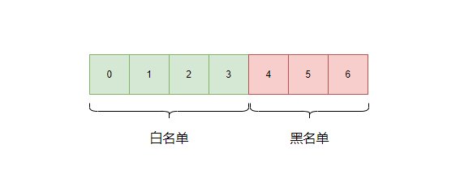
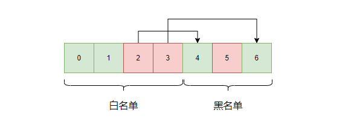

[#0710-random-pick-with-blacklist]
= 710. Random Pick with Blacklist

https://leetcode.com/problems/random-pick-with-blacklist/[LeetCode - Random Pick with Blacklist^]

Given a blacklist `B` containing unique integers from `[0, N)`, write a function to return a uniform random integer from `[0, N)` which is *NOT* in `B`.

Optimize it such that it minimizes the call to system&rsquo;s `Math.random()`.

*Note:*

. `1 <= N <= 1000000000`
. `0 <= B.length < min(100000, N)`
. `[0, N)` does NOT include N. See https://en.wikipedia.org/wiki/Interval_(mathematics)[interval notation^].

*Example 1:*

[subs="verbatim,quotes,macros"]
----
*Input:*
 ["Solution","pick","pick","pick"]
 [[1,[]],[],[],[]]
*Output:* [null,0,0,0]
----

*Example 2:*

[subs="verbatim,quotes,macros"]
----
*Input:*
 ["Solution","pick","pick","pick"]
 [[2,[]],[],[],[]]
*Output:* [null,1,1,1]
----

*Example 3:*

[subs="verbatim,quotes,macros"]
----
*Input:*
 ["Solution","pick","pick","pick"]
 [[3,[1]],[],[],[]]
*Output:* [null,0,0,2]
----

*Example 4:*

[subs="verbatim,quotes,macros"]
----
*Input:*
 ["Solution","pick","pick","pick"]
 [[4,[2]],[],[],[]]
*Output:* [null,1,3,1]
----

*Explanation of Input Syntax:*

The input is two lists: the subroutines called and their arguments. `Solution`'s constructor has two arguments, `N` and the blacklist `B`. `pick` has no arguments. Arguments are always wrapped with a list, even if there aren't any.

== 思路分析

[[src-0710]]
[{java_src_attr}]
----
include::{sourcedir}/_0710_RandomPickWithBlacklist.java[tag=answer]
----

