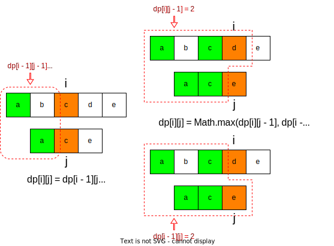

[#0712-minimum-ascii-delete-sum-for-two-strings]
= 712. 两个字符串的最小ASCII删除和

https://leetcode.cn/problems/minimum-ascii-delete-sum-for-two-strings/[LeetCode - 712. 两个字符串的最小ASCII删除和^]

给定两个字符串 `s1` 和 `s2`，返回 _使两个字符串相等所需删除字符的 **ASCII** 值的最小和_。

*示例 1:*

....
输入: s1 = "sea", s2 = "eat"
输出: 231
解释: 在 "sea" 中删除 "s" 并将 "s" 的值(115)加入总和。
在 "eat" 中删除 "t" 并将 116 加入总和。
结束时，两个字符串相等，115 + 116 = 231 就是符合条件的最小和。
....

*示例 2:*

....
输入: s1 = "delete", s2 = "leet"
输出: 403
解释: 在 "delete" 中删除 "dee" 字符串变成 "let"，
将 100[d]101[e]101[e] 加入总和。在 "leet" 中删除 "e" 将 101[e] 加入总和。
结束时，两个字符串都等于 "let"，结果即为 100101101+101 = 403 。
如果改为将两个字符串转换为 "lee" 或 "eet"，我们会得到 433 或 417 的结果，比答案更大。
....

*提示:*

* `0 \<= s1.length, s2.length \<= 1000`
* `s1` 和 `s2` 由小写英文字母组成

== 思路分析

动态规划！

从后向前，如果遇到相等字符串则向前移动，否则舍弃其中一个结尾，向前探索。

image::images/0712-11.svg[{image_attr}]

image::images/0712-12.svg[{image_attr}]

[[src-0712]]
[tabs]
====
一刷(暴力破解)::
+
--
[{java_src_attr}]
----
include::{sourcedir}/_0712_MinimumAsciiDeleteSumForTwoStrings_1a.java[tag=answer]
----
--

一刷(备忘录)::
+
--
[{java_src_attr}]
----
include::{sourcedir}/_0712_MinimumAsciiDeleteSumForTwoStrings_1a.java[tag=answer]
----
--

// 二刷::
// +
// --
// [{java_src_attr}]
// ----
// include::{sourcedir}/_0712_MinimumAsciiDeleteSumForTwoStrings_2.java[tag=answer]
// ----
// --
====

== 参考资料

. https://leetcode.cn/problems/minimum-ascii-delete-sum-for-two-strings/solutions/1629453/by-lfool-lfpu/[712. 两个字符串的最小ASCII删除和 - 最长公共子序列 (LCS)：「模版」&「输出」^]
. https://leetcode.cn/problems/minimum-ascii-delete-sum-for-two-strings/solutions/3053336/ling-shen-dpti-dan-da-qia-ji-yi-hua-di-t-znkt/[712. 两个字符串的最小ASCII删除和 - 🍭灵神dp题单打卡，记忆化，递推，递归🍭^]
. https://leetcode.cn/problems/minimum-ascii-delete-sum-for-two-strings/solutions/3869951/kao-lu-zui-duo-bao-liu-de-ascii-zhi-he-p-ijdc/[712. 两个字符串的最小ASCII删除和 - 正难则反：计算最多保留的 ASCII 之和^]
. https://leetcode.cn/problems/minimum-ascii-delete-sum-for-two-strings/solutions/1712998/liang-ge-zi-fu-chuan-de-zui-xiao-asciish-xllf/[712. 两个字符串的最小ASCII删除和 - 官方题解^]
