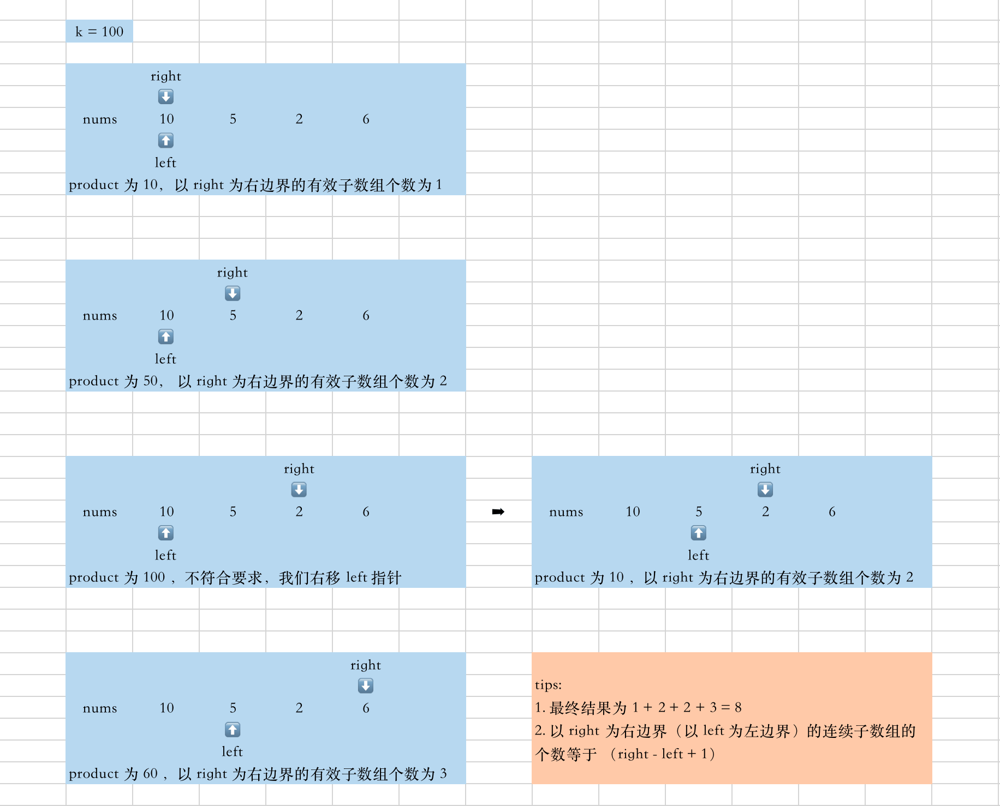

[#0713-subarray-product-less-than-k]
= 713. Subarray Product Less Than K

https://leetcode.com/problems/subarray-product-less-than-k/[LeetCode - Subarray Product Less Than K]

Your are given an array of positive integers `nums`.
Count and print the number of (contiguous) subarrays where the product of all the elements in the subarray is less than `k`.

*Example 1:*

[subs="verbatim,quotes,macros"]
----
*Input:* nums = [10, 5, 2, 6], k = 100
*Output:* 8
*Explanation:* The 8 subarrays that have product less than 100 are: [10], [5], [2], [6], [10, 5], [5, 2], [2, 6], [5, 2, 6].
Note that [10, 5, 2] is not included as the product of 100 is not strictly less than k.
----

*Note:*
. `0 < nums.length <= 50000`.</li>
. `0 < nums[i] < 1000`.</li>
. `0 <= k < 10^6`.</li>

[[src-0713]]
[{java_src_attr}]
----
include::{sourcedir}/_0713_SubarrayProductLessThanK.java[]
----

== 参考资料

. https://leetcode.cn/problems/subarray-product-less-than-k/solutions/1320871/jian-dan-yi-dong-xiang-xi-zhu-jie-shuang-jvy3/[713. 乘积小于 K 的子数组 - 官方思路秒懂○注释详细○双指针滑窗 【附通用滑窗模板】^]
. https://leetcode.cn/problems/subarray-product-less-than-k/solutions/1373555/hua-dong-chuang-kou-by-fenjue-xvg5/[713. 乘积小于 K 的子数组 - 变长滑动窗口，理解窗口含义^]
. https://leetcode.cn/problems/subarray-product-less-than-k/solutions/1389823/by-programmercoding-hqm4/[713. 乘积小于 K 的子数组 - 滑动窗口^]
. https://leetcode.cn/problems/subarray-product-less-than-k/solutions/1959538/xia-biao-zong-suan-cuo-qing-kan-zhe-by-e-jebq/[713. 乘积小于 K 的子数组 - 【视频讲解】不定长滑窗：求方案数^]
