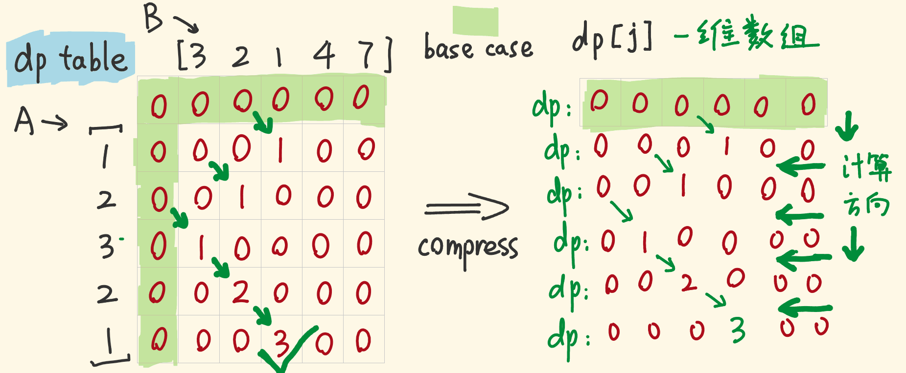

[#0718-maximum-length-of-repeated-subarray]
= 718. 最长重复子数组

https://leetcode.cn/problems/maximum-length-of-repeated-subarray/[LeetCode - 718. 最长重复子数组 ^]

给两个整数数组 `nums1` 和 `nums2` ，返回 _两个数组中 *公共的*、长度最长的子数组的长度 _。

*示例 1：*

....
输入：nums1 = [1,2,3,2,1], nums2 = [3,2,1,4,7]
输出：3
解释：长度最长的公共子数组是 [3,2,1] 。
....

*示例 2：*

....
输入：nums1 = [0,0,0,0,0], nums2 = [0,0,0,0,0]
输出：5
....

*提示：*

* `+1 <= nums1.length, nums2.length <= 1000+`
* `+0 <= nums1[i], nums2[i] <= 100+`

== 思路分析

动态规划：

image::images/0718-01.png[{image_attr}]

image::images/0718-02.png[{image_attr}]

TIP: 这里求的是公共子数组，只能在两个字符相等时，在上一个字符的基础上加 `1`，否则就应该设置为 `0`。不能取 `min{dp[i-1][j], dp[i][j-1]}`。

滑动窗口的解法非常妙！

image:images/0718-01.gif[{image_attr}]

[[src-0718]]
[tabs]
====
一刷::
+
--
[{java_src_attr}]
----
include::{sourcedir}/_0718_MaximumLengthOfRepeatedSubarray.java[tag=answer]
----
--

二刷::
+
--
[{java_src_attr}]
----
include::{sourcedir}/_0718_MaximumLengthOfRepeatedSubarray_2.java[tag=answer]
----
--
====

== 参考资料

. https://leetcode.cn/problems/maximum-length-of-repeated-subarray/solutions/310099/zui-chang-zhong-fu-zi-shu-zu-by-leetcode-solution/[718. 最长重复子数组 - 官方题解^]
. https://leetcode.cn/problems/maximum-length-of-repeated-subarray/solutions/28583/wu-li-jie-fa-by-stg-2/[718. 最长重复子数组 - 滑动窗口解法^]
. https://leetcode.cn/problems/maximum-length-of-repeated-subarray/solutions/310509/zhe-yao-jie-shi-ken-ding-jiu-dong-liao-by-hyj8/[718. 最长重复子数组 -「手画图解」动态规划 思路解析^]

