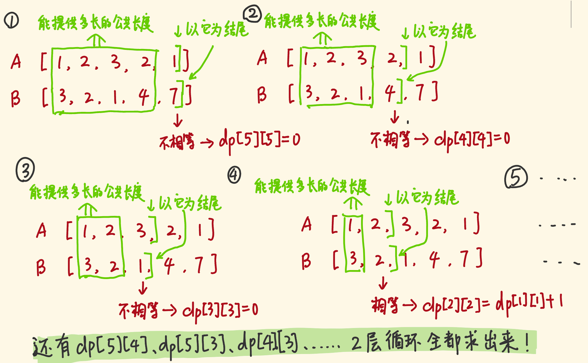

[#0718-maximum-length-of-repeated-subarray]
= 718. 最长重复子数组

https://leetcode.cn/problems/maximum-length-of-repeated-subarray/[LeetCode - 718. 最长重复子数组^]

给两个整数数组 `nums1` 和 `nums2` ，返回 _两个数组中 *公共的*、长度最长的子数组的长度_。

*示例 1：*

....
输入：nums1 = [1,2,3,2,1], nums2 = [3,2,1,4,7]
输出：3
解释：长度最长的公共子数组是 [3,2,1] 。
....

*示例 2：*

....
输入：nums1 = [0,0,0,0,0], nums2 = [0,0,0,0,0]
输出：5
....

*提示：*

* `+1 <= nums1.length, nums2.length <= 1000+`
* `+0 <= nums1[i], nums2[i] <= 100+`

== 思路分析

该题的暴力破解解法可以看出，*深度优先遍历不一定都能从一个入口遍历完，可能还需要多个入口。*

动态规划：

image::images/0718-02.png[{image_attr}]

image::images/0718-03.png[{image_attr}]

[TIP]
====
这里求的是公共子数组，只能在两个字符相等时，在上一个字符的基础上加 `1`，否则就应该设置为 `0`。不能取 `min{dp[i-1][j], dp[i][j-1]}`。

对比 xref:1143-longest-common-subsequence.adoc[1143. Longest Common Subsequence]，注意区分“子数组”和“子序列”的区别。

对比 xref:0718-maximum-length-of-repeated-subarray.adoc[718. 最长重复子数组] 和 xref:1143-longest-common-subsequence.adoc[1143. Longest Common Subsequence] 两道题的差异：

. 对于求子数组来说：
.. 使用深度优先遍历的暴力破解方法，当不符合子数组约束时，递归被终止。如果只用一个入口无法覆盖全部场景，必须使用循环尝试多个入口才能覆盖掉。
.. 使用动态规划时，只需要更新符合条件的情况即可，其他情况无需更新。
. 对于求子序列来讲：
.. 使用深度优先遍历的暴力破解方法，不会中间终止，递归过程会覆盖全部场景，所以，只需要一个入口即可。
.. 使用动态规划时，每一个节点都是前一个节点的累加或者两个节点的最大值，所以，任何情况都需要更新。
====

滑动窗口的解法非常妙！

image:images/0718-01.gif[{image_attr}]

[[src-0718]]
[tabs]
====
一刷::
+
--
[{java_src_attr}]
----
include::{sourcedir}/_0718_MaximumLengthOfRepeatedSubarray.java[tag=answer]
----
--

二刷::
+
--
[{java_src_attr}]
----
include::{sourcedir}/_0718_MaximumLengthOfRepeatedSubarray_2.java[tag=answer]
----
--

三刷::
+
--
[{java_src_attr}]
----
include::{sourcedir}/_0718_MaximumLengthOfRepeatedSubarray_3.java[tag=answer]
----
--

三刷（暴力破解）::
+
--
[{java_src_attr}]
----
include::{sourcedir}/_0718_MaximumLengthOfRepeatedSubarray_31a.java[tag=answer]
----
--

三刷（备忘录）::
+
--
[{java_src_attr}]
----
include::{sourcedir}/_0718_MaximumLengthOfRepeatedSubarray_31b.java[tag=answer]
----
--

三刷（动态规划）::
+
--
[{java_src_attr}]
----
include::{sourcedir}/_0718_MaximumLengthOfRepeatedSubarray_31c.java[tag=answer]
----
--
====

== 参考资料

. https://leetcode.cn/problems/maximum-length-of-repeated-subarray/solutions/310099/zui-chang-zhong-fu-zi-shu-zu-by-leetcode-solution/[718. 最长重复子数组 - 官方题解^]
. https://leetcode.cn/problems/maximum-length-of-repeated-subarray/solutions/28583/wu-li-jie-fa-by-stg-2/[718. 最长重复子数组 - 滑动窗口解法^]
. https://leetcode.cn/problems/maximum-length-of-repeated-subarray/solutions/310509/zhe-yao-jie-shi-ken-ding-jiu-dong-liao-by-hyj8/[718. 最长重复子数组 -「手画图解」动态规划 思路解析^]

