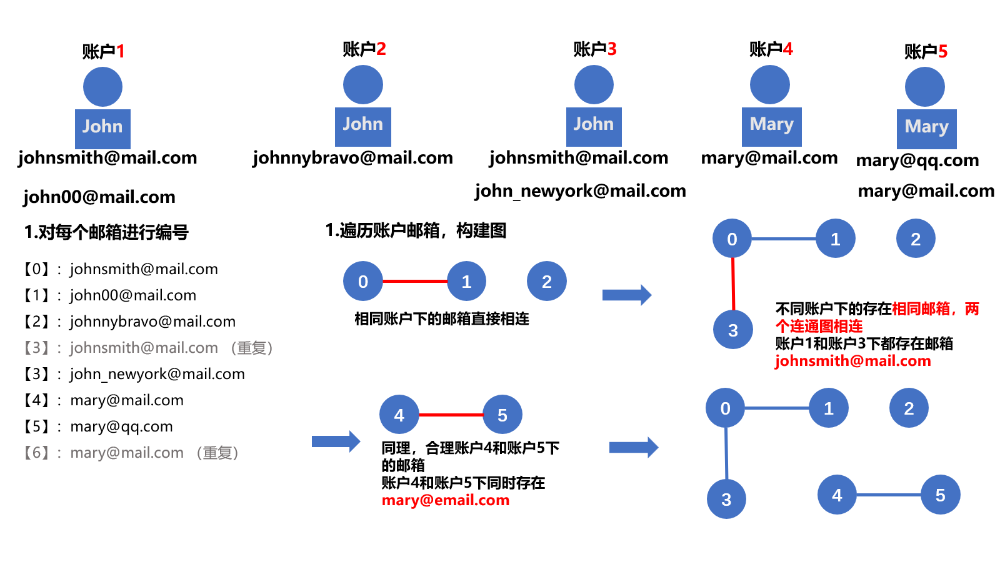

[#0721-accounts-merge]
= 721. 账户合并

https://leetcode.cn/problems/accounts-merge/[LeetCode - 721. 账户合并 ^]

给定一个列表 `accounts`，每个元素 `accounts[i]` 是一个字符串列表，其中第一个元素 `accounts[i][0]` 是 _名称 (name)_，其余元素是 *_emails_* 表示该账户的邮箱地址。

现在，我们想合并这些账户。如果两个账户都有一些共同的邮箱地址，则两个账户必定属于同一个人。请注意，即使两个账户具有相同的名称，它们也可能属于不同的人，因为人们可能具有相同的名称。一个人最初可以拥有任意数量的账户，但其所有账户都具有相同的名称。

合并账户后，按以下格式返回账户：每个账户的第一个元素是名称，其余元素是 *按字符 ASCII 顺序排列* 的邮箱地址。账户本身可以以 *任意顺序* 返回。

*示例 1：*

....
输入：accounts = [
       ["John", "johnsmith@mail.com", "john00@mail.com"],
       ["John", "johnnybravo@mail.com"],
       ["John", "johnsmith@mail.com", "john_newyork@mail.com"],
       ["Mary", "mary@mail.com"]
     ]
输出：[
       ["John", 'john00@mail.com', 'john_newyork@mail.com', 'johnsmith@mail.com'],
       ["John", "johnnybravo@mail.com"],
       ["Mary", "mary@mail.com"]
     ]
解释：
第一个和第三个 John 是同一个人，因为他们有共同的邮箱地址 "johnsmith@mail.com"。
第二个 John 和 Mary 是不同的人，因为他们的邮箱地址没有被其他帐户使用。
可以以任何顺序返回这些列表，例如答案 [['Mary'，'mary@mail.com']，['John'，'johnnybravo@mail.com']，
['John'，'john00@mail.com'，'john_newyork@mail.com'，'johnsmith@mail.com']] 也是正确的。
....

*示例 2：*

....
输入：accounts = [
       ["Gabe","Gabe0@m.co","Gabe3@m.co","Gabe1@m.co"],
       ["Kevin","Kevin3@m.co","Kevin5@m.co","Kevin0@m.co"],
       ["Ethan","Ethan5@m.co","Ethan4@m.co","Ethan0@m.co"],
       ["Hanzo","Hanzo3@m.co","Hanzo1@m.co","Hanzo0@m.co"],
       ["Fern","Fern5@m.co","Fern1@m.co","Fern0@m.co"]
     ]
输出：[
       ["Ethan","Ethan0@m.co","Ethan4@m.co","Ethan5@m.co"],
       ["Gabe","Gabe0@m.co","Gabe1@m.co","Gabe3@m.co"],
       ["Hanzo","Hanzo0@m.co","Hanzo1@m.co","Hanzo3@m.co"],
       ["Kevin","Kevin0@m.co","Kevin3@m.co","Kevin5@m.co"],
       ["Fern","Fern0@m.co","Fern1@m.co","Fern5@m.co"]
     ]
....

*提示：*

* `+1 <= accounts.length <= 1000+`
* `+2 <= accounts[i].length <= 10+`
* `+1 <= accounts[i][j].length <= 30+`
* `accounts[i][0]` 由英文字母组成
* `accounts[i][j] (for j > 0)` 是有效的邮箱地址

== 思路分析

并查集。

通过邮箱编号建立连接，而不是通过账户索引建立连接。

image::images/0721-10.png[{image_attr}]

也可以使用深度优先遍历。

还有一个解法：

将后续账户中出现重复的情况时，添加到前面的账户中。相比并查集，代码更简单一些。

[[src-0721]]
[tabs]
====
一刷::
+
--
[{java_src_attr}]
----
include::{sourcedir}/_0721_AccountsMerge.java[tag=answer]
----
--

二刷::
+
--
[{java_src_attr}]
----
include::{sourcedir}/_0721_AccountsMerge_2.java[tag=answer]
----
--
====

== 参考资料

. https://leetcode.cn/problems/accounts-merge/solutions/564305/zhang-hu-he-bing-by-leetcode-solution-3dyq/[721. 账户合并 - 官方题解^]
. https://leetcode.cn/problems/accounts-merge/solutions/2844186/ha-xi-biao-dfspythonjavacgojsrust-by-end-z9nh/[721. 账户合并 - 哈希表 + DFS^]
. https://leetcode.cn/problems/accounts-merge/solutions/564451/tu-jie-yi-ran-shi-bing-cha-ji-by-yexiso-5ncf/[721. 账户合并 - 【图解】依然是并查集^]
. https://leetcode.cn/problems/accounts-merge/solutions/2844329/qu-qiao-de-fang-fa-3miao-kan-dong-si-wei-llcx/[721. 账户合并 - 取巧的减治方法，3秒看懂，思维难度小，复杂度就大，图一乐 :)^]
