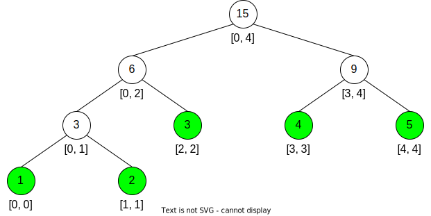

[#0729-my-calendar-i]
= 729. 我的日程安排表 I

https://leetcode.cn/problems/my-calendar-i/[LeetCode - 729. 我的日程安排表 I^]

实现一个 `MyCalendar` 类来存放你的日程安排。如果要添加的日程安排不会造成 *重复预订*，则可以存储这个新的日程安排。

当两个日程安排有一些时间上的交叉时（例如两个日程安排都在同一时间内），就会产生 *重复预订*。

日程可以用一对整数 `start` 和 `end` 表示，这里的时间是半开区间，即 `[start, end)`, 实数 `x` 的范围为，`start \<= x < end`。

实现 `MyCalendar` 类：

* `MyCalendar()` 初始化日历对象。
* `boolean book(int start, int end)` 如果可以将日程安排成功添加到日历中而不会导致重复预订，返回 `true`。否则，返回 `false` 并且不要将该日程安排添加到日历中。

*示例：*

....
输入：
["MyCalendar", "book", "book", "book"]
[[], [10, 20], [15, 25], [20, 30]]
输出：
[null, true, false, true]

解释：
MyCalendar myCalendar = new MyCalendar();
myCalendar.book(10, 20); // return True
myCalendar.book(15, 25); // return False ，这个日程安排不能添加到日历中，因为时间 15 已经被另一个日程安排预订了。
myCalendar.book(20, 30); // return True ，这个日程安排可以添加到日历中，因为第一个日程安排预订的每个时间都小于 20 ，且不包含时间 20 。
....

*提示：*

* `0 \<= start < end \<= 10^9^`
* 每个测试用例，调用 `book` 方法的次数最多不超过 `1000` 次。

== 思路分析

维持一个排序的链表，直接遍历查找或者使用二分查找。更高级的用法是线段树。

[[src-0729]]
[tabs]
====
一刷::
+
--
[{java_src_attr}]
----
include::{sourcedir}/_0729_MyCalendarI.java[tag=answer]
----
--

// 二刷::
// +
// --
// [{java_src_attr}]
// ----
// include::{sourcedir}/_0729_MyCalendarI_2.java[tag=answer]
// ----
// --
====

== 参考资料

. https://leetcode.cn/problems/my-calendar-i/solutions/1643942/wo-de-ri-cheng-an-pai-biao-i-by-leetcode-nlxr/[729. 我的日程安排表 I - 官方题解^]
. https://leetcode.cn/problems/my-calendar-i/solutions/1646079/by-lfool-xvpv/[729. 我的日程安排表 I - 线段树详解「汇总级别整理 🔥🔥🔥」^]
. https://leetcode.cn/problems/my-calendar-i/solutions/1646389/by-ac_oier-hnjl/[729. 我的日程安排表 I - 一题三解 :「模拟」&「线段树（动态开点）」&「分块 + 位运算（分桶）」^]
