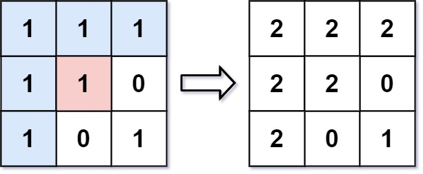

[#0733-flood-fill]
= 733. 图像渲染

https://leetcode.cn/problems/flood-fill/[LeetCode - 733. 图像渲染^]

有一幅以 `m x n` 的二维整数数组表示的图画 `image`，其中 `image[i][j]` 表示该图画的像素值大小。你也被给予三个整数 `sr`,  `sc` 和 `color`。你应该从像素 `image[sr][sc]` 开始对图像进行上色 *填充*。

为了完成 *上色工作*：

. 从初始像素开始，将其颜色改为 `color`。
. 对初始坐标的 *上下左右四个方向上* 相邻且与初始像素的原始颜色同色的像素点执行相同操作。
. 通过检查与初始像素的原始颜色相同的相邻像素并修改其颜色来继续 *重复* 此过程。
. 当 *没有* 其它原始颜色的相邻像素时 *停止* 操作。

最后返回经过上色渲染 *修改* 后的图像 。

*示例 1:*

**输入：**image = [[1,1,1],[1,1,0],[1,0,1]]，sr = 1, sc = 1, color = 2

*输出：*[[2,2,2],[2,2,0],[2,0,1]]

**解释：**在图像的正中间，坐标
`+(sr,sc)=(1,1)+` （即红色像素）,在路径上所有符合条件的像素点的颜色都被更改成相同的新颜色（即蓝色像素）。

注意，右下角的像素 *没有* 更改为2，因为它不是在上下左右四个方向上与初始点相连的像素点。

*示例 2:*

**输入：**image = [[0,0,0],[0,0,0]], sr = 0, sc = 0, color = 0

*输出：*[[0,0,0],[0,0,0]]

**解释：**初始像素已经用 0 着色，这与目标颜色相同。因此，不会对图像进行任何更改。

*提示:*

* `m == image.length`
* `n == image[i].length`
* `1 \<= m, n \<= 50`
* `0 \<= image[i][j], color < 2^16^
* `0 \<= sr < m`
* `0 \<= sc < n`

== 思路分析

深度优先遍历。

[[src-0733]]
[tabs]
====
一刷::
+
--
[{java_src_attr}]
----
include::{sourcedir}/_0733_FloodFill.java[tag=answer]
----
--

// 二刷::
// +
// --
// [{java_src_attr}]
// ----
// include::{sourcedir}/_0733_FloodFill_2.java[tag=answer]
// ----
// --
====

== 参考资料

. https://leetcode.cn/problems/flood-fill/solutions/375836/tu-xiang-xuan-ran-by-leetcode-solution/[733. 图像渲染 - 官方题解^]
