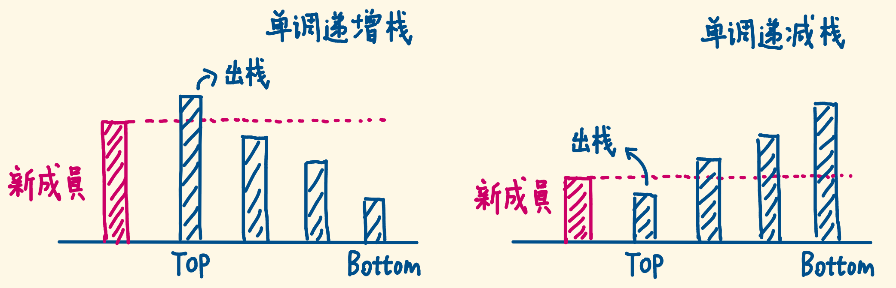
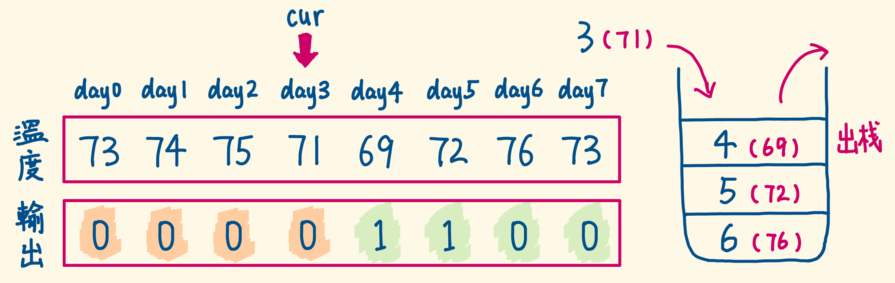

[#0739-daily-temperatures]
= 739. 每日温度

https://leetcode.cn/problems/daily-temperatures/[LeetCode - 739. 每日温度^]

给定一个整数数组 `temperatures` ，表示每天的温度，返回一个数组 `answer` ，其中 `answer[i]` 是指对于第
`i` 天，下一个更高温度出现在几天后。如果气温在这之后都不会升高，请在该位置用 `0` 来代替。

*示例 1:*

....
输入: temperatures = [73,74,75,71,69,72,76,73]
输出: [1,1,4,2,1,1,0,0]
....

*示例 2:*

....
输入: temperatures = [30,40,50,60]
输出: [1,1,1,0]
....

*示例 3:*

....
输入: temperatures = [30,60,90]
输出: [1,1,0]
....

*提示：*

* `1 \<= temperatures.length \<= 10^5^`
* `+30 <= temperatures[i] <= 100+`

== 思路分析

单调栈。从后向前，如果栈顶元素小于等于当前元素，则弹出。如果栈不为空，则栈顶元素就是比当前元素大的最近的元素。

[[src-0739]]
[tabs]
====
一刷::
+
--
[{java_src_attr}]
----
include::{sourcedir}/_0739_DailyTemperatures.java[tag=answer]
----
--

二刷::
+
--
[{java_src_attr}]
----
include::{sourcedir}/_0739_DailyTemperatures_2.java[tag=answer]
----
--
====

== 参考资料

. https://leetcode.cn/problems/daily-temperatures/solutions/2470179/shi-pin-jiang-qing-chu-wei-shi-yao-yao-y-k0ks/[739. 每日温度 - 讲清楚为什么要用单调栈！两种写法：从右到左 / 从左到右^]
. https://blog.csdn.net/zy_dreamer/article/details/131036101[算法数据结构——关于单调栈（Monotone Stack）的详细讲解及应用案例^]
. https://leetcode.cn/problems/daily-temperatures/solutions/2811416/dai-ni-xue-hui-dan-diao-zhan-ji-chu-zhi-eqpen/[739. 每日温度 - PPT 动画带你轻松学会单调栈基础知识^]
. https://leetcode.cn/problems/daily-temperatures/solutions/283196/mei-ri-wen-du-by-leetcode-solution/[739. 每日温度 - 官方题解^]
. https://leetcode.cn/problems/daily-temperatures/solutions/283745/shou-hui-ti-jie-fang-da-guan-cha-dan-diao-zhan-si-/[739. 每日温度 - 「手画图解」单调栈思路的形成+模板套路^]
. https://leetcode.cn/problems/daily-temperatures/solutions/868874/yi-pian-ti-jie-gao-ding-dan-diao-zhan-we-2pkf/[739. 每日温度 - 一篇题解搞定单调栈问题，详解单调栈一类题型^]
. https://leetcode.cn/problems/daily-temperatures/solutions/609485/739-mei-ri-wen-du-dan-diao-zhan-xiang-ji-8kl5/[739. 每日温度 - 「代码随想录」739. 每日温度【单调栈】详解！^]
