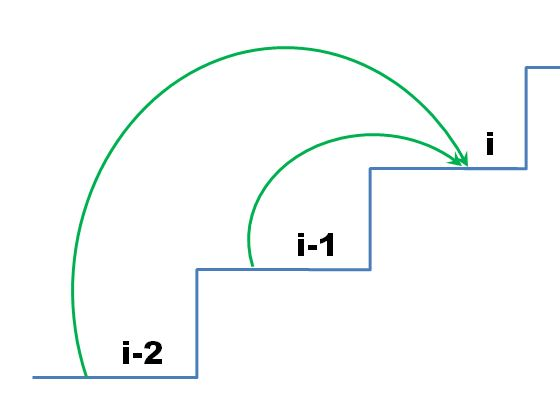

[#0746-min-cost-climbing-stairs]
= 746. Min Cost Climbing Stairs

{leetcode}/problems/min-cost-climbing-stairs/[LeetCode - Min Cost Climbing Stairs^]

On a staircase, the `i`-th step has some non-negative cost `cost[i]` assigned (0 indexed).

Once you pay the cost, you can either climb one or two steps. You need to find minimum cost to reach the top of the floor, and you can either start from the step with index 0, or the step with index 1.

*Example 1:*

[subs="verbatim,quotes,macros"]
----
*Input:* cost = [10, 15, 20]
*Output:* 15
*Explanation:* Cheapest is start on cost[1], pay that cost and go to the top.
----

*Example 2:*

[subs="verbatim,quotes,macros"]
----
*Input:* cost = [1, 100, 1, 1, 1, 100, 1, 1, 100, 1]
*Output:* 6
*Explanation:* Cheapest is start on cost[0], and only step on 1s, skipping cost[3].
----

*Note:*

. `cost` will have a length in the range `[2, 1000]`.
. Every `cost[i]` will be an integer in the range `[0, 999]`.

== 思路分析

[[src-0736]]
[tabs]
====
一刷::
+
--
[{java_src_attr}]
----
include::{sourcedir}/_0746_MinCostClimbingStairs.java[tag=answer]
----
--

// 二刷::
// +
// --
// [{java_src_attr}]
// ----
// include::{sourcedir}/_0078_Subsets_2.java[tag=answer]
// ----
// --
====

== 参考资料

. https://leetcode.cn/problems/min-cost-climbing-stairs/solutions/528955/shi-yong-zui-xiao-hua-fei-pa-lou-ti-by-l-ncf8/[746. 使用最小花费爬楼梯 - 官方题解^]
. https://leetcode.cn/problems/min-cost-climbing-stairs/solutions/177077/yi-bu-yi-bu-tui-dao-dong-tai-gui-hua-de-duo-chong-/[746. 使用最小花费爬楼梯 - 一步一步推导动态规划的多种解法^]
. https://leetcode.cn/problems/min-cost-climbing-stairs/solutions/856958/dai-ma-sui-xiang-lu-dong-tai-gui-hua-wu-abbwz/[746. 使用最小花费爬楼梯 - 「代码随想录」带你学透动态规划！^]

