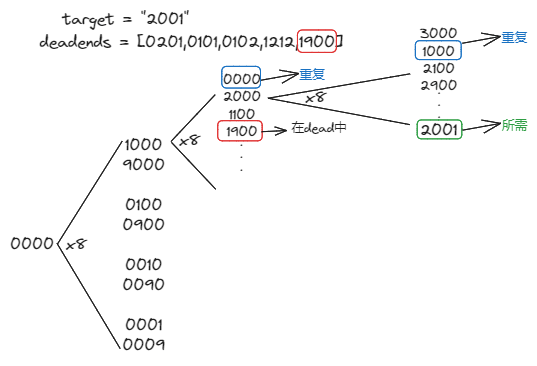

[#0752-open-the-lock]
= 752. Open the Lock

https://leetcode.com/problems/open-the-lock/[LeetCode - Open the Lock]

You have a lock in front of you with 4 circular wheels.  Each wheel has 10 slots: `'0', '1', '2', '3', '4', '5', '6', '7', '8', '9'`.  The wheels can rotate freely and wrap around: for example we can turn `'9'` to be `'0'`, or `'0'` to be `'9'`.  Each move consists of turning one wheel one slot.

The lock initially starts at `'0000'`, a string representing the state of the 4 wheels.

You are given a list of `deadends` dead ends, meaning if the lock displays any of these codes, the wheels of the lock will stop turning and you will be unable to open it.

Given a `target` representing the value of the wheels that will unlock the lock, return the minimum total number of turns required to open the lock, or -1 if it is impossible.

*Example 1:*

[subs="verbatim,quotes,macros"]
----
*Input:* deadends = ["0201","0101","0102","1212","2002"], target = "0202"
*Output:* 6
*Explanation:*
A sequence of valid moves would be "0000" -> "1000" -> "1100" -> "1200" -> "1201" -> "1202" -> "0202".
Note that a sequence like "0000" -> "0001" -> "0002" -> "0102" -> "0202" would be invalid,
because the wheels of the lock become stuck after the display becomes the dead end "0102".
----

*Example 2:*

[subs="verbatim,quotes,macros"]
----
*Input:* deadends = ["8888"], target = "0009"
*Output:* 1
*Explanation:*
We can turn the last wheel in reverse to move from "0000" -> "0009".
----

*Example 3:*

[subs="verbatim,quotes,macros"]
----
*Input:* deadends = ["8887","8889","8878","8898","8788","8988","7888","9888"], target = "8888"
*Output:* -1
*Explanation:*
We can't reach the target without getting stuck.
----

*Example 4:*

[subs="verbatim,quotes,macros"]
----
*Input:* deadends = ["0000"], target = "8888"
*Output:* -1
----

*Note:*

. The length of `deadends` will be in the range `[1, 500]`.
. `target` will not be in the list `deadends`.
. Every string in `deadends` and the string `target` will be a string of 4 digits from the 10,000 possibilities `'0000'` to `'9999'`.

== 思路分析

可以把题目的意思画图表示一下：

从这张图上可以看出，可以使用广度优先搜索算法来解题。这道题可以 xref:0111-minimum-depth-of-binary-tree.adoc[111. Minimum Depth of Binary Tree] 参考理解，不同的是： 111 是二叉树，本题是多叉树。

[[src-0752]]
[{java_src_attr}]
----
include::{sourcedir}/_0752_OpenTheLock.java[]
----

== 附加题

尝试自己实现一下 双向BFS 的解法。

== 参考资料

. https://leetcode.cn/problems/open-the-lock/solutions/2793129/tuland-tu-_da-kai-zhuan-pan-suo-_po-su-b-oy9u/[752. 打开转盘锁 - 「🖼️图解🖼️ 朴素BFS+剪枝」^]
. https://leetcode.cn/problems/open-the-lock/solutions/843986/gong-shui-san-xie-yi-ti-shuang-jie-shuan-wyr9/[752. 打开转盘锁 - 一题三解：「双向 BFS」& 「AStar 算法」&「IDA* 算法」^] -- 双向 BFS 有点意思。
. https://leetcode.cn/problems/open-the-lock/solutions/844162/shuang-xiang-bfsliang-mian-bao-jia-zhi-s-hvev/[752. 打开转盘锁 - 双向BFS详解，两面包夹芝士寻找起点与终点的最短路上的汇集点，妈妈再也不用担心BFS复杂...^]
. https://leetcode.cn/problems/open-the-lock/solutions/1399174/by-huan-huan-20-f37j/[752. 打开转盘锁 - BFS、双向BFS清晰易懂方法论 [图解\] & [框架\] & [超详细注释\]^]

