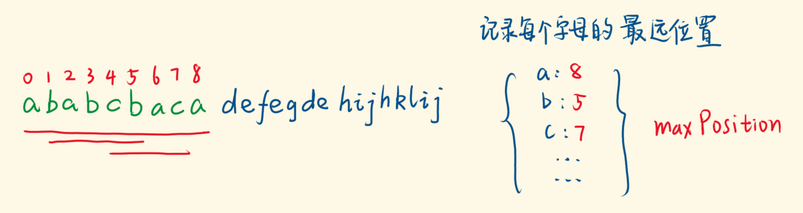

[#0763-partition-labels]
= 763. 划分字母区间

https://leetcode.cn/problems/partition-labels/[LeetCode - 763. 划分字母区间^]

给你一个字符串 `s`。我们要把这个字符串划分为尽可能多的片段，同一字母最多出现在一个片段中。例如，字符串 `"ababcc"` 能够被分为 `["abab", "cc"]`，但类似 `["aba", "bcc"]` 或 `["ab", "ab", "cc"]` 的划分是非法的。

注意，划分结果需要满足：将所有划分结果按顺序连接，得到的字符串仍然是 `s`。

返回一个表示每个字符串片段的长度的列表。

*示例 1：*

....
输入：s = "ababcbacadefegdehijhklij"
输出：[9,7,8]
解释：
划分结果为 "ababcbaca"、"defegde"、"hijhklij" 。
每个字母最多出现在一个片段中。
像 "ababcbacadefegde", "hijhklij" 这样的划分是错误的，因为划分的片段数较少。
....

*示例 2：*

....
输入：s = "eccbbbbdec"
输出：[10]
....

*提示：*

* `+1 <= s.length <= 500+`
* `s` 仅由小写英文字母组成

== 思路分析

本质来说，就是一个区间合并，把有重叠的区间全部合并成一个大区间即可。

[[src-0763]]
[tabs]
====
一刷::
+
--
[{java_src_attr}]
----
include::{sourcedir}/_0763_PartitionLabels.java[tag=answer]
----
--

// 二刷::
// +
// --
// [{java_src_attr}]
// ----
// include::{sourcedir}/_0763_PartitionLabels_2.java[tag=answer]
// ----
// --
====

== 参考资料

. https://leetcode.cn/problems/partition-labels/solutions/2806706/ben-zhi-shi-he-bing-qu-jian-jian-ji-xie-ygsn8/[763. 划分字母区间 - 本质是合并区间，简洁写法^]
. https://leetcode.cn/problems/partition-labels/solutions/455898/python-jiu-zhe-quan-guo-zui-cai-you-hua-dai-ma-by-/[763. 划分字母区间 - Python 就这？！ 【全国最菜优化代码】^]
. https://leetcode.cn/problems/partition-labels/solutions/455703/hua-fen-zi-mu-qu-jian-by-leetcode-solution/[763. 划分字母区间 - 官方题解^]
. https://leetcode.cn/problems/partition-labels/solutions/455814/shou-hua-tu-jie-hua-fen-zi-mu-qu-jian-ji-lu-zui-yu/[763. 划分字母区间 - 『手画图解』划分字母区间 | 记录最远位置^]
. https://leetcode.cn/problems/partition-labels/solutions/455924/763-hua-fen-zi-mu-qu-jian-ji-lu-zui-yuan-wei-zhi-y/[763. 划分字母区间 - 「代码随想录」763. 划分字母区间:【记录最远位置与双指针】详解^]
. https://leetcode.cn/problems/partition-labels/solutions/245298/zui-jian-dan-jie-shi-bi-guan-jie-hao-dong-duo-liao/[763. 划分字母区间 - 最简单解释，比官解好懂多了^]
