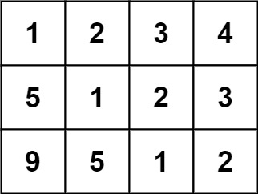
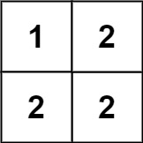
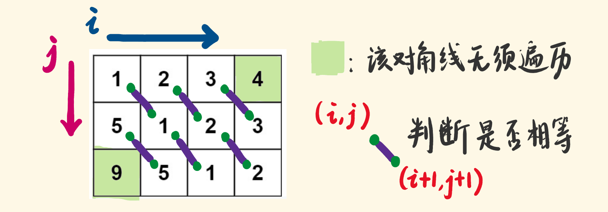
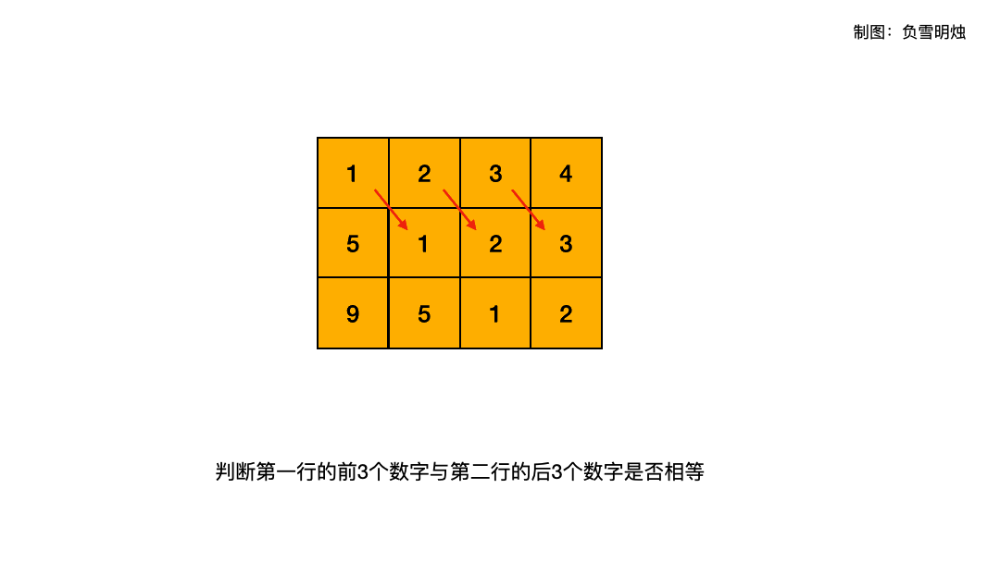

[#0766-toeplitz-matrix]
= 766. 托普利茨矩阵

https://leetcode.cn/problems/toeplitz-matrix/[LeetCode - 766. 托普利茨矩阵^]

给你一个 `m x n` 的矩阵 `matrix`。如果这个矩阵是托普利茨矩阵，返回 `true`；否则，返回 `false`。

如果矩阵上每一条由左上到右下的对角线上的元素都相同，那么这个矩阵是 *托普利茨矩阵*。

*示例 1：*

....
输入：matrix = [[1,2,3,4],[5,1,2,3],[9,5,1,2]]
输出：true
解释：
在上述矩阵中, 其对角线为:
"[9]", "[5, 5]", "[1, 1, 1]", "[2, 2, 2]", "[3, 3]", "[4]"。
各条对角线上的所有元素均相同, 因此答案是 True 。
....

*示例 2：*

....
输入：matrix = [[1,2],[2,2]]
输出：false
解释：
对角线 "[1, 2]" 上的元素不同。
....

*提示：*

* `m == matrix.length`
* `n == matrix[i].length`
* `1 \<= m, n \<= 20`
* `0 \<= matrix[i][j] \<= 99`

*进阶：*

* 如果矩阵存储在磁盘上，并且内存有限，以至于一次最多只能将矩阵的一行加载到内存中，该怎么办？
* 如果矩阵太大，以至于一次只能将不完整的一行加载到内存中，该怎么办？

== 思路分析

1. 找出从 `[0, 0]` 开始的对角线
2. 向右平移
3. 向下平移

[[src-0766]]
[tabs]
====
一刷::
+
--
[{java_src_attr}]
----
include::{sourcedir}/_0766_ToeplitzMatrix.java[tag=answer]
----
--

// 二刷::
// +
// --
// [{java_src_attr}]
// ----
// include::{sourcedir}/_0766_ToeplitzMatrix_2.java[tag=answer]
// ----
// --
====

== 参考资料

. https://leetcode.cn/problems/toeplitz-matrix/solutions/613732/tuo-pu-li-ci-ju-zhen-by-leetcode-solutio-57bb/[766. 托普利茨矩阵 - 官方题解^]
. https://leetcode.cn/problems/toeplitz-matrix/solutions/614391/pan-duan-mei-ge-yuan-su-he-ta-de-you-xia-x3fi/[766. 托普利茨矩阵 - 判断每个元素和它的右下角元素相等^]
. https://leetcode.cn/problems/toeplitz-matrix/solutions/614257/shou-hua-tu-jie-766tuo-pu-li-ci-ju-zhen-mgkuu/[766. 托普利茨矩阵 - 手画图解^]
