[#0768-max-chunks-to-make-sorted-ii]
= 768. Max Chunks To Make Sorted II

{leetcode}/problems/max-chunks-to-make-sorted-ii/[LeetCode - Max Chunks To Make Sorted II^]

_This question is the same as "Max Chunks to Make Sorted" except the integers of the given array are not necessarily distinct, the input array could be up to length `2000`, and the elements could be up to `10**8`._

Given an array `arr` of integers (*not necessarily distinct*), we split the array into some number of "chunks" (partitions), and individually sort each chunk.  After concatenating them, the result equals the sorted array.

What is the most number of chunks we could have made?

*Example 1:*

[subs="verbatim,quotes,macros"]
----
*Input:* arr = [5,4,3,2,1]
*Output:* 1
*Explanation:*
Splitting into two or more chunks will not return the required result.
For example, splitting into [5, 4], [3, 2, 1] will result in [4, 5, 1, 2, 3], which isn't sorted.
----

*Example 2:*

[subs="verbatim,quotes,macros"]
----
*Input:* arr = [2,1,3,4,4]
*Output:* 4
*Explanation:*
We can split into two chunks, such as [2, 1], [3, 4, 4].
However, splitting into [2, 1], [3], [4], [4] is the highest number of chunks possible.
----

*Note:*

* `arr` will have length in range `[1, 2000]`.
* `arr[i]` will be an integer in range `[0, 10**8]`.

== 思路分析

对于已经分好块的数组，那么右边的块的所有数字均大于或等于左边的块的所有数字。

对于已经分好块的数组，若在其末尾添加一个数字，如何求得新数组的分块方式？

那么，如果新数字大于块中所有数字，则可以自己独立成块；否则，就需要跟前面合并：从新增数字向左，直到排序块的最大值小于新增数字为止，这个区间合并为一个新快。

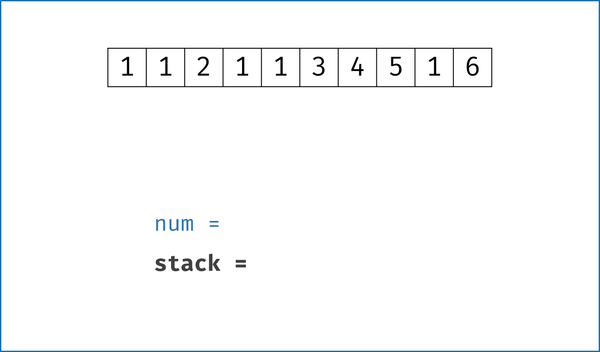

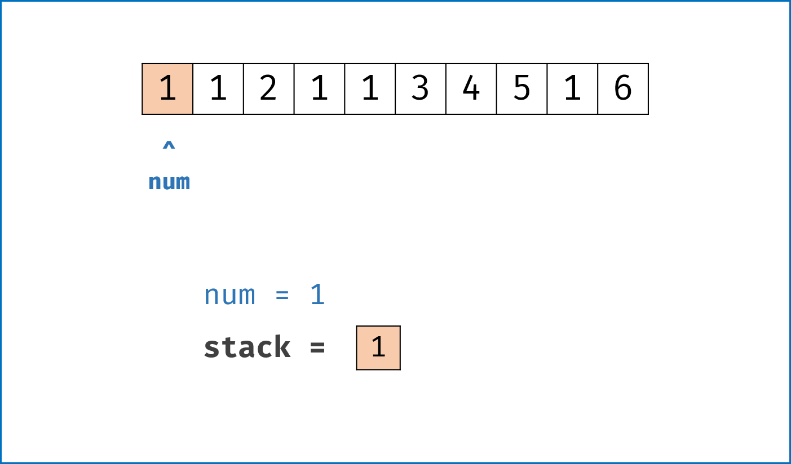

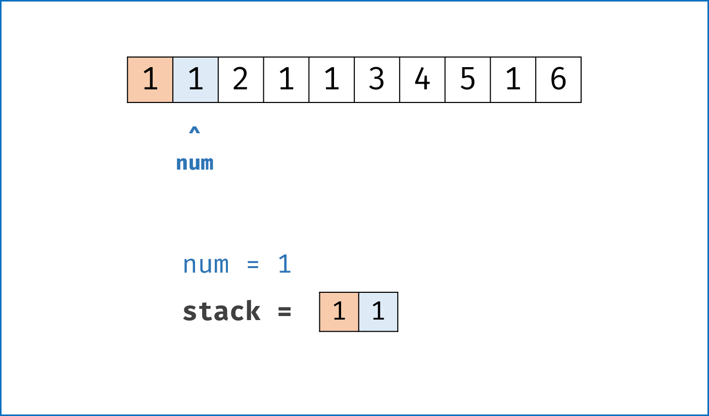

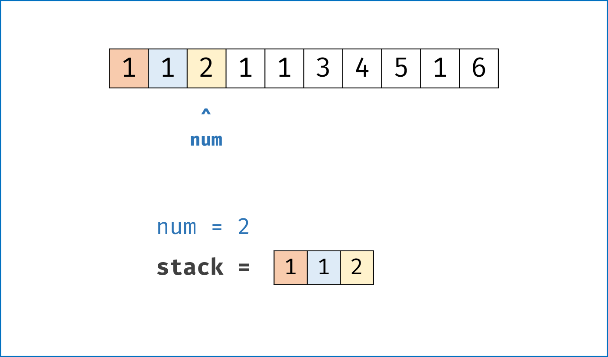

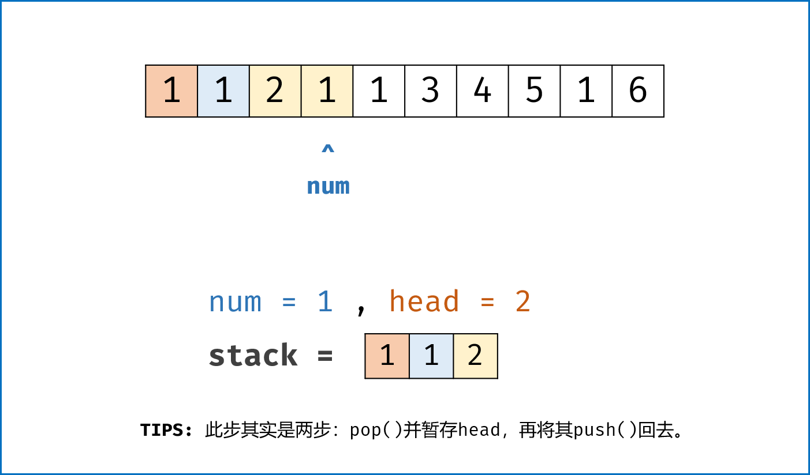

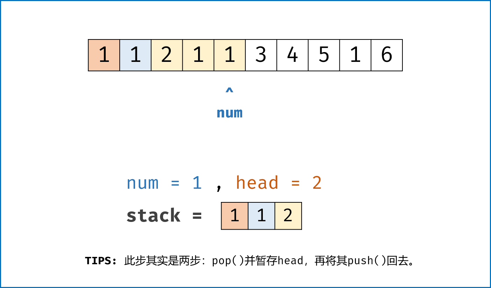

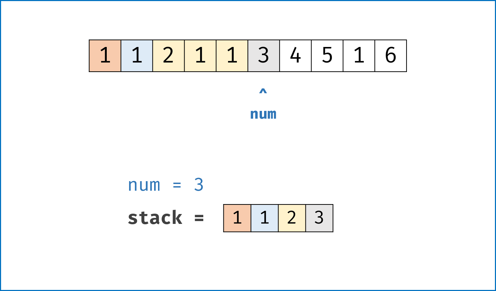

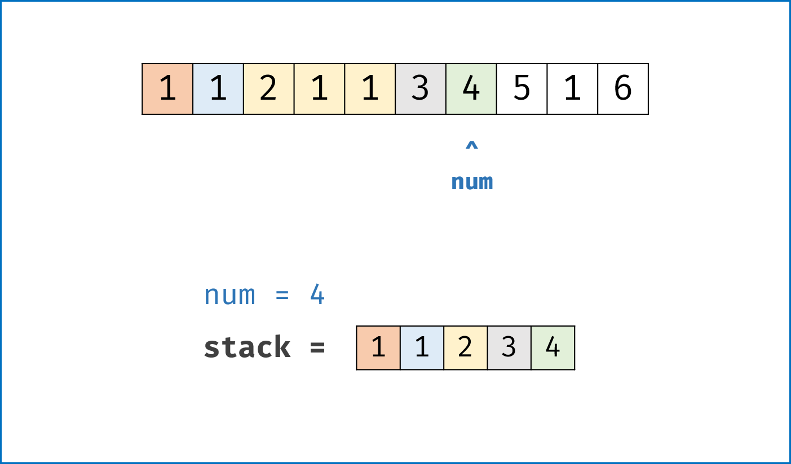

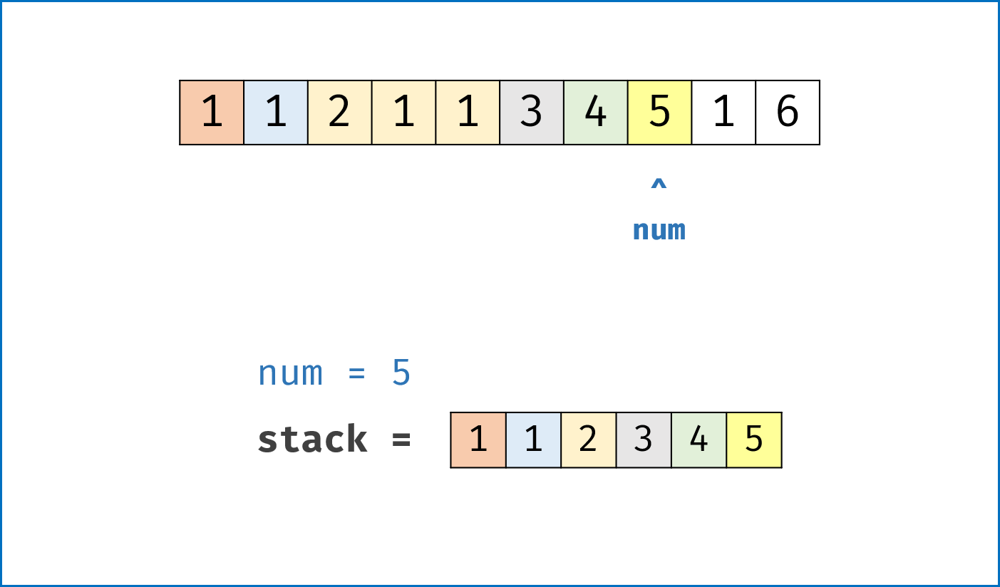

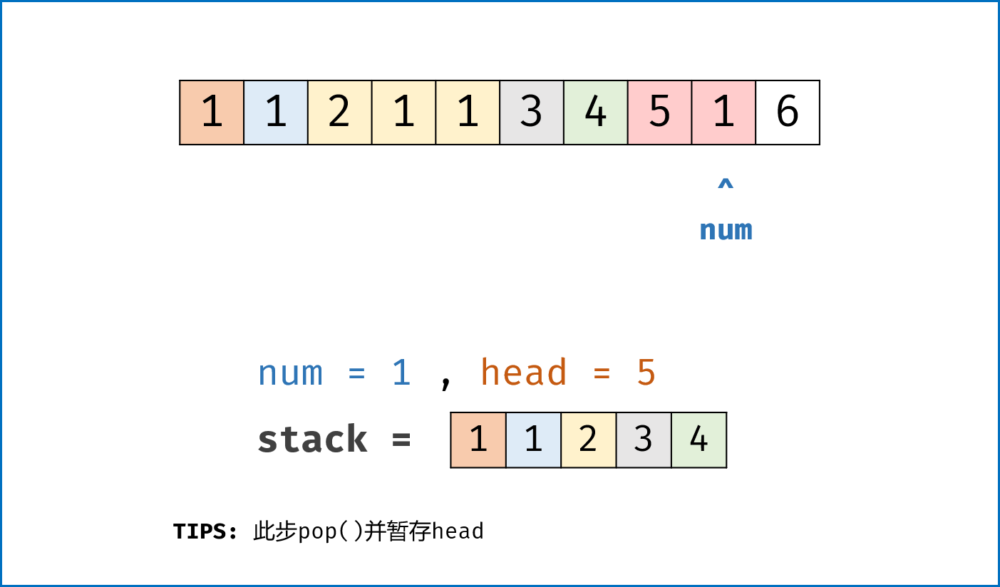

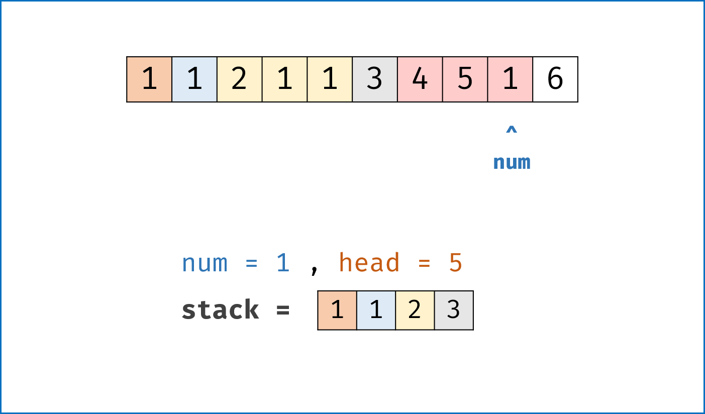

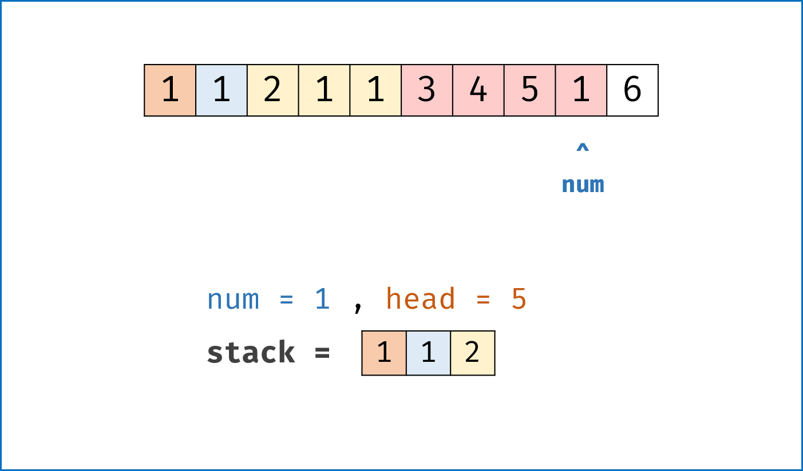

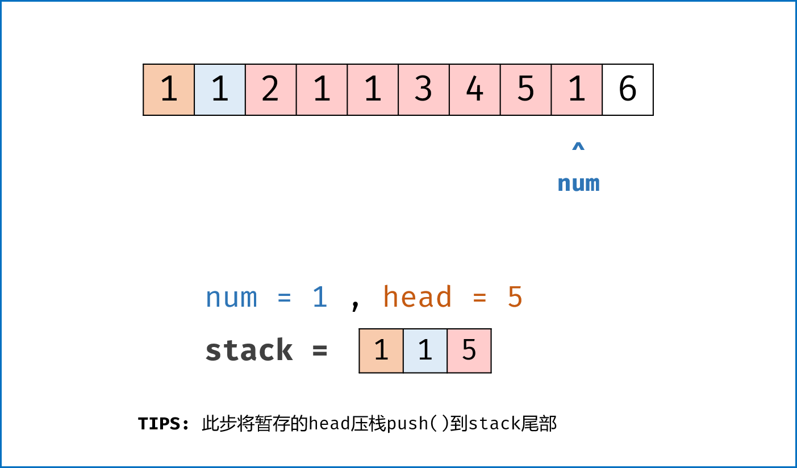

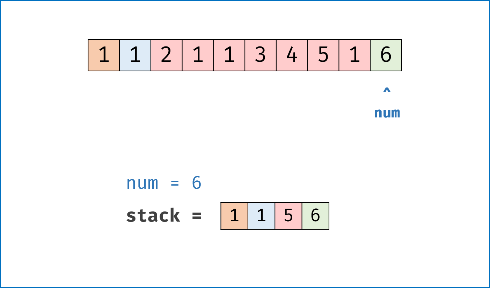

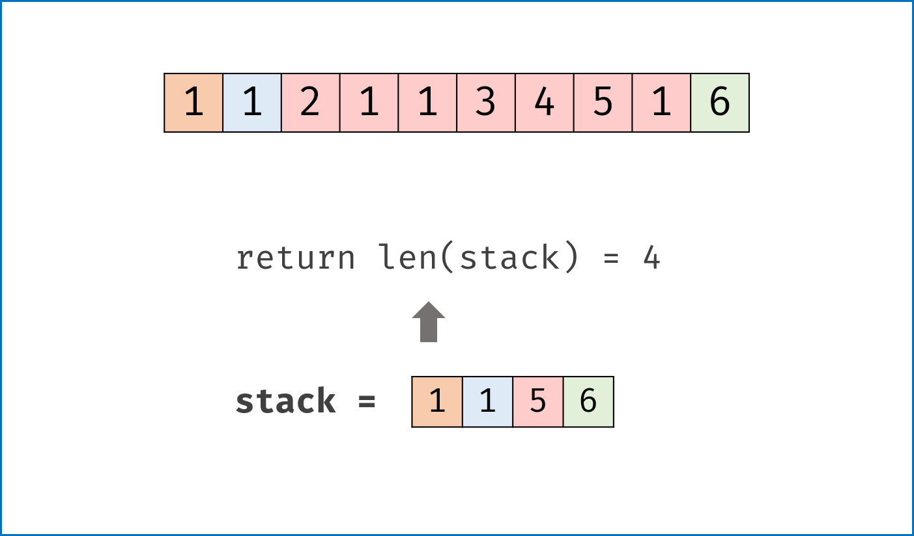

[[src-0768]]
[tabs]
====
一刷::
+
--
[{java_src_attr}]
----
include::{sourcedir}/_0768_MaxChunksToMakeSortedII.java[tag=answer]
----
--

// 二刷::
// +
// --
// [{java_src_attr}]
// ----
// include::{sourcedir}/_0768_MaxChunksToMakeSortedII_2.java[tag=answer]
// ----
// --
====

== 参考资料

. https://leetcode.cn/problems/max-chunks-to-make-sorted-ii/solutions/1741851/zui-duo-neng-wan-cheng-pai-xu-de-kuai-ii-w5c6/?envType=study-plan-v2&envId=selected-coding-interview[768. 最多能完成排序的块 II - 官方题解^]
. https://leetcode.cn/problems/max-chunks-to-make-sorted-ii/solutions/22785/zui-duo-neng-wan-cheng-pai-xu-de-kuai-ii-deng-jie-/?envType=study-plan-v2&envId=selected-coding-interview[768. 最多能完成排序的块 II - 辅助栈法，清晰图解^] -- 图解很好！但是，解题思路还是得参考官方题解。

