[#0768-max-chunks-to-make-sorted-ii]
= 768. 最多能完成排序的块 II

https://leetcode.cn/problems/max-chunks-to-make-sorted-ii/[LeetCode - 768. 最多能完成排序的块 II^]

给你一个整数数组 `arr` 。

将 `arr` 分割成若干 *块*，并将这些块分别进行排序。之后再连接起来，使得连接的结果和按升序排序后的原数组相同。

返回能将数组分成的最多块数？

*示例 1：*

....
输入：arr = [5,4,3,2,1]
输出：1
解释：
将数组分成2块或者更多块，都无法得到所需的结果。
例如，分成 [5, 4], [3, 2, 1] 的结果是 [4, 5, 1, 2, 3]，这不是有序的数组。
....

*示例 2：*

....
输入：arr = [2,1,3,4,4]
输出：4
解释：
可以把它分成两块，例如 [2, 1], [3, 4, 4]。
然而，分成 [2, 1], [3], [4], [4] 可以得到最多的块数。
....

*提示：*

* `1 \<= arr.length \<= 2000`
* `0 \<= arr[i] \<= 10^8^`

== 思路分析

对于已经分好块的数组，那么右边的块的所有数字均大于或等于左边的块的所有数字。

对于已经分好块的数组，若在其末尾添加一个数字，如何求得新数组的分块方式？

那么，如果新数字大于块中所有数字，则可以自己独立成块；否则，就需要跟前面合并：从新增数字向左，直到排序块的最大值小于新增数字为止，这个区间合并为一个新快。

单调递增栈，需要注意，弹出栈时，要保留栈顶，把中间元素弹出后，还要把栈顶元素入栈。

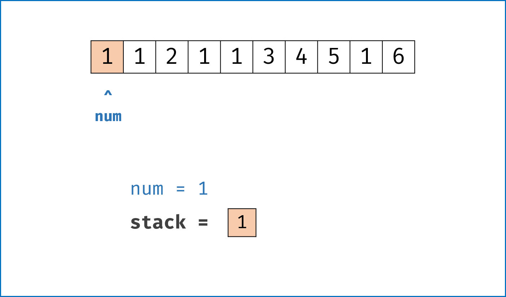

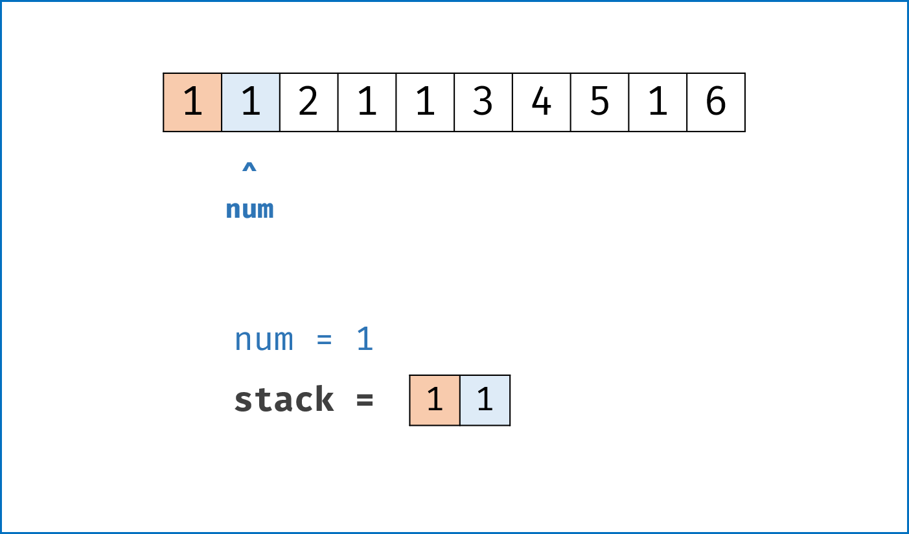

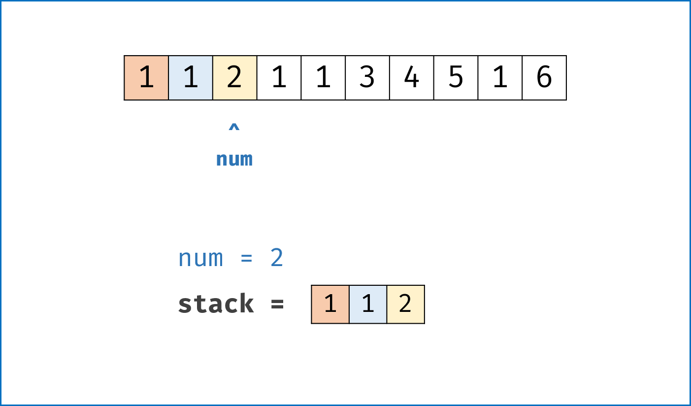

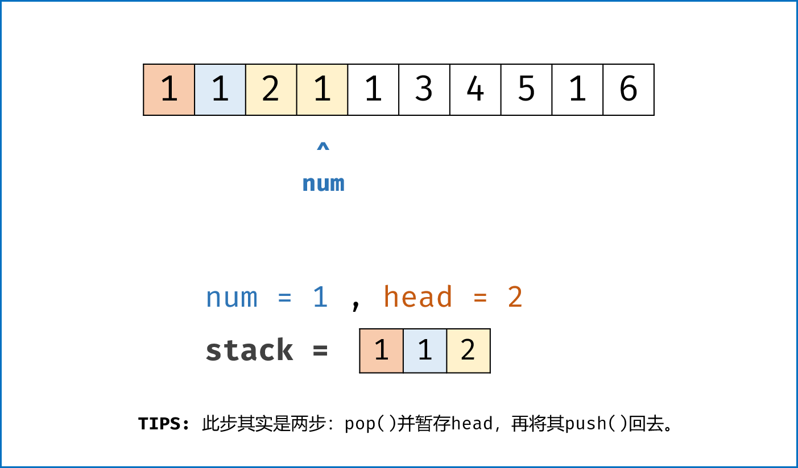

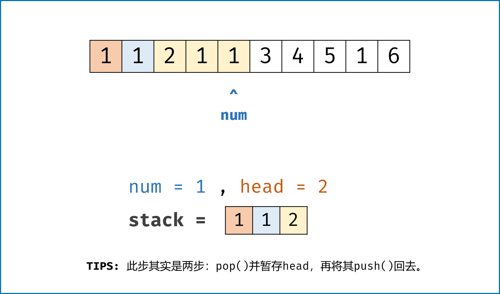

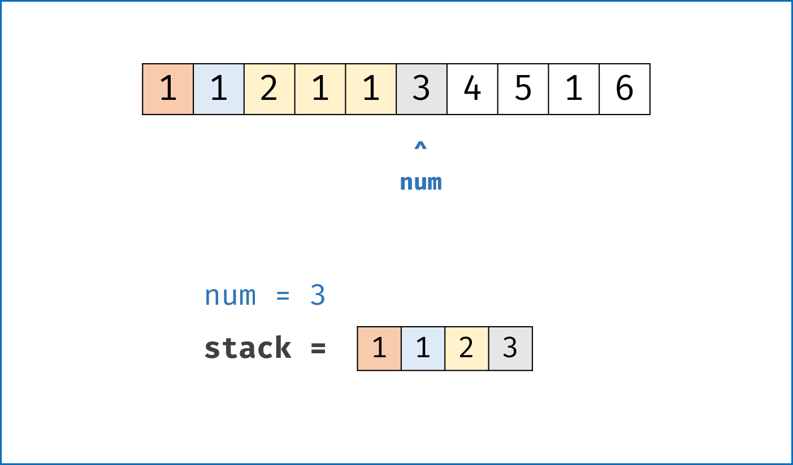

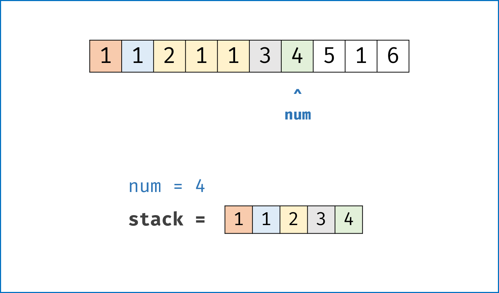

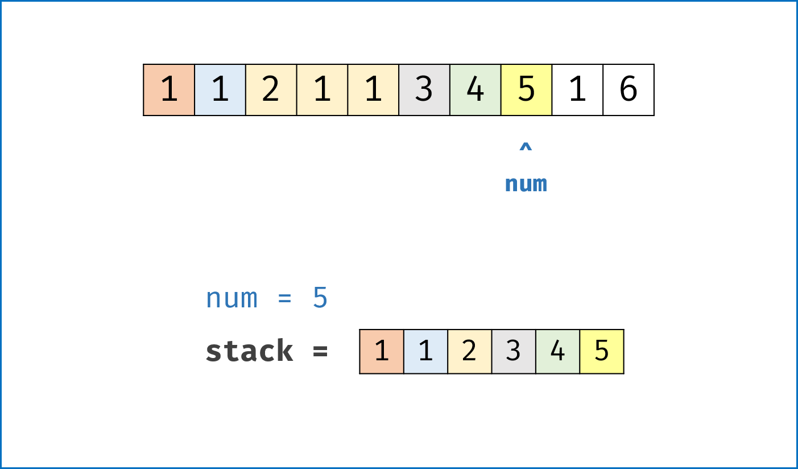

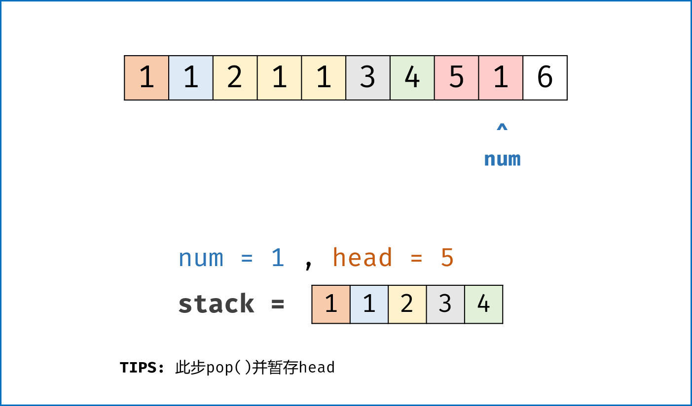

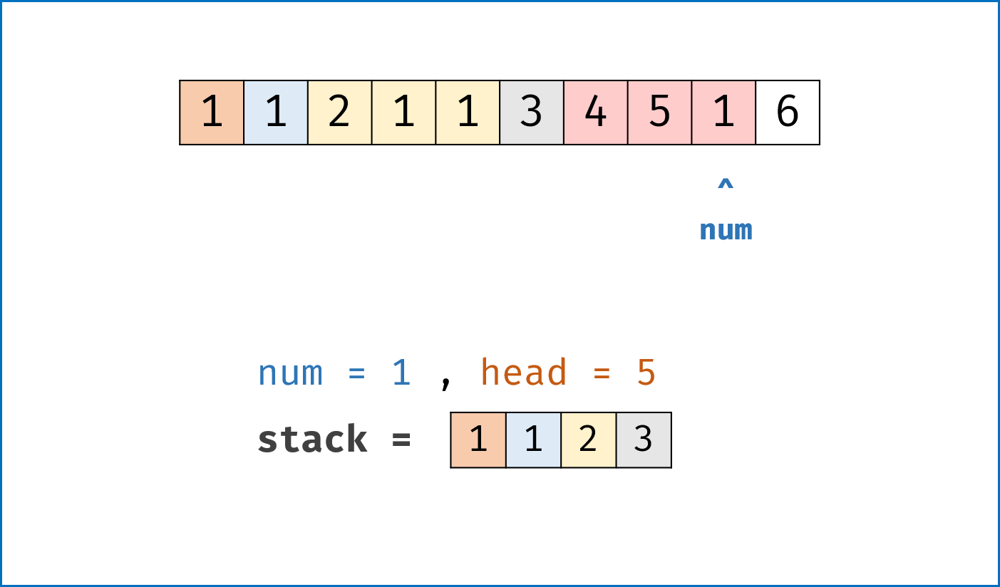

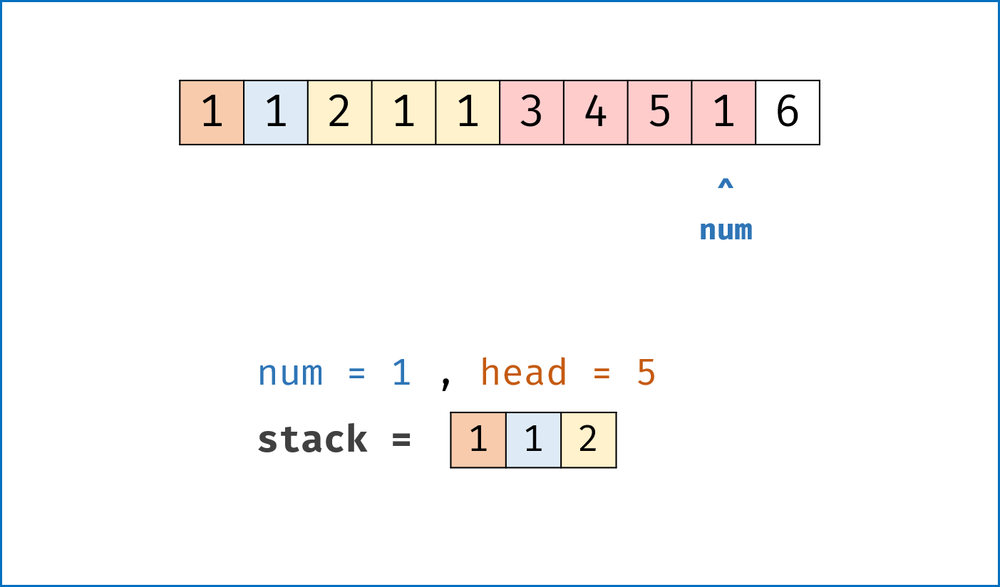

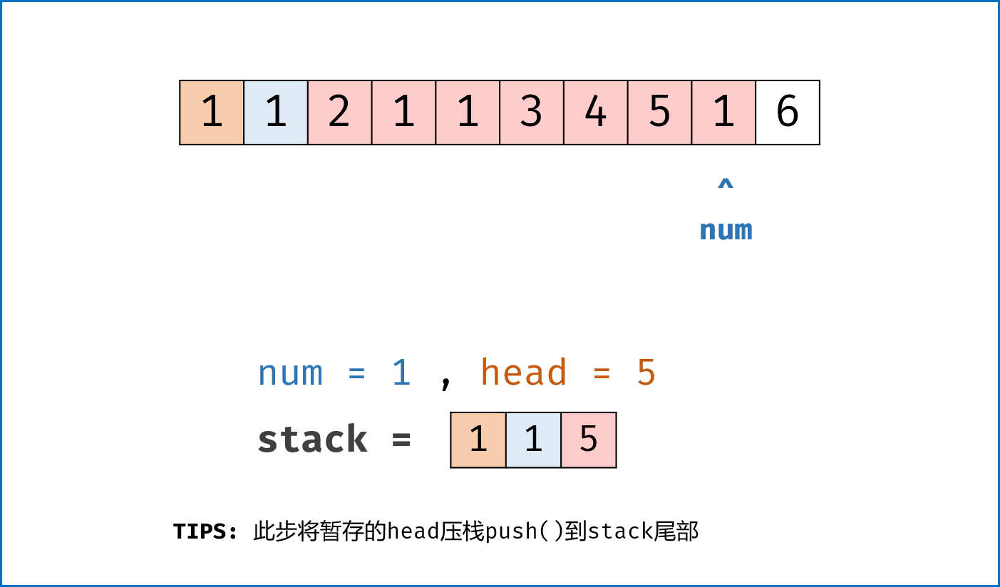

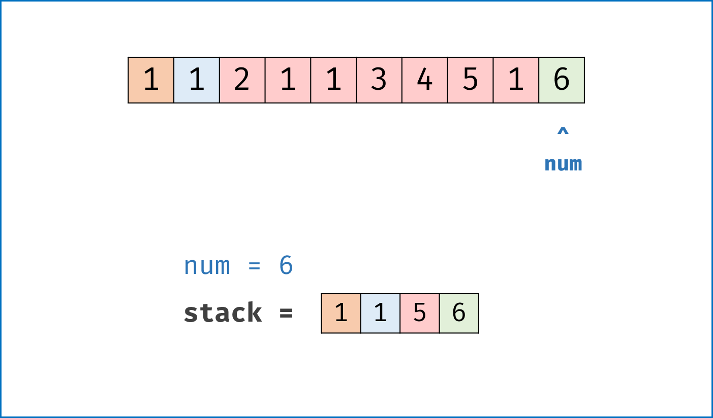

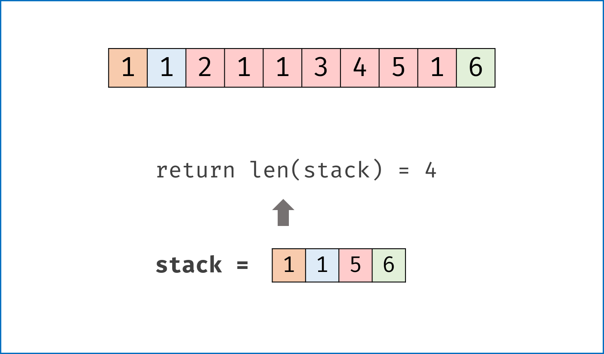

[[src-0768]]
[tabs]
====
一刷::
+
--
[{java_src_attr}]
----
include::{sourcedir}/_0768_MaxChunksToMakeSortedII.java[tag=answer]
----
--

二刷::
+
--
[{java_src_attr}]
----
include::{sourcedir}/_0768_MaxChunksToMakeSortedIi_2.java[tag=answer]
----
--
====

== 参考资料

. https://leetcode.cn/problems/max-chunks-to-make-sorted-ii/solutions/22785/zui-duo-neng-wan-cheng-pai-xu-de-kuai-ii-deng-jie-/?envType=study-plan-v2&envId=selected-coding-interview[768. 最多能完成排序的块 II - 辅助栈法，清晰图解^] -- 图解很好！但是，解题思路还是得参考官方题解。
. https://leetcode.cn/problems/max-chunks-to-make-sorted-ii/solutions/1741851/zui-duo-neng-wan-cheng-pai-xu-de-kuai-ii-w5c6/?envType=study-plan-v2&envId=selected-coding-interview[768. 最多能完成排序的块 II - 官方题解^]

