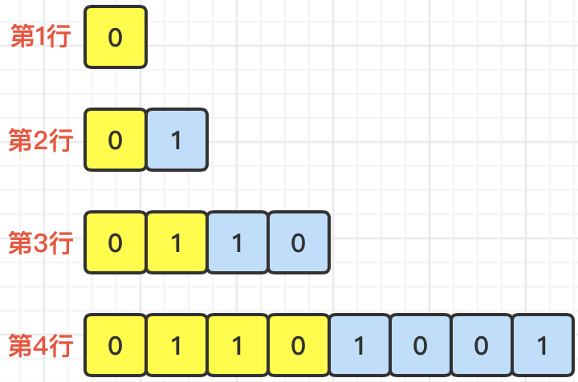
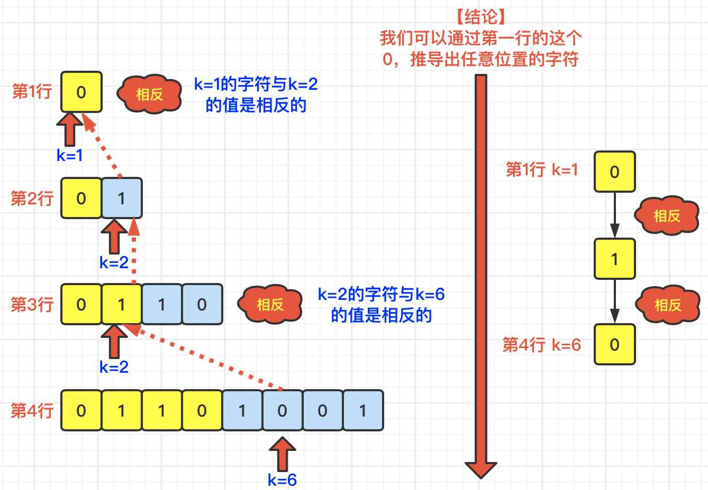

[#0779-k-th-symbol-in-grammar]
= 779. 第K个语法符号

https://leetcode.cn/problems/k-th-symbol-in-grammar/[LeetCode - 779. 第K个语法符号^]

我们构建了一个包含 `n` 行(*索引从 1 开始 *)的表。首先在第一行我们写上一个 `0`。接下来的每一行，将前一行中的 `0` 替换为 `01`，`1` 替换为 `10`。

* 例如，对于 `n = 3` ，第 `1` 行是 `0` ，第 `2` 行是 `01`，第3行是 `0110`。

给定行数 `n` 和序数 `k`，返回第 `n` 行中第 `k` 个字符。（`k` *从索引 1 开始*）

*示例 1:*

....
输入: n = 1, k = 1
输出: 0
解释: 第一行：0
....

*示例 2:*

....
输入: n = 2, k = 1
输出: 0
解释:
第一行: 0
第二行: 01
....

*示例 3:*

....
输入: n = 2, k = 2
输出: 1
解释:
第一行: 0
第二行: 01
....

*提示:*

* `1 \<= n \<= 30`
* `1 \<= k \<= 2^n-1^`

== 思路分析

总结出一句话就是：找出第 `n` 行第 `k` 个字符与第 `1` 行的这个 `0` 的演变关系。

[[src-0779]]
[tabs]
====
一刷::
+
--
[{java_src_attr}]
----
include::{sourcedir}/_0779_KThSymbolInGrammar.java[tag=answer]
----
--

// 二刷::
// +
// --
// [{java_src_attr}]
// ----
// include::{sourcedir}/_0779_KThSymbolInGrammar_2.java[tag=answer]
// ----
// --
====

== 参考资料

. https://leetcode.cn/problems/k-th-symbol-in-grammar/solutions/1906763/-by-muse-77-zw7u/[779. 第K个语法符号 - 图解LeetCode^]
. https://leetcode.cn/problems/k-th-symbol-in-grammar/solutions/1903508/di-kge-yu-fa-fu-hao-by-leetcode-solution-zgwd/[779. 第K个语法符号 - 官方题解^]
