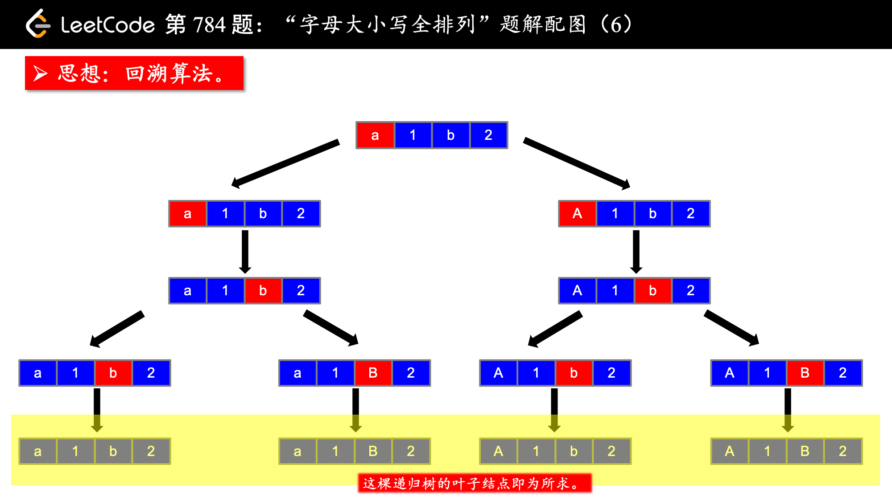

[#0784-letter-case-permutation]
= 784. 字母大小写全排列

https://leetcode.cn/problems/letter-case-permutation/[LeetCode - 784. 字母大小写全排列^]

给定一个字符串 `s`，通过将字符串 `s` 中的每个字母转变大小写，我们可以获得一个新的字符串。

返回 _所有可能得到的字符串集合_。以 *任意顺序* 返回输出。

*示例 1：*

....
输入：s = "a1b2"
输出：["a1b2", "a1B2", "A1b2", "A1B2"]
....

*示例 2:*

....
输入: s = "3z4"
输出: ["3z4","3Z4"]
....

*提示:*

* `1 \<= s.length \<= 12`
* `s` 由小写英文字母、大写英文字母和数字组成

== 思路分析

回溯：在遇到数字时，继续前进；遇到字母时，分别对大小写进行尝试。

[[src-0784]]
[tabs]
====
一刷::
+
--
[{java_src_attr}]
----
include::{sourcedir}/_0784_LetterCasePermutation.java[tag=answer]
----
--

// 二刷::
// +
// --
// [{java_src_attr}]
// ----
// include::{sourcedir}/_0784_LetterCasePermutation_2.java[tag=answer]
// ----
// --
====

== 参考资料

. https://leetcode.cn/problems/letter-case-permutation/solutions/1934375/zi-mu-da-xiao-xie-quan-pai-lie-by-leetco-cwpx/[784. 字母大小写全排列 - 官方题解^]
. https://leetcode.cn/problems/letter-case-permutation/solutions/14819/shen-du-you-xian-bian-li-hui-su-suan-fa-python-dai/[784. 字母大小写全排列 - 回溯算法（深度优先遍历，Java）^]
