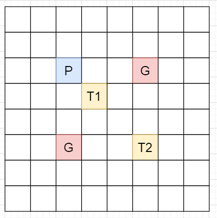

[#0789-escape-the-ghosts]
= 789. 逃脱阻碍者

https://leetcode.cn/problems/escape-the-ghosts/[LeetCode - 789. 逃脱阻碍者^]

你在进行一个简化版的吃豆人游戏。你从 `[0, 0]` 点开始出发，你的目的地是 `target = [x~target~, y~target~]`。地图上有一些阻碍者，以数组 `ghosts` 给出，第 `i` 个阻碍者从 `ghosts[i] = [x~i~, y~i~]` 出发。所有输入均为 *整数坐标*。

每一回合，你和阻碍者们可以同时向东，西，南，北四个方向移动，每次可以移动到距离原位置 *1 个单位* 的新位置。当然，也可以选择 *不动*。所有动作 *同时* 发生。

如果你可以在任何阻碍者抓住你 *之前* 到达目的地（阻碍者可以采取任意行动方式），则被视为逃脱成功。如果你和阻碍者 *同时* 到达了一个位置（包括目的地） *都不算* 是逃脱成功。

如果不管阻碍者怎么移动都可以成功逃脱时，输出 `true`；否则，输出 `false`。

*示例 1：*

....
输入：ghosts = [[1,0],[0,3]], target = [0,1]
输出：true
解释：你可以直接一步到达目的地 (0,1) ，在 (1, 0) 或者 (0, 3) 位置的阻碍者都不可能抓住你。
....

*示例 2：*

....
输入：ghosts = [[1,0]], target = [2,0]
输出：false
解释：你需要走到位于 (2, 0) 的目的地，但是在 (1, 0) 的阻碍者位于你和目的地之间。
....

*示例 3：*

....
输入：ghosts = [[2,0]], target = [1,0]
输出：false
解释：阻碍者可以和你同时达到目的地。
....

*提示：*

* `1 \<= ghosts.length \<= 100`
* `ghosts[i].length == 2`
* `-10^4^ \<= x~i~, y~i~ \<= 10^4^`
* 同一位置可能有 *多个阻碍者* 。
* `target.length == 2`
* `-10^4^ \<= x~target~, y~target~ \<= 10^4^`

== 思路分析

题目看着很虎，实际很简单：就是检查一下是否存在阻碍者到终点距离比起点到终点的距离更短？

[[src-0789]]
[tabs]
====
一刷::
+
--
[{java_src_attr}]
----
include::{sourcedir}/_0789_EscapeTheGhosts.java[tag=answer]
----
--

// 二刷::
// +
// --
// [{java_src_attr}]
// ----
// include::{sourcedir}/_0789_EscapeTheGhosts_2.java[tag=answer]
// ----
// --
====

== 参考资料

. https://leetcode.cn/problems/escape-the-ghosts/solutions/949892/tao-tuo-zu-ai-zhe-by-leetcode-solution-gjga/[789. 逃脱阻碍者 - 官方题解^]
. https://leetcode.cn/problems/escape-the-ghosts/solutions/950879/tong-ge-lai-shua-ti-la-man-ha-dun-ju-chi-4es2/[789. 逃脱阻碍者 - 曼哈顿距离，反证法！^]
