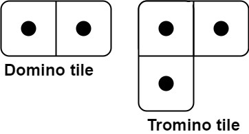
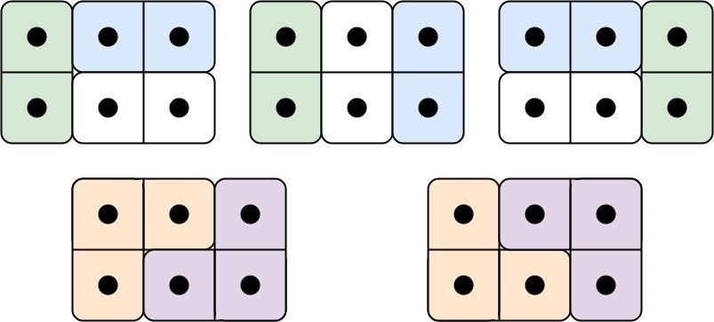
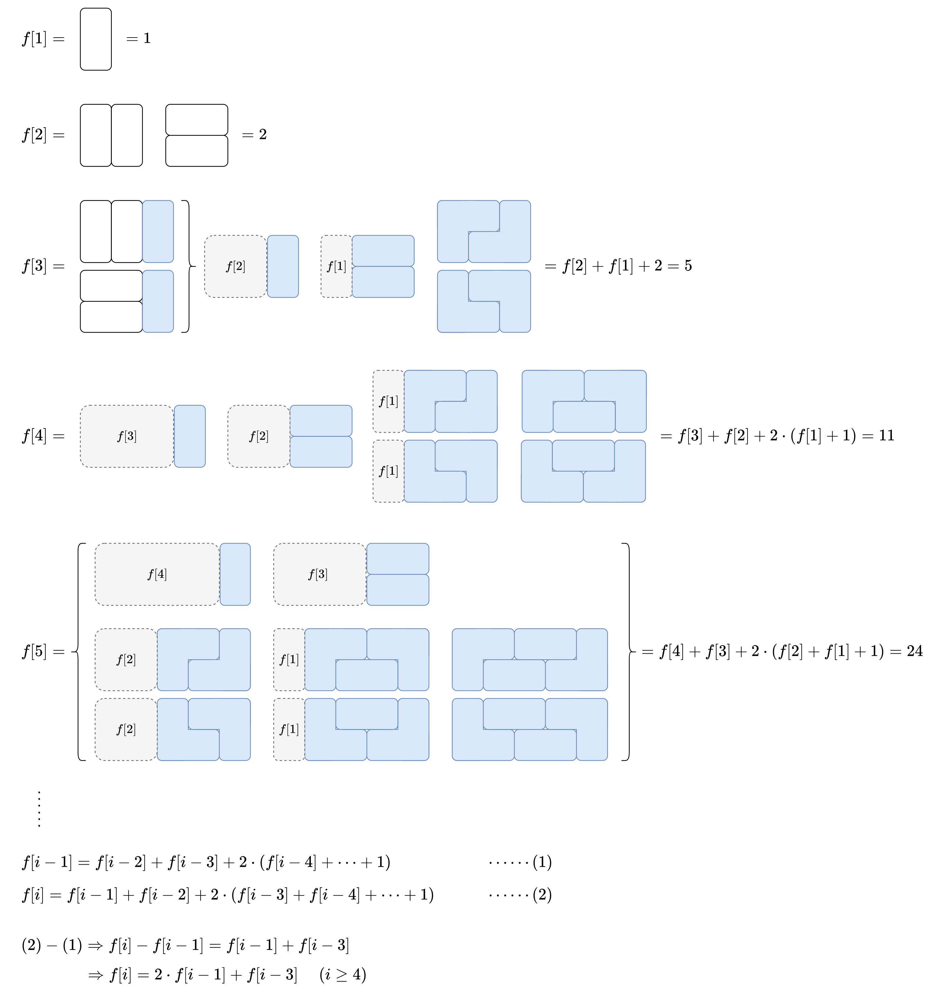

[#0790-domino-and-tromino-tiling]
= 790. 多米诺和托米诺平铺

https://leetcode.cn/problems/domino-and-tromino-tiling/[LeetCode - 790. 多米诺和托米诺平铺^]

有两种形状的瓷砖：一种是 `2 x 1` 的多米诺形，另一种是形如 "L"
的托米诺形。两种形状都可以旋转。

给定整数 `n`，返回可以平铺 `2 x n` 的面板的方法的数量。*返回对* `10^9^ + 7` **取模 **的值。

平铺指的是每个正方形都必须有瓷砖覆盖。两个平铺不同，当且仅当面板上有四个方向上的相邻单元中的两个，使得恰好有一个平铺有一个瓷砖占据两个正方形。

*示例 1:*

....
输入: n = 3
输出: 5
解释: 五种不同的方法如上所示。
....

*示例 2:*

....
输入: n = 1
输出: 1
....

*提示：*

* `1 \<= n \<= 1000`

== 思路分析

TIP: 还是要画图分析思路才更容易理顺！

[[src-0790]]
[tabs]
====
一刷::
+
--
[{java_src_attr}]
----
include::{sourcedir}/_0790_DominoAndTrominoTiling.java[tag=answer]
----
--

// 二刷::
// +
// --
// [{java_src_attr}]
// ----
// include::{sourcedir}/_0790_DominoAndTrominoTiling_2.java[tag=answer]
// ----
// --
====

== 参考资料

. https://leetcode.cn/problems/domino-and-tromino-tiling/solutions/1968516/by-endlesscheng-umpp/[790. 多米诺和托米诺平铺 - 【图解】stem:[f[n\]=2*f[n-1\]+f[n-3\]]^]
. https://leetcode.cn/problems/domino-and-tromino-tiling/solutions/1962465/duo-mi-nuo-he-tuo-mi-nuo-ping-pu-by-leet-7n0j/[790. 多米诺和托米诺平铺 - 官方题解^]
. https://leetcode.cn/problems/domino-and-tromino-tiling/solutions/1968470/gong-shui-san-xie-by-ac_oier-kuv4/[790. 多米诺和托米诺平铺 - 简单状态机 DP 运用题^]
