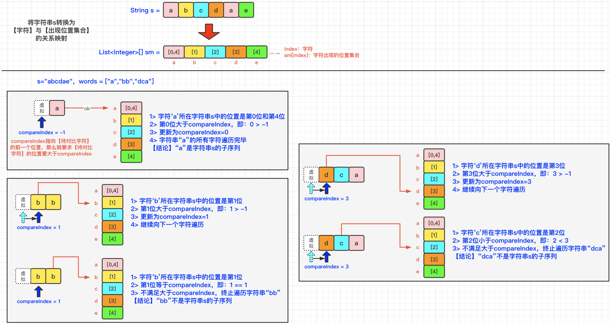

[#0792-number-of-matching-subsequences]
= 792. 匹配子序列的单词数

https://leetcode.cn/problems/number-of-matching-subsequences/[LeetCode - 792. 匹配子序列的单词数^]

给定字符串 `s` 和字符串数组 `words`, 返回  _`words[i]` 中是 `s` 的子序列的单词个数_。

字符串的 *子序列* 是从原始字符串中生成的新字符串，可以从中删去一些字符(可以是none)，而不改变其余字符的相对顺序。

* 例如， `ace` 是 `abcde` 的子序列。

*示例 1:*

....
输入: s = "abcde", words = ["a","bb","acd","ace"]
输出: 3
解释: 有三个是 s 的子序列的单词: "a", "acd", "ace"。
....

*Example 2:*

....
输入: s = "dsahjpjauf", words = ["ahjpjau","ja","ahbwzgqnuk","tnmlanowax"]
输出: 2
....

*提示:*

* `1 \<= s.length \<= 5 * 10^4^`
* `1 \<= words.length \<= 5000`
* `1 \<= words[i].length \<= 50`
* `words[i]` 和 `s` 都只由小写字母组成。

== 思路分析

字符串！

这道题有多种解法：字典树，二分查找，还有如下图的解法：

[[src-0792]]
[tabs]
====
一刷::
+
--
[{java_src_attr}]
----
include::{sourcedir}/_0792_NumberOfMatchingSubsequences.java[tag=answer]
----
--

// 二刷::
// +
// --
// [{java_src_attr}]
// ----
// include::{sourcedir}/_0792_NumberOfMatchingSubsequences_2.java[tag=answer]
// ----
// --
====

== 参考资料

. https://leetcode.cn/problems/number-of-matching-subsequences/solutions/1975581/-by-muse-77-1vhl/[792. 匹配子序列的单词数 - 图解LeetCode^]
. https://leetcode.cn/problems/number-of-matching-subsequences/solutions/1973995/pi-pei-zi-xu-lie-de-dan-ci-shu-by-leetco-vki7/[792. 匹配子序列的单词数 - 官方题解^]
. https://leetcode.cn/problems/number-of-matching-subsequences/solutions/1975263/java-liang-chong-jie-fa-er-fen-cha-zhao-wnyb0/[792. 匹配子序列的单词数 - 两种解法 简洁代码 二分查找 & 多指针优化^]
