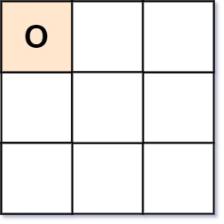

[#0794-valid-tic-tac-toe-state]
= 794. 有效的井字游戏

https://leetcode.cn/problems/valid-tic-tac-toe-state/[LeetCode - 794. 有效的井字游戏 ^]

给你一个字符串数组 `board` 表示井字游戏的棋盘。当且仅当在井字游戏过程中，棋盘有可能达到 `board` 所显示的状态时，才返回 `true` 。

井字游戏的棋盘是一个 `3 x 3` 数组，由字符 `' '`，`'X'` 和 `'O'` 组成。字符 `' '` 代表一个空位。

以下是井字游戏的规则：

* 玩家轮流将字符放入空位（`' '`）中。
* 玩家 1 总是放字符 `'X'` ，而玩家 2 总是放字符 `'O'` 。
* `'X'` 和 `'O'` 只允许放置在空位中，不允许对已放有字符的位置进行填充。
* 当有 3 个相同（且非空）的字符填充任何行、列或对角线时，游戏结束。
* 当所有位置非空时，也算为游戏结束。
* 如果游戏结束，玩家不允许再放置字符。

*示例 1：*

....
输入：board = ["O  ","   ","   "]
输出：false
解释：玩家 1 总是放字符 "X" 。
....

*示例 2：*

image::images/0794-02.jpg[{image_attr}]

....
输入：board = ["XOX"," X ","   "]
输出：false
解释：玩家应该轮流放字符。
....

*示例 3:*

image::images/0794-03.jpg[{image_attr}]

....
输入：board = ["XOX","O O","XOX"]
输出：true
....

*提示：*

* `board.length == 3`
* `board[i].length == 3`
* `board[i][j]` 为 `'X'`、`'O'` 或 `' '`

== 思路分析

[[src-0794]]
[tabs]
====
一刷::
+
--
[{java_src_attr}]
----
include::{sourcedir}/_0794_ValidTicTacToeState.java[tag=answer]
----
--

// 二刷::
// +
// --
// [{java_src_attr}]
// ----
// include::{sourcedir}/_0794_ValidTicTacToeState_2.java[tag=answer]
// ----
// --
====

== 参考资料

