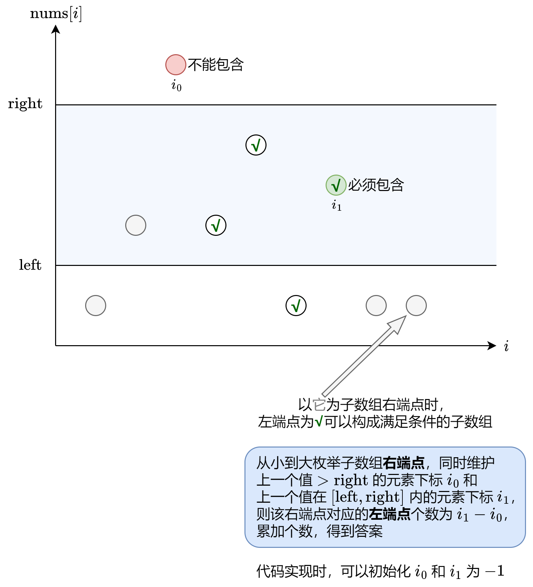

[#0795-number-of-subarrays-with-bounded-maximum]
= 795. 区间子数组个数

https://leetcode.cn/problems/number-of-subarrays-with-bounded-maximum/[LeetCode - 795. 区间子数组个数^]

给你一个整数数组 `nums` 和两个整数：`left` 及 `right` 。找出 `nums` 中连续、非空且其中最大元素在范围 `[left, right]` 内的子数组，并返回满足条件的子数组的个数。

生成的测试用例保证结果符合 *32-bit* 整数范围。

*示例 1：*

....
输入：nums = [2,1,4,3], left = 2, right = 3
输出：3
解释：满足条件的三个子数组：[2], [2, 1], [3]
....

*示例 2：*

....
输入：nums = [2,9,2,5,6], left = 2, right = 8
输出：7
....

*提示：*

* `1 \<= nums.length \<= 10^5^`
* `0 \<= nums[i] \<= 10^9^`
* `0 \<= left \<= right \<= 10^9^`

== 思路分析

看题解也一脸懵逼！

[[src-0795]]
[tabs]
====
一刷::
+
--
[{java_src_attr}]
----
include::{sourcedir}/_0795_NumberOfSubarraysWithBoundedMaximum.java[tag=answer]
----
--

// 二刷::
// +
// --
// [{java_src_attr}]
// ----
// include::{sourcedir}/_0795_NumberOfSubarraysWithBoundedMaximum_2.java[tag=answer]
// ----
// --
====

== 参考资料

. https://leetcode.cn/problems/number-of-subarrays-with-bounded-maximum/solutions/1988198/tu-jie-yi-ci-bian-li-jian-ji-xie-fa-pyth-n75l/[795. 区间子数组个数 - 【图解】一次遍历+简洁写法^]
. https://leetcode.cn/problems/number-of-subarrays-with-bounded-maximum/solutions/1986565/qu-jian-zi-shu-zu-ge-shu-by-leetcode-sol-7it1/[795. 区间子数组个数 - 官方题解^]

