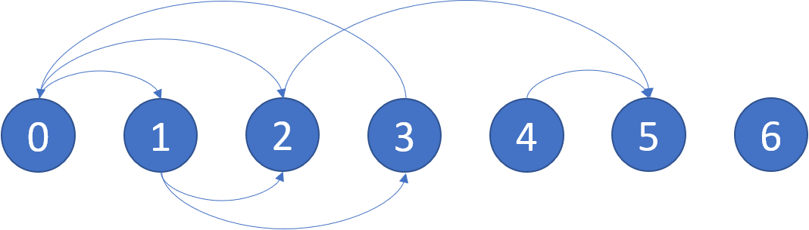

[#0802-find-eventual-safe-states]
= 802. 找到最终的安全状态

https://leetcode.cn/problems/find-eventual-safe-states/[LeetCode - 802. 找到最终的安全状态^]

有一个有 `n` 个节点的有向图，节点按 `0` 到 `n - 1` 编号。图由一个 *索引从 0 开始* 的 2D 整数数组 `graph`表示， `graph[i]`是与节点 `i` 相邻的节点的整数数组，这意味着从节点 `i` 到 `graph[i]`中的每个节点都有一条边。

如果一个节点没有连出的有向边，则该节点是 *终端节点*。如果从该节点开始的所有可能路径都通向 *终端节点* ，则该节点为 *安全节点*。

返回一个由图中所有 *安全节点* 组成的数组作为答案。答案数组中的元素应当按 *升序* 排列。

*示例 1：*

....
输入：graph = [[1,2],[2,3],[5],[0],[5],[],[]]
输出：[2,4,5,6]
解释：示意图如上。
节点 5 和节点 6 是终端节点，因为它们都没有出边。
从节点 2、4、5 和 6 开始的所有路径都指向节点 5 或 6 。
....

*示例 2：*

....
输入：graph = [[1,2,3,4],[1,2],[3,4],[0,4],[]]
输出：[4]
解释:
只有节点 4 是终端节点，从节点 4 开始的所有路径都通向节点 4 。
....

*提示：*

* `+n == graph.length+`
* `1 \<= n \<= 10^4^`
* `+0 <= graph[i].length <= n+`
* `+0 <= graph[i][j] <= n - 1+`
* `graph[i]` 按严格递增顺序排列。
* 图中可能包含自环。
* 图中边的数目在范围 `+[1, 4 * 10^4^]+` 内。

== 思路分析

深度优先搜索，广度优先搜索或拓扑排序。

如果使用拓扑排序，需要构造反向图，然后从入度为 `0` 的节点开始沿着反向“遍历”。

[[src-0802]]
[tabs]
====
一刷::
+
--
[{java_src_attr}]
----
include::{sourcedir}/_0802_FindEventualSafeStates.java[tag=answer]
----
--

二刷::
+
--
[{java_src_attr}]
----
include::{sourcedir}/_0802_FindEventualSafeStates_2.java[tag=answer]
----
--
====

== 参考资料

. https://leetcode.cn/problems/find-eventual-safe-states/solutions/916155/zhao-dao-zui-zhong-de-an-quan-zhuang-tai-yzfz/[802. 找到最终的安全状态 - 官方题解^]
. https://leetcode.cn/problems/find-eventual-safe-states/solutions/916548/gong-shui-san-xie-noxiang-xin-ke-xue-xi-isy6u/[802. 找到最终的安全状态 - 详解何为拓扑排序，以及求拓扑排序方法的正确性证明^]
. https://leetcode.cn/problems/find-eventual-safe-states/solutions/916564/gtalgorithm-san-ju-hua-jiao-ni-wan-zhuan-xf5o/[802. 找到最终的安全状态 - 5分钟干掉拓扑排序^]
. https://leetcode.cn/problems/find-eventual-safe-states/solutions/917056/tong-ge-lai-shua-ti-la-yi-ti-liang-jie-d-t5m3/[802. 找到最终的安全状态 - 一题两解：DFS & 拓扑排序，简单易懂！^]
